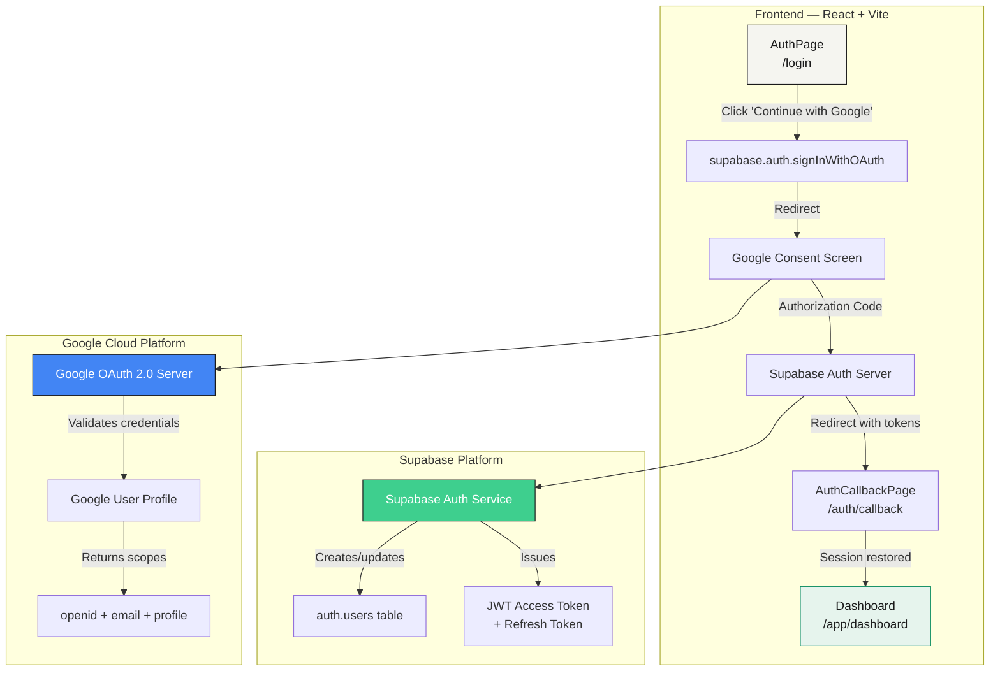
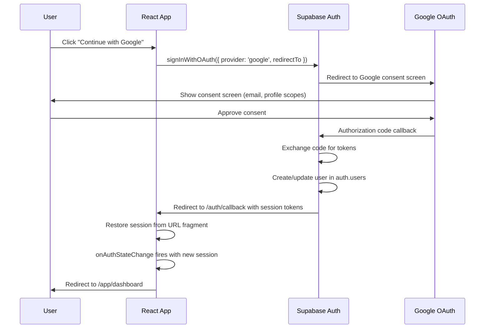
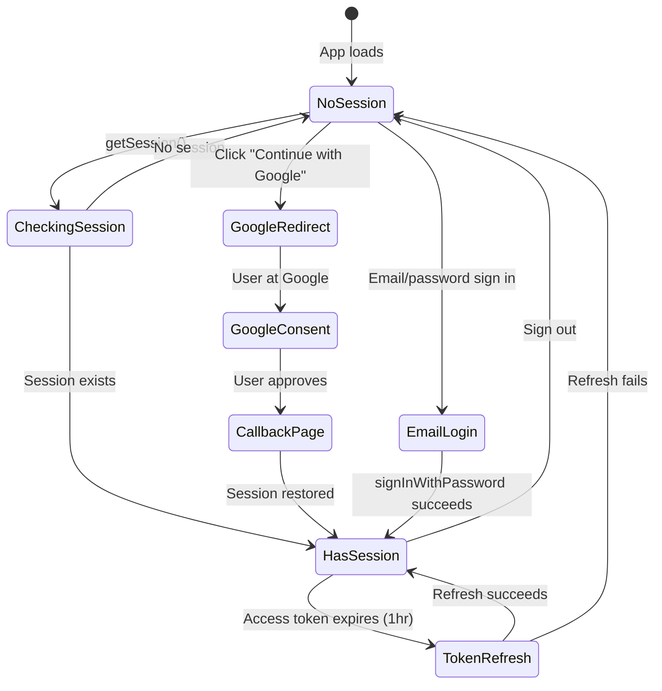
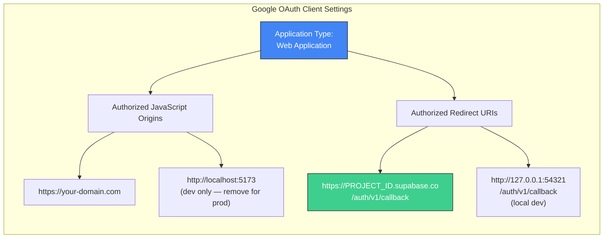
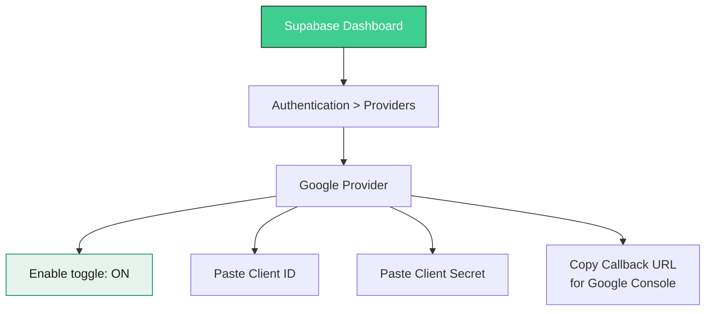
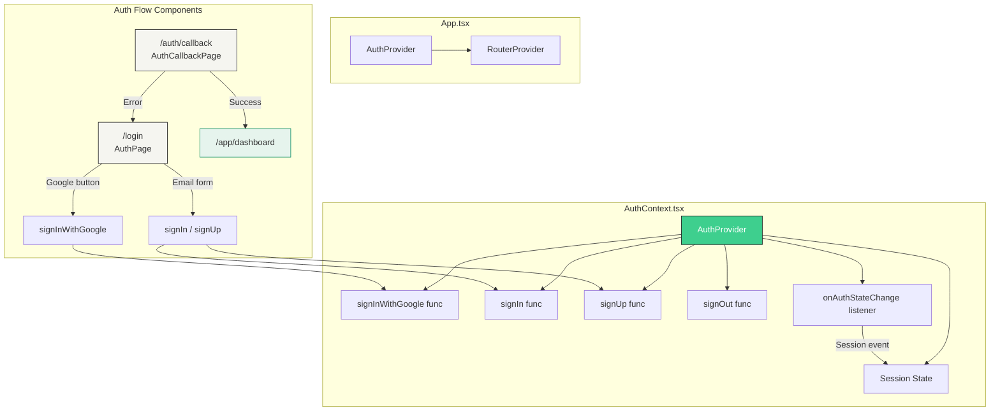
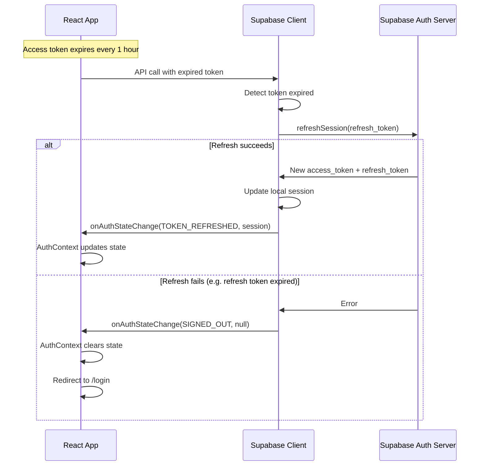
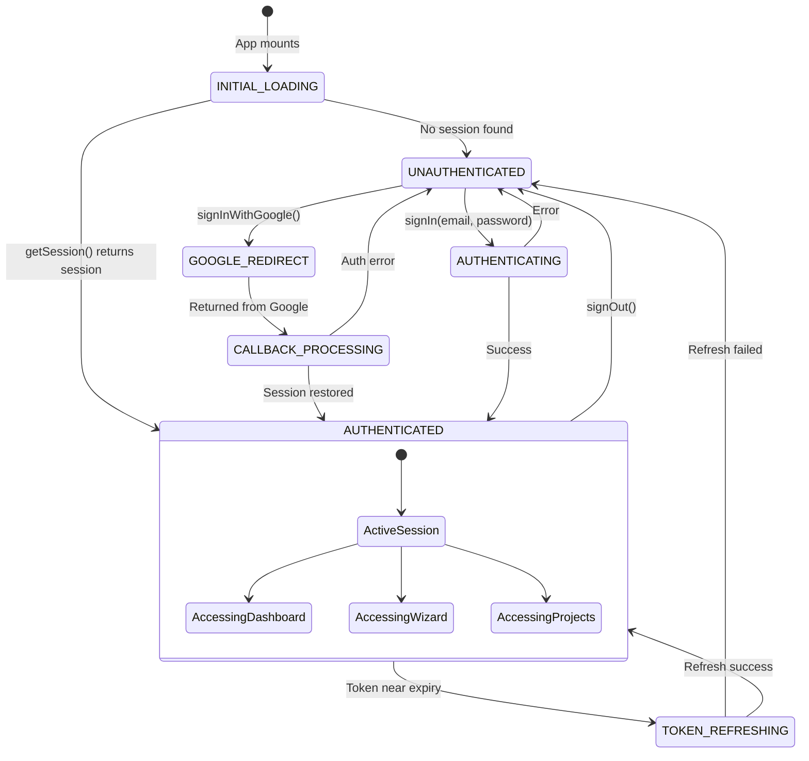
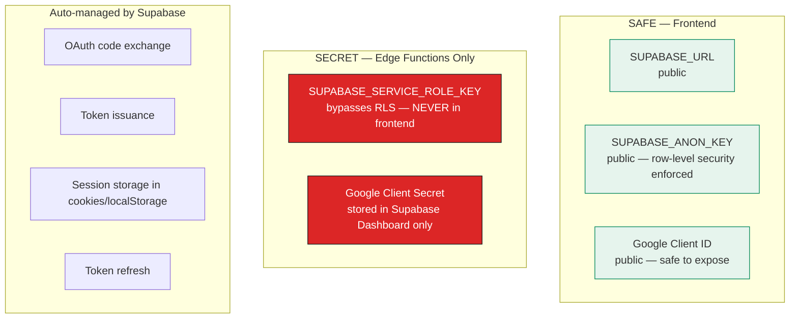
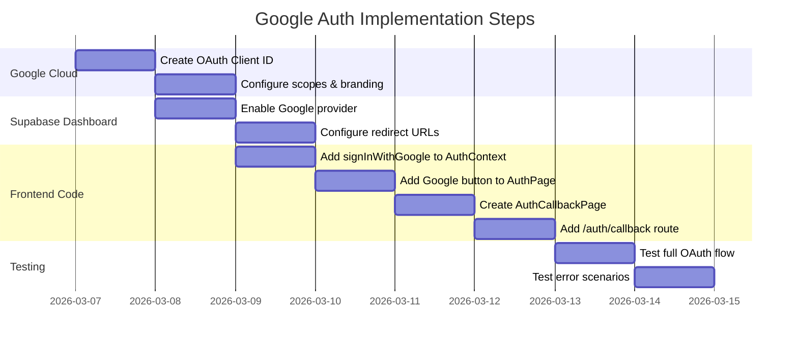

# 06 - Supabase Google Auth Implementation Plan

> **Version:** 2.0.0  
> **Date:** 2026-03-07  
> **Status:** Implemented — Awaiting Google Cloud + Supabase Dashboard Config  
> **Depends on:** Supabase project configured, Google Cloud project created  
> **Reference:** [Official Supabase Google Auth Docs](https://supabase.com/docs/guides/auth/social-login/auth-google)

---

## 1. Architecture Overview

### 1.1 High-Level System Diagram



### 1.2 OAuth 2.0 PKCE Flow (Implicit for SPA)



### 1.3 Session Lifecycle



---

## 2. Google Cloud Console Setup

### 2.1 Prerequisites Checklist

| Step | Action | Status |
|------|--------|--------|
| 1 | Go to [Google Cloud Console](https://console.cloud.google.com) | Pending |
| 2 | Create or select a project | Pending |
| 3 | Navigate to **APIs & Services > OAuth consent screen** | Pending |
| 4 | Configure consent screen (External or Internal) | Pending |
| 5 | Add required scopes (see 2.2) | Pending |
| 6 | Create OAuth 2.0 Client ID (Web application) | Pending |
| 7 | Configure authorized origins and redirect URIs | Pending |
| 8 | Copy Client ID and Client Secret | Pending |

### 2.2 Required Scopes

Per official Supabase docs, these scopes must be configured in Google's **Data Access (Scopes)** screen:

```
openid                          # Must add manually
.../auth/userinfo.email         # Added by default
.../auth/userinfo.profile       # Added by default
```

> **Warning:** Adding sensitive or restricted scopes triggers Google verification, which may take days.

### 2.3 OAuth Client Configuration



**Critical:** The redirect URI must be the Supabase project's callback URL:
```
https://<PROJECT_ID>.supabase.co/auth/v1/callback
```
This is found on the **Google provider page** in the Supabase Dashboard.

---

## 3. Supabase Dashboard Configuration

### 3.1 Enable Google Provider



Steps:
1. Go to **Supabase Dashboard > Authentication > Providers**
2. Find **Google** in the provider list
3. Toggle **Enable Sign in with Google**
4. Paste the **Client ID** from Google Cloud Console
5. Paste the **Client Secret** from Google Cloud Console
6. Copy the **Callback URL** shown — paste it into Google's Authorized Redirect URIs
7. Save

### 3.2 Redirect URL Configuration

In **Supabase Dashboard > Authentication > URL Configuration**:

| Setting | Value |
|---------|-------|
| Site URL | `https://your-production-domain.com` |
| Redirect URLs (allow list) | `https://your-domain.com/auth/callback` |
| | `http://localhost:5173/auth/callback` (dev) |

---

## 4. Frontend Implementation Plan

### 4.1 Component Architecture



### 4.2 Files to Create/Modify

| File | Action | Purpose |
|------|--------|---------|
| `/components/AuthContext.tsx` | **Modify** | Add `signInWithGoogle()` method |
| `/components/AuthPage.tsx` | **Modify** | Add Google sign-in button with BCG styling |
| `/components/AuthCallbackPage.tsx` | **Create** | Handle OAuth redirect, restore session |
| `/routes.tsx` | **Modify** | Add `/auth/callback` route |
| `/lib/supabase.ts` | **No change** | Existing client singleton works as-is |

### 4.3 Key Code Patterns

#### signInWithGoogle (AuthContext)
```typescript
// Per official Supabase docs — implicit flow for SPA
const signInWithGoogle = useCallback(async () => {
  const supabase = getSupabaseClient();
  const { error } = await supabase.auth.signInWithOAuth({
    provider: 'google',
    options: {
      redirectTo: `${window.location.origin}/auth/callback`,
    },
  });
  if (error) {
    console.error('Google OAuth error:', error.message);
  }
}, []);
```

#### AuthCallbackPage
```typescript
// Handles the redirect from Supabase after Google consent
// The onAuthStateChange listener in AuthContext automatically
// picks up the new session from the URL hash fragment.
// This page just waits for that to happen, then redirects.
useEffect(() => {
  const supabase = getSupabaseClient();
  supabase.auth.getSession().then(({ data: { session } }) => {
    if (session) {
      navigate('/app/dashboard', { replace: true });
    } else {
      // Give onAuthStateChange a moment to fire
      setTimeout(() => navigate('/login', { replace: true }), 2000);
    }
  });
}, [navigate]);
```

---

## 5. Authentication Flow Diagrams

### 5.1 Complete User Journey

```mermaid
flowchart TD
    START([User visits /login]) --> CHECK{Already<br/>logged in?}
    CHECK -->|Yes| DASH[Redirect to /app/dashboard]
    CHECK -->|No| SHOW[Show AuthPage]
    
    SHOW --> CHOICE{User chooses}
    
    CHOICE -->|Google| G1[Click 'Continue with Google']
    G1 --> G2[supabase.auth.signInWithOAuth]
    G2 --> G3[Browser redirects to Google]
    G3 --> G4{User approves?}
    G4 -->|Yes| G5[Google sends code to Supabase]
    G5 --> G6[Supabase exchanges code for tokens]
    G6 --> G7[Supabase creates/updates auth.users row]
    G7 --> G8[Redirect to /auth/callback with session]
    G8 --> G9[AuthCallbackPage restores session]
    G9 --> DASH
    G4 -->|No/Cancel| G10[Return to /login with error]
    
    CHOICE -->|Email| E1[Fill email + password]
    E1 --> E2{Login or Signup?}
    E2 -->|Login| E3[signInWithPassword]
    E2 -->|Signup| E4[Server creates user, then signIn]
    E3 --> E5{Success?}
    E4 --> E5
    E5 -->|Yes| DASH
    E5 -->|No| E6[Show error message]
    
    CHOICE -->|Guest| GU1[Continue as Guest]
    GU1 --> GU2[/wizard — local storage only]

    style DASH fill:#E6F4ED,stroke:#00875A,color:#1A1A1A
    style G3 fill:#4285F4,stroke:#1A1A1A,color:#FFFFFF
    style G7 fill:#3ECF8E,stroke:#1A1A1A,color:#FFFFFF
```

### 5.2 Token Refresh Flow



### 5.3 Auth State Machine



---

## 6. Security Best Practices

### 6.1 Checklist

| Practice | Implementation | Status |
|----------|---------------|--------|
| Use PKCE flow | Supabase handles this automatically for `signInWithOAuth` | Auto |
| Validate redirect URLs | Configure allow list in Supabase Dashboard | Manual |
| Remove localhost from Google origins in production | Check before launch | Manual |
| Never expose `SUPABASE_SERVICE_ROLE_KEY` to frontend | Only used in Edge Functions | Enforced |
| Use `redirectTo` parameter | Points to `/auth/callback` within app domain | Code |
| Handle auth errors gracefully | Callback page falls back to `/login` | Code |
| Session auto-refresh | Supabase JS client handles automatically | Auto |
| Custom domain for consent screen | Recommended to prevent phishing | Manual |
| Brand verification with Google | Prevents "unverified app" warning | Manual |

### 6.2 Security Architecture



---

## 7. Testing Plan

### 7.1 Manual Test Scenarios

| # | Scenario | Expected Result |
|---|----------|----------------|
| 1 | Click "Continue with Google" on /login | Redirects to Google consent screen |
| 2 | Approve Google consent | Redirected to /auth/callback, then /app/dashboard |
| 3 | Cancel Google consent | Returns to /login, shows no crash |
| 4 | Visit /login when already signed in with Google | Auto-redirects to /app/dashboard |
| 5 | Sign out from dashboard | Session cleared, returns to /login |
| 6 | Refresh page after Google sign-in | Session persists, stays on dashboard |
| 7 | Access /auth/callback directly (no session) | Redirects to /login after timeout |
| 8 | Sign in with Google, then sign in with email (same email) | Supabase links accounts automatically |

### 7.2 Error Scenarios

| # | Scenario | Expected Result |
|---|----------|----------------|
| 1 | Google provider not enabled in Supabase | Error displayed on /login |
| 2 | Invalid redirect URL in Supabase config | Google shows redirect_uri_mismatch error |
| 3 | Network failure during OAuth | User stays on Google, can retry |
| 4 | Token refresh fails | User redirected to /login |

---

## 8. Implementation Order



---

## 9. Post-Implementation Notes

- **Brand verification:** Submit for Google verification if using external users. This shows your app name/logo instead of project ID on the consent screen.
- **Custom domain:** Consider setting `auth.sunaiagency.com` as a custom domain in Supabase for a more trustworthy consent screen.
- **Provider tokens:** If you later need to access Google APIs (Gmail, Calendar, etc.) on behalf of the user, pass `access_type: 'offline'` and `prompt: 'consent'` to get a refresh token from Google.
- **Account linking:** Supabase automatically links Google and email accounts if they share the same email address.

---

## Appendix A: Environment Variables Reference

| Variable | Location | Purpose |
|----------|----------|---------|
| `SUPABASE_URL` | Frontend + Edge Functions | Supabase project URL |
| `SUPABASE_ANON_KEY` | Frontend + Edge Functions | Public API key (RLS enforced) |
| `SUPABASE_SERVICE_ROLE_KEY` | Edge Functions ONLY | Admin key (bypasses RLS) |
| Google Client ID | Supabase Dashboard | OAuth client identifier |
| Google Client Secret | Supabase Dashboard | OAuth client secret |

> **Note:** Google Client ID and Secret are stored in the Supabase Dashboard, NOT in environment variables. Supabase's auth service uses them server-side during the OAuth code exchange.