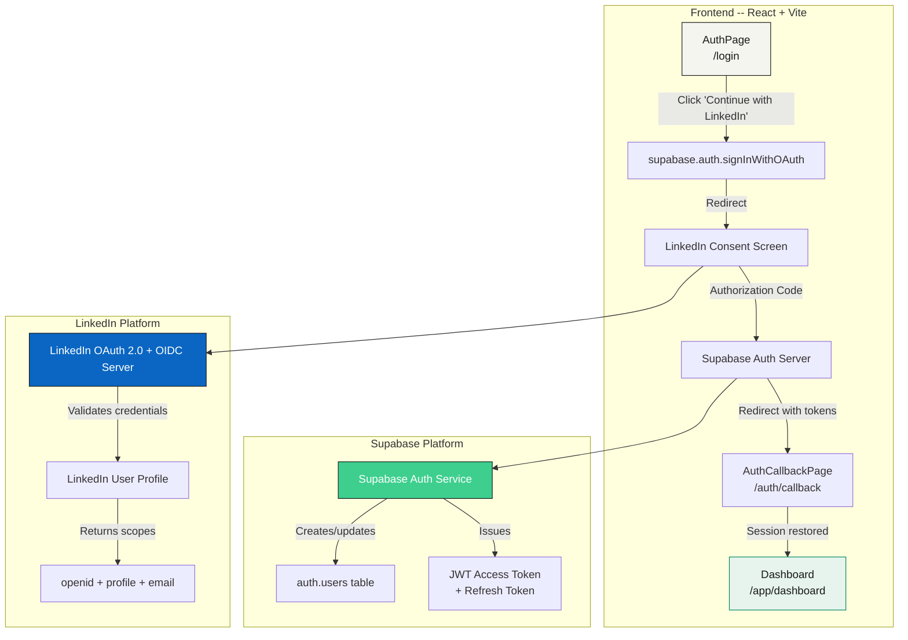
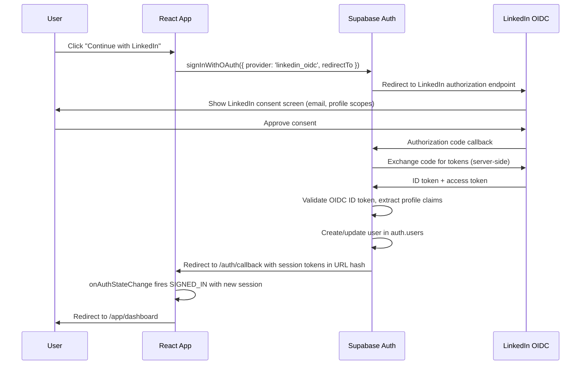
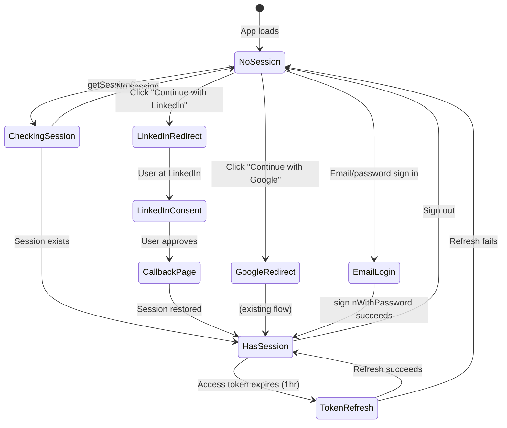
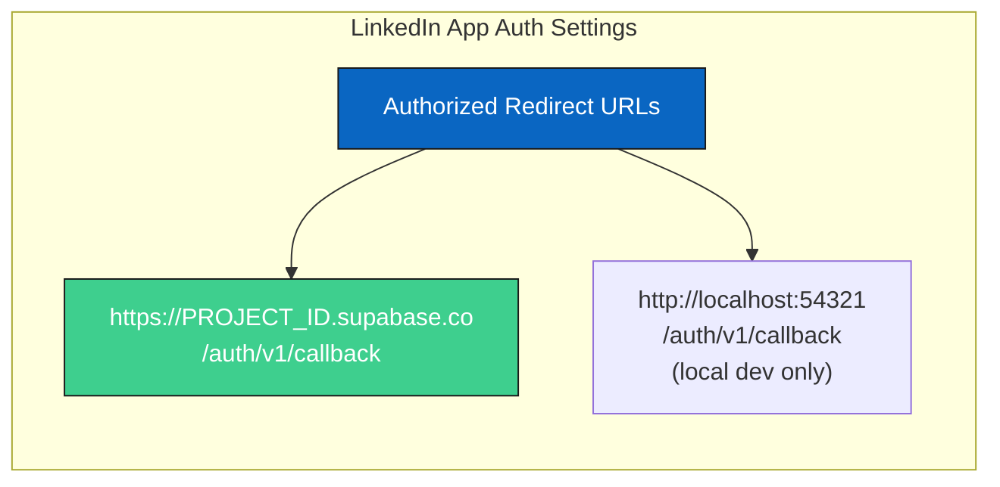
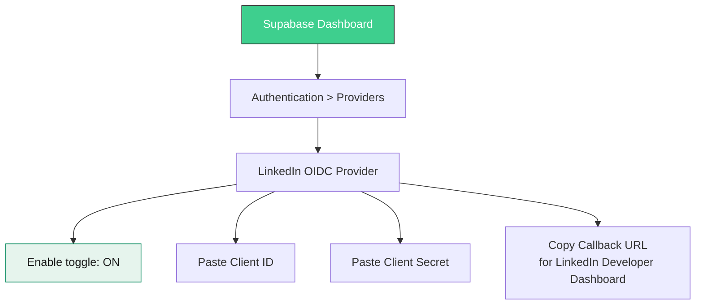
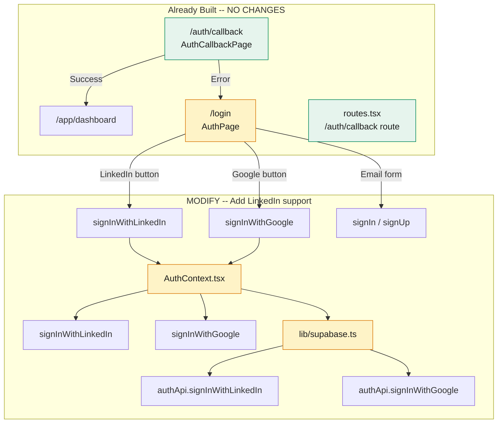
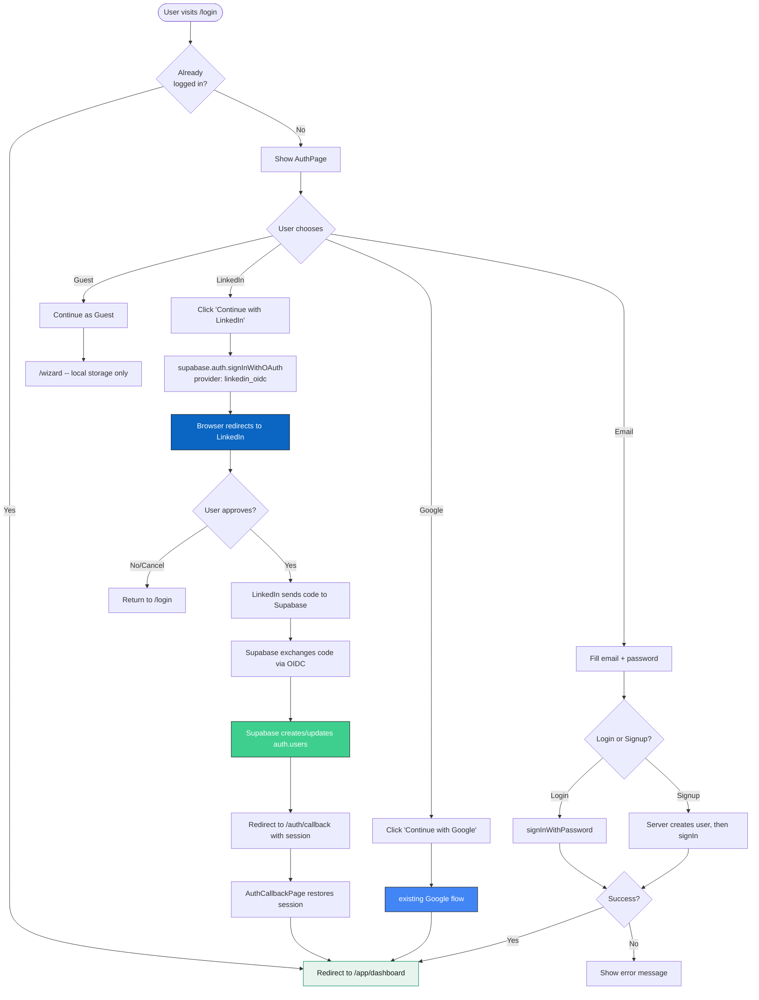
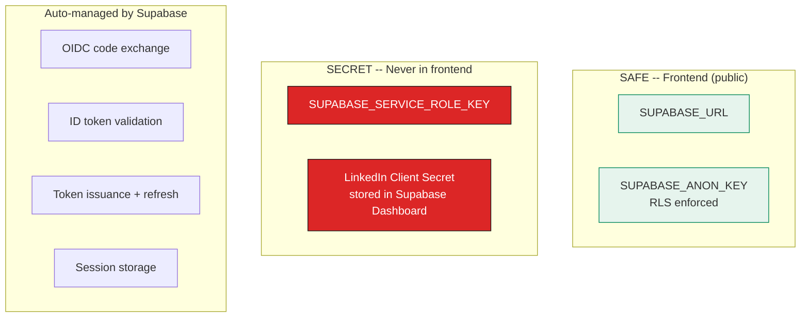
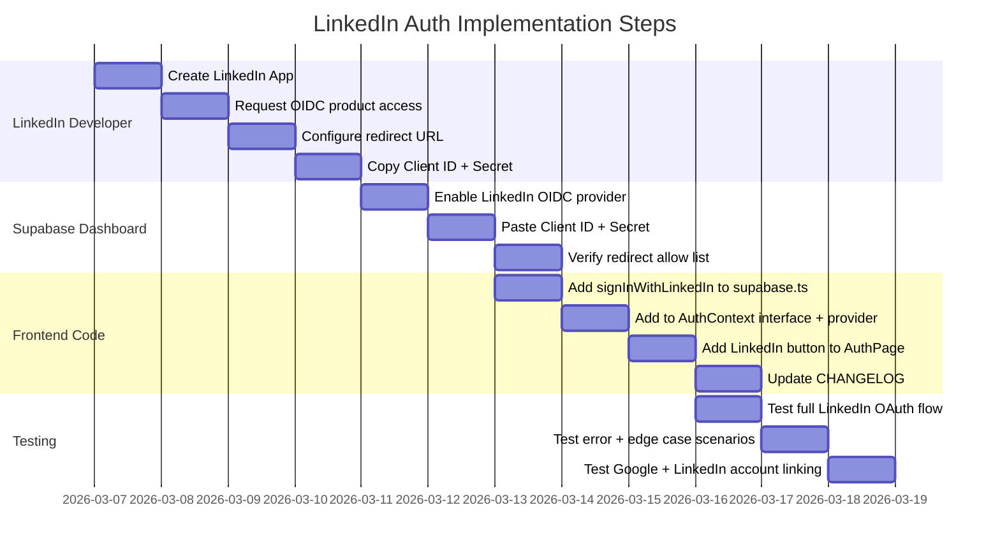

# 07 - Supabase LinkedIn (OIDC) Auth Implementation Plan

> **Version:** 2.0.0  
> **Date:** 2026-03-07  
> **Status:** Implemented -- Awaiting LinkedIn Developer App + Supabase Dashboard Config  
> **Depends on:** Supabase project configured, LinkedIn Developer account  
> **Reference:** [Official Supabase LinkedIn Auth Docs](https://supabase.com/docs/guides/auth/social-login/auth-linkedin-oidc)  
> **Prior art:** [06-google-auth-plan.md](./06-google-auth-plan.md) (same pattern)  
> **Auth wiring notes:** [/imports/auth-wiring-notes.md](/imports/auth-wiring-notes.md) (reconciled -- all items resolved)

---

## 1. Architecture Overview

### 1.1 High-Level System Diagram



### 1.2 OAuth 2.0 + OpenID Connect Flow



### 1.3 Session Lifecycle (Shared with Google)



---

## 2. Key Difference: LinkedIn OIDC vs Google

| Aspect | Google | LinkedIn (OIDC) |
|--------|--------|-----------------|
| Supabase provider name | `google` | `linkedin_oidc` |
| Developer portal | Google Cloud Console | LinkedIn Developer Dashboard |
| Protocol | OAuth 2.0 | OAuth 2.0 + OpenID Connect |
| Scopes | `openid`, `email`, `profile` | `openid`, `profile`, `email` (via OIDC product) |
| Product activation | None required | Must request "Sign In with LinkedIn using OpenID Connect" |
| Provider setting in Supabase | Authentication > Providers > Google | Authentication > Providers > LinkedIn (OIDC) |
| Callback URL format | Same: `https://<PROJECT_ID>.supabase.co/auth/v1/callback` | Same |
| User metadata fields | `avatar_url`, `full_name`, `email` | `avatar_url`, `full_name`, `email` |
| Account linking | Auto-links if same email | Auto-links if same email |

> **Important:** Supabase deprecated the old `linkedin` provider. You **must** use `linkedin_oidc`. The old provider was removed on 4 January 2024.

---

## 3. LinkedIn Developer Dashboard Setup

### 3.1 Prerequisites Checklist

| Step | Action | Status |
|------|--------|--------|
| 1 | Go to [LinkedIn Developer Dashboard](https://www.linkedin.com/developers/) | Pending |
| 2 | Log in with your LinkedIn account | Pending |
| 3 | Click **Create App** (top right) | Pending |
| 4 | Fill in: App name, LinkedIn Page, Privacy policy URL, App logo | Pending |
| 5 | Click **Save** | Pending |
| 6 | Go to **Products** tab | Pending |
| 7 | Find **"Sign In with LinkedIn using OpenID Connect"** and click **Request Access** | Pending |
| 8 | Wait for access approval (usually instant) | Pending |
| 9 | Go to **Auth** tab | Pending |
| 10 | Add Redirect URL (see 3.2) | Pending |
| 11 | Copy **Client ID** | Pending |
| 12 | Copy **Client Secret** | Pending |
| 13 | Verify scopes at bottom of Auth tab (see 3.3) | Pending |

### 3.2 Redirect URL Configuration



**Critical:** The redirect URL is the **Supabase** callback URL, NOT your app's `/auth/callback`. LinkedIn sends the authorization code to Supabase, and Supabase then redirects to your app.

Where to find your Supabase callback URL:
1. Go to **Supabase Dashboard > Authentication > Providers > LinkedIn (OIDC)**
2. Copy the **Callback URL** shown at the top
3. It will be: `https://<YOUR_PROJECT_REF>.supabase.co/auth/v1/callback`

### 3.3 Required OAuth 2.0 Scopes

After requesting the "Sign In with LinkedIn using OpenID Connect" product, verify these scopes appear under **OAuth 2.0 Scopes** at the bottom of the Auth tab:

```
openid      # Required for OIDC — returns ID token
profile     # Returns name, profile picture
email       # Returns email address
```

If any scope is missing, you may need to re-request the OIDC product or contact LinkedIn support.

---

## 4. Supabase Dashboard Configuration

### 4.1 Enable LinkedIn (OIDC) Provider



Steps:
1. Go to **Supabase Dashboard > Authentication > Providers**
2. Find **LinkedIn (OIDC)** in the provider list (NOT the deprecated "LinkedIn")
3. Toggle **Enable Sign in with LinkedIn (OIDC)** to ON
4. Paste the **Client ID** from LinkedIn Developer Dashboard
5. Paste the **Client Secret** from LinkedIn Developer Dashboard
6. Copy the **Callback URL** shown at the top of this section
7. Click **Save**

### 4.2 Redirect URL Allow List

In **Supabase Dashboard > Authentication > URL Configuration**:

| Setting | Value |
|---------|-------|
| Site URL | `https://your-production-domain.com` |
| Redirect URLs (allow list) | `https://your-domain.com/auth/callback` |
| | `http://localhost:5173/auth/callback` (dev) |

> These should already be configured from the Google OAuth setup. If so, no changes needed.

---

## 5. Frontend Implementation Plan

### 5.1 Component Architecture — What Changes



### 5.2 Files to Modify (3 files) — No New Files Needed

| File | Action | What to Add |
|------|--------|-------------|
| `/lib/supabase.ts` | **Modify** | Add `authApi.signInWithLinkedIn(returnPath?)` method |
| `/components/AuthContext.tsx` | **Modify** | Add `signInWithLinkedIn()` to context and interface |
| `/components/AuthPage.tsx` | **Modify** | Add LinkedIn button below Google button |

| File | Action | Why |
|------|--------|-----|
| `/components/AuthCallbackPage.tsx` | **No change** | Already provider-agnostic (handles any OAuth callback) |
| `/routes.tsx` | **No change** | `/auth/callback` route already registered |
| `/components/dashboard/DashboardHeader.tsx` | **No change** | Already shows `avatarUrl` from user metadata |

### 5.3 Code Changes — Detail

#### 5.3.1 `lib/supabase.ts` — Add `signInWithLinkedIn`

Add directly below the existing `signInWithGoogle` method:

```typescript
signInWithLinkedIn: async (returnPath?: string) => {
  const supabase = getSupabaseClient();
  const callbackUrl = new URL('/auth/callback', window.location.origin);
  if (returnPath) {
    callbackUrl.searchParams.set('return', returnPath);
  }
  const { error } = await supabase.auth.signInWithOAuth({
    provider: 'linkedin_oidc',   // <-- MUST be 'linkedin_oidc', NOT 'linkedin'
    options: {
      redirectTo: callbackUrl.toString(),
    },
  });
  if (error) {
    console.error('[Auth] LinkedIn OIDC OAuth error:', error.message);
    return { error: error.message };
  }
  // Browser will redirect -- no return value needed
  return { error: null };
},
```

#### 5.3.2 `AuthContext.tsx` — Add to interface and provider

Update the `AuthContextType` interface:

```typescript
interface AuthContextType extends AuthState {
  signIn: (email: string, password: string) => Promise<{ success: boolean; error?: string }>;
  signUp: (email: string, password: string, name?: string) => Promise<{ success: boolean; error?: string }>;
  signInWithGoogle: (returnPath?: string) => Promise<void>;
  signInWithLinkedIn: (returnPath?: string) => Promise<void>;  // <-- NEW
  signOut: () => Promise<void>;
  clearError: () => void;
}
```

Add the `signInWithLinkedIn` callback (identical pattern to Google):

```typescript
const signInWithLinkedIn = useCallback(async (returnPath?: string) => {
  setState(s => ({ ...s, loading: true, error: null }));
  const { error } = await authApi.signInWithLinkedIn(returnPath);
  if (error) {
    setState(s => ({ ...s, loading: false, error }));
  }
  // On success: browser redirects to LinkedIn -- keep loading: true
}, []);
```

Update the `useAuth()` fallback and the Provider value to include `signInWithLinkedIn`.

#### 5.3.3 `AuthPage.tsx` — Add LinkedIn button

Add a LinkedIn button below the Google button, using the same UI pattern. The LinkedIn brand color is `#0A66C2`. The button should:

1. Call `signInWithLinkedIn(returnPath)` on click
2. Show a `<Loader2>` spinner with "Redirecting to LinkedIn..." during redirect
3. Use a separate `linkedinRedirecting` state (distinct from `googleRedirecting`)
4. Be disabled during any other auth operation

LinkedIn SVG logo for the button:

```tsx
<svg width="18" height="18" viewBox="0 0 18 18" fill="none" xmlns="http://www.w3.org/2000/svg">
  <path d="M15.335 15.339H12.67v-4.177c0-.996-.02-2.278-1.39-2.278-1.389 0-1.601 1.086-1.601 2.207v4.248H7.013V6.75h2.56v1.17h.035c.358-.674 1.228-1.387 2.528-1.387 2.7 0 3.2 1.778 3.2 4.091v4.715zM4.003 5.575a1.546 1.546 0 1 1 0-3.092 1.546 1.546 0 0 1 0 3.092zM5.339 15.339H2.666V6.75h2.673v8.589zM16.67 0H1.329C.593 0 0 .58 0 1.297v15.406C0 17.42.594 18 1.328 18h15.339C17.4 18 18 17.42 18 16.703V1.297C18 .58 17.4 0 16.67 0z" fill="#0A66C2"/>
</svg>
```

Button layout in AuthPage (top to bottom):
1. **Google button** (existing)
2. **LinkedIn button** (new -- same size, same border style, different icon + text)
3. **Divider** ("or continue with email")
4. **Email form** (existing)

### 5.4 `isDisabled` Flag Update

The existing `isDisabled` flag must include the new LinkedIn state:

```typescript
const [linkedinRedirecting, setLinkedinRedirecting] = useState(false);
// ...
const isDisabled = loading || success || googleRedirecting || linkedinRedirecting;
```

---

## 6. Complete User Journey — LinkedIn Path

### 6.1 Full Data Path

```
User visits /app/dashboard (unauthenticated)
  -> DashboardLayout auth guard -> Navigate to /login?return=%2Fapp%2Fdashboard
  -> AuthPage reads ?return= param
  -> User clicks "Continue with LinkedIn"
  -> signInWithLinkedIn(returnPath="/app/dashboard")
  -> authApi.signInWithLinkedIn() builds redirectTo: /auth/callback?return=%2Fapp%2Fdashboard
  -> supabase.auth.signInWithOAuth({ provider: 'linkedin_oidc', redirectTo })
  -> Browser redirects to LinkedIn authorization screen
  -> User approves -> LinkedIn sends authorization code to Supabase
  -> Supabase exchanges code for OIDC tokens (server-side)
  -> Supabase validates ID token, extracts name/email/picture claims
  -> Supabase creates/updates auth.users row with LinkedIn profile data
  -> Supabase redirects to /auth/callback?return=%2Fapp%2Fdashboard#access_token=...
  -> AuthCallbackPage mounts, reads ?return= param
  -> onAuthStateChange fires SIGNED_IN with new session
  -> AuthContext updates user state (name, email, avatarUrl from LinkedIn)
  -> navigateOnce("/app/dashboard") via handledRef guard
  -> DashboardHeader shows LinkedIn avatar photo + display name
```

### 6.2 Flowchart



---

## 7. Security Considerations

### 7.1 Checklist

| Practice | Implementation | Status |
|----------|---------------|--------|
| Use `linkedin_oidc` (not deprecated `linkedin`) | Specified in `signInWithOAuth` call | Code |
| PKCE flow | Supabase handles automatically | Auto |
| Validate redirect URLs | Supabase Dashboard allow list | Manual |
| LinkedIn Client Secret never in frontend | Stored in Supabase Dashboard only | Enforced |
| `SUPABASE_SERVICE_ROLE_KEY` never in frontend | Only in Edge Functions | Enforced |
| Use `redirectTo` with `?return=` param | Points to `/auth/callback` within app | Code |
| Handle auth errors gracefully | Callback page falls back to `/login` | Code |
| Session auto-refresh | Supabase JS client handles automatically | Auto |

### 7.2 Secret Management



---

## 8. Account Linking Behavior

Supabase automatically links accounts that share the same email address. This means:

| Scenario | Result |
|----------|--------|
| User signs up with email `jane@co.com`, then signs in with LinkedIn (same email) | Accounts linked -- same `auth.users` row |
| User signs in with Google `jane@co.com`, then signs in with LinkedIn (same email) | All three identities linked |
| User signs in with LinkedIn (personal email), then email signup (work email) | Two separate accounts (different emails) |

The user's `auth.users.raw_user_meta_data` will contain combined metadata from all linked providers.

---

## 9. Testing Plan

### 9.1 Manual Test Scenarios

| # | Scenario | Expected Result |
|---|----------|----------------|
| 1 | Click "Continue with LinkedIn" on /login | Redirects to LinkedIn consent screen |
| 2 | Approve LinkedIn consent | Redirected to /auth/callback, then /app/dashboard |
| 3 | Cancel/deny LinkedIn consent | Returns to /login, no crash |
| 4 | Visit /login when already signed in via LinkedIn | Auto-redirects to /app/dashboard |
| 5 | Sign out from dashboard after LinkedIn login | Session cleared, returns to /login |
| 6 | Refresh page after LinkedIn sign-in | Session persists, stays on dashboard |
| 7 | Access /auth/callback directly (no session) | Redirects to /login after 8s timeout |
| 8 | Sign in with LinkedIn, then sign in with Google (same email) | Supabase links accounts automatically |
| 9 | Visit /app/clients (protected route) while logged out | Redirects to /login?return=/app/clients, LinkedIn login, lands on /app/clients |
| 10 | Click LinkedIn button while Google redirect is in progress | Button disabled (isDisabled flag) |

### 9.2 Error Scenarios

| # | Scenario | Expected Result |
|---|----------|----------------|
| 1 | LinkedIn (OIDC) provider not enabled in Supabase | Error message on /login: "provider is not enabled" |
| 2 | Invalid redirect URL in LinkedIn app config | LinkedIn shows "redirect_uri does not match" error |
| 3 | OIDC product not requested on LinkedIn app | Scopes missing, consent screen may fail |
| 4 | Network failure during OAuth | User stays on LinkedIn, can retry |
| 5 | Token refresh fails after session expires | User redirected to /login |

---

## 10. Implementation Order



### Step-by-Step Summary

| # | Where | Task | Effort |
|---|-------|------|--------|
| 1 | LinkedIn Developer Dashboard | Create app, request OIDC product, add redirect URL, copy credentials | 10 min |
| 2 | Supabase Dashboard | Enable LinkedIn (OIDC) provider, paste Client ID + Secret | 5 min |
| 3 | `/lib/supabase.ts` | Add `authApi.signInWithLinkedIn(returnPath?)` | 5 min |
| 4 | `/components/AuthContext.tsx` | Add `signInWithLinkedIn` to interface, context, provider value, fallback | 10 min |
| 5 | `/components/AuthPage.tsx` | Add LinkedIn button, `linkedinRedirecting` state, handler function | 15 min |
| 6 | CHANGELOG | Add entry | 5 min |
| 7 | Testing | Run through 10 test scenarios | 15 min |
| **Total** | | | **~65 min** |

---

## 11. Post-Implementation Notes

- **LinkedIn profile photos:** LinkedIn provides `avatar_url` in the OIDC claims. The existing `DashboardHeader.tsx` already displays `user.avatarUrl` with `referrerPolicy="no-referrer"`, which works for LinkedIn CDN images.
- **Account linking:** If a user has already signed in with Google or email using the same email address, LinkedIn login will automatically link to the existing account. No additional code needed.
- **LinkedIn app review:** LinkedIn apps in development mode can only be used by app administrators and authorized developers. To allow any LinkedIn user to sign in, you must complete LinkedIn's app review process.
- **Provider-specific data:** If you later need to access LinkedIn APIs (connections, posts, etc.) on behalf of the user, you would need additional scopes and a provider token. For sign-in only, the default OIDC scopes are sufficient.
- **Deprecated `linkedin` provider:** Supabase removed the old `linkedin` provider on 4 January 2024. Always use `linkedin_oidc` in both the `signInWithOAuth()` call and the Supabase Dashboard.

---

## Appendix A: Environment Variables Reference

| Variable | Location | Purpose |
|----------|----------|---------|
| `SUPABASE_URL` | Frontend + Edge Functions | Supabase project URL |
| `SUPABASE_ANON_KEY` | Frontend + Edge Functions | Public API key (RLS enforced) |
| `SUPABASE_SERVICE_ROLE_KEY` | Edge Functions ONLY | Admin key (bypasses RLS) |
| LinkedIn Client ID | Supabase Dashboard | OAuth client identifier |
| LinkedIn Client Secret | Supabase Dashboard | OAuth client secret |

> **Note:** LinkedIn Client ID and Secret are stored in the Supabase Dashboard, NOT in environment variables or frontend code. Supabase's auth service uses them server-side during the OIDC code exchange.

---

## Appendix B: Supabase CLI Local Dev Config

If using the Supabase CLI for local development, add to `config.toml`:

```toml
[auth.external.linkedin_oidc]
enabled = true
client_id = "your-linkedin-client-id"
secret = "your-linkedin-client-secret"
```

And ensure the local callback URL is added to your LinkedIn app:
```
http://localhost:54321/auth/v1/callback
```

---

## Appendix C: Existing Code Reuse Summary

The LinkedIn implementation benefits heavily from the Google OAuth infrastructure built in v0.16.0:

| Component | Reuse | Notes |
|-----------|-------|-------|
| `AuthCallbackPage.tsx` | 100% reuse | Provider-agnostic: handles any OAuth callback via `onAuthStateChange` |
| `/auth/callback` route | 100% reuse | Already registered in `routes.tsx` |
| `DashboardLayout.tsx` auth guard | 100% reuse | `?return=` param passthrough works for any provider |
| `DashboardHeader.tsx` avatar | 100% reuse | Shows `avatarUrl` from any provider's user metadata |
| `AuthPage.tsx` error/success UI | 100% reuse | Only adding a new button, all states work |
| `AuthContext.tsx` session restore | 100% reuse | `onAuthStateChange` handles any provider's session |
| `lib/supabase.ts` API pattern | Template | Copy `signInWithGoogle`, change provider to `linkedin_oidc` |

**Net new code: ~30 lines across 3 files.**

---

*This document follows the same structure as [06-google-auth-plan.md](./06-google-auth-plan.md) for consistency. Last updated: 2026-03-07.*