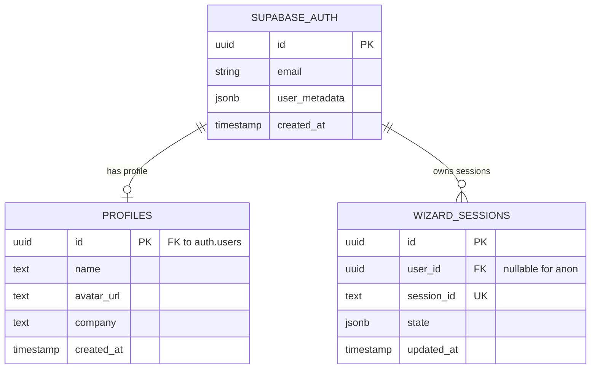

# P0: Auth Wiring

> **Priority:** CRITICAL -- Unblocks everything (dashboard, wizard protection, user journeys)
> **Blockers solved:** B1, B2, B3
> **Est:** ~2 hours

---

## Status

| Component | File | Status |
|-----------|------|--------|
| AuthContext (full-featured) | `src/components/AuthContext.tsx` | 🟢 Complete (177 lines) |
| AuthProvider (competing/broken) | `src/components/auth/AuthProvider.tsx` | 🔴 Remove -- imports non-existent `supabase` export |
| AuthLayout (split-screen) | `src/components/auth/AuthLayout.tsx` | 🟢 Complete (60 lines) |
| LoginPage | `src/components/auth/LoginPage.tsx` | 🟢 Built, not routed |
| SignupPage | `src/components/auth/SignupPage.tsx` | 🟢 Built, not routed |
| ProtectedRoute | `src/components/auth/ProtectedRoute.tsx` | 🟡 Built, imports wrong AuthProvider |
| App.tsx wraps AuthProvider | `src/App.tsx` | 🔴 Missing -- bare `<RouterProvider>` |
| `/auth/*` routes | `src/routes.tsx` | 🔴 Missing -- 0 auth routes |
| `/app/*` routes | `src/routes.tsx` | 🔴 Missing -- 0 dashboard routes |

---

## ERD: Auth Data Flow



## Flow: Auth Lifecycle

```mermaid
flowchart TD
    A[User visits /auth/login] --> B{Has session?}
    B -->|Yes| C[Redirect to /app/dashboard]
    B -->|No| D[Show LoginPage in AuthLayout]
    D --> E{Auth method}
    E -->|Email/Password| F[authApi.signIn]
    E -->|Google| G[authApi.signInWithGoogle]
    F --> H{Success?}
    G --> I[Google OAuth redirect]
    I --> J[/auth/callback]
    J --> H
    H -->|Yes| K[onAuthStateChange fires]
    K --> L[AuthContext updates user+token]
    L --> C
    H -->|No| M[Show error in LoginPage]

    N[User visits /app/*] --> O{ProtectedRoute}
    O -->|loading| P[Show spinner]
    O -->|no user| Q[Redirect /auth/login]
    O -->|has user| R[Render DashboardLayout > Outlet]
```

---

## Implementation Steps

### Step 1: Remove competing auth system (B3)

**Delete:** `src/components/auth/AuthProvider.tsx`

This file imports `supabase` from `@/lib/supabase` which doesn't exist as a named export. The real auth system is `src/components/AuthContext.tsx` which exports `AuthProvider` and `useAuth()`.

### Step 2: Fix ProtectedRoute import (B3)

**File:** `src/components/auth/ProtectedRoute.tsx`

Change line 2:
```diff
- import { useAuth } from "./AuthProvider";
+ import { useAuth } from "../AuthContext";
```

### Step 3: Wrap App.tsx with AuthProvider (B2)

**File:** `src/App.tsx`

Current (6 lines):
```tsx
import { RouterProvider } from 'react-router';
import { router } from './routes';

export default function App() {
  return <RouterProvider router={router} />;
}
```

Change to:
```tsx
import { RouterProvider } from 'react-router';
import { router } from './routes';
import { AuthProvider } from './components/AuthContext';

export default function App() {
  return (
    <AuthProvider>
      <RouterProvider router={router} />
    </AuthProvider>
  );
}
```

### Step 4: Add auth + app route groups (B1)

**File:** `src/routes.tsx`

Add imports at top:
```tsx
import AuthLayout from './components/auth/AuthLayout';
import LoginPage from './components/auth/LoginPage';
import SignupPage from './components/auth/SignupPage';
import ProtectedRoute from './components/auth/ProtectedRoute';
import DashboardLayout from './components/dashboard/DashboardLayout';
import DashboardHome from './components/dashboard/DashboardHome';
import { ProjectsList } from './components/dashboard/ProjectsList';
import ProjectDetail from './components/dashboard/ProjectDetail';
import RoadmapPage from './components/dashboard/RoadmapPage';
import { ClientsListPage } from './components/dashboard/clients/ClientsListPage';
import ClientDetailPage from './components/dashboard/clients/ClientDetailPage';
import { InsightsPage } from './components/dashboard/insights/InsightsPage';
import { AgentsPage as DashAgentsPage } from './components/dashboard/agents/AgentsPage';
import SettingsPage from './components/dashboard/SettingsPage';
import PlaceholderPage from './components/dashboard/PlaceholderPage';
```

Add two route groups to the `createBrowserRouter` array (before the `*` catch-all):

```tsx
// Auth routes -- standalone layout (no site header/footer)
{
  path: '/auth',
  Component: AuthLayout,
  children: [
    { path: 'login', Component: LoginPage },
    { path: 'signup', Component: SignupPage },
  ],
},

// Protected app routes -- dashboard layout with auth guard
{
  path: '/app',
  Component: ProtectedRoute,
  children: [
    {
      Component: DashboardLayout,
      children: [
        { index: true, Component: DashboardHome },
        { path: 'dashboard', Component: DashboardHome },
        { path: 'projects', Component: ProjectsList },
        { path: 'projects/:id', Component: ProjectDetail },
        { path: 'roadmap', Component: RoadmapPage },
        { path: 'clients', Component: ClientsListPage },
        { path: 'clients/:id', Component: ClientDetailPage },
        { path: 'insights', Component: InsightsPage },
        { path: 'agents', Component: DashAgentsPage },
        { path: 'settings', Component: SettingsPage },
        // Stubs
        { path: 'crm/pipelines', Component: PlaceholderPage },
        { path: 'documents', Component: PlaceholderPage },
        { path: 'financial', Component: PlaceholderPage },
        { path: 'workflows', Component: PlaceholderPage },
      ],
    },
  ],
},
```

> **Note:** The DashboardSidebar already uses `/app/*` paths (confirmed in `DashboardSidebar.tsx:13-24`). The DashboardLayout already imports `useAuth` from `../AuthContext` (confirmed in `DashboardLayout.tsx:7`). These are already aligned.

### Step 5: Fix DashboardLayout redirect path

**File:** `src/components/dashboard/DashboardLayout.tsx:34`

The redirect currently goes to `/login` (non-existent). Fix:
```diff
- return <Navigate to={`/login?return=${encodeURIComponent(location.pathname)}`} replace />;
+ return <Navigate to={`/auth/login?return=${encodeURIComponent(location.pathname)}`} replace />;
```

### Step 6: Build & verify

```bash
cd /home/sk/sunv2
npm run build
```

Expected: zero TypeScript errors, zero build warnings about missing imports.

### Step 7: Manual smoke test

1. `npm run dev`
2. Visit `/auth/login` -- should show split-screen login
3. Visit `/auth/signup` -- should show signup form
4. Visit `/app/dashboard` -- should redirect to `/auth/login` (not logged in)
5. Sign up with test email -- should redirect to `/app/dashboard`
6. Sidebar links should all resolve

---

## Route Map After This Task

```
/                       -> HomePageV3 (marketing)
/auth/login             -> AuthLayout > LoginPage        NEW
/auth/signup            -> AuthLayout > SignupPage        NEW
/app                    -> ProtectedRoute > DashboardLayout > DashboardHome  NEW
/app/dashboard          -> DashboardHome                  NEW
/app/projects           -> ProjectsList                   NEW
/app/projects/:id       -> ProjectDetail                  NEW
/app/roadmap            -> RoadmapPage                    NEW
/app/clients            -> ClientsListPage                NEW
/app/clients/:id        -> ClientDetailPage               NEW
/app/insights           -> InsightsPage                   NEW
/app/agents             -> DashAgentsPage                 NEW
/app/settings           -> SettingsPage                   NEW
/app/crm/pipelines      -> PlaceholderPage (stub)         NEW
/app/documents          -> PlaceholderPage (stub)          NEW
/app/financial          -> PlaceholderPage (stub)          NEW
/app/workflows          -> PlaceholderPage (stub)          NEW
/wizard                 -> WizardPage (public)
... (28 marketing routes unchanged)
```
