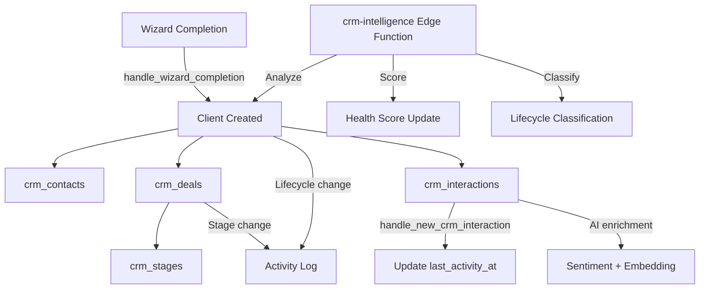

# 056: CRM System Architecture

> Complete CRM data model, relationships, and operational patterns

---

## CRM Tables

### clients (21 columns)
The root CRM entity. Represents a company/organization being sold to or serviced.

| Column | Type | Default | Purpose |
|--------|------|---------|---------|
| `id` | uuid | gen_random_uuid() | PK |
| `org_id` | uuid | — | FK organizations (tenant) |
| `name` | text | — | Company name |
| `industry` | text | null | Industry vertical |
| `website_url` | text | null | Company website |
| `pipeline_stage` | text | 'new' | Legacy stage field |
| `status` | text | 'lead' | Active/inactive |
| `lifecycle_stage` | text | 'lead' | lead/prospect/customer/churned |
| `assigned_to` | uuid | null | FK team_members (owner) |
| `value` | numeric | null | Estimated lifetime value |
| `health_score` | integer | 50 | 0-100 health metric |
| `contact_name` | text | null | Primary contact (denormalized) |
| `contact_email` | text | null | Primary email (denormalized) |
| `contact_phone` | text | null | Primary phone (denormalized) |
| `company_size` | text | null | Employee count range |
| `notes` | text | null | Free-form notes |
| `next_action_date` | timestamptz | null | Follow-up reminder |
| `last_activity_at` | timestamptz | null | Auto-updated by trigger |
| `onboarded_at` | timestamptz | null | When converted to customer |
| `created_at` | timestamptz | now() | — |
| `updated_at` | timestamptz | now() | — |

### crm_contacts (13 columns)
People at client companies. Multiple contacts per client.

| Column | Type | Default | Purpose |
|--------|------|---------|---------|
| `id` | uuid | gen_random_uuid() | PK |
| `org_id` | uuid | — | FK organizations |
| `client_id` | uuid | null | FK clients |
| `first_name` | text | — | Required |
| `last_name` | text | null | — |
| `email` | text | null | — |
| `phone` | text | null | — |
| `linkedin_url` | text | null | — |
| `job_title` | text | null | — |
| `is_primary` | boolean | false | Primary contact flag |
| `tags` | text[] | '{}' | Categorization tags |
| `created_at` | timestamptz | now() | — |
| `updated_at` | timestamptz | now() | — |

### crm_deals (13 columns)
Revenue opportunities tied to clients and pipeline stages.

| Column | Type | Default | Purpose |
|--------|------|---------|---------|
| `id` | uuid | gen_random_uuid() | PK |
| `org_id` | uuid | — | FK organizations |
| `client_id` | uuid | — | FK clients (required) |
| `stage_id` | uuid | null | FK crm_stages |
| `title` | text | — | Deal name |
| `amount` | numeric | 0 | Deal value |
| `currency` | text | 'USD' | Currency code |
| `expected_close_date` | date | null | Forecast close |
| `owner_id` | uuid | null | FK team_members |
| `win_probability` | integer | null | 0-100% |
| `status` | text | 'open' | open/won/lost |
| `created_at` | timestamptz | now() | — |
| `updated_at` | timestamptz | now() | — |

### crm_interactions (14 columns)
Communication/meeting log with AI-powered sentiment and embeddings.

| Column | Type | Default | Purpose |
|--------|------|---------|---------|
| `id` | uuid | gen_random_uuid() | PK |
| `org_id` | uuid | — | FK organizations |
| `client_id` | uuid | null | FK clients |
| `deal_id` | uuid | null | FK crm_deals |
| `contact_id` | uuid | null | FK crm_contacts |
| `type` | crm_interaction_type | — | email/call/meeting/note/task |
| `direction` | text | null | inbound/outbound |
| `subject` | text | null | Subject line |
| `content` | text | null | Full content |
| `summary` | text | null | AI-generated summary |
| `embedding` | vector | null | For semantic search |
| `sentiment` | crm_sentiment | 'neutral' | positive/neutral/negative |
| `created_by` | uuid | null | FK auth.users |
| `created_at` | timestamptz | now() | — |

### crm_pipelines (6 columns) + crm_stages (7 columns)
Pipeline configuration with ordered stages.

**Current seed data:**
- Sales Pipeline (default): New -> Contacted -> Qualified -> Proposal -> Negotiation -> Closed Won -> Closed Lost
- Renewal Pipeline: Renewal Due -> Renewed

---

## CRM Data Flow



---

## CRM Lifecycle Stages

```
lead -> prospect -> customer -> churned
  |                    |           |
  +--- disqualified    +-- active  +-- win-back
```

### Stage Transitions
| From | To | Trigger |
|------|----|---------|
| lead | prospect | First meeting booked |
| prospect | customer | Deal won + onboarded |
| customer | churned | No activity 90+ days |
| churned | customer | New deal won |

---

## Edge Function: crm-intelligence

Deployed as `crm-intelligence` edge function. Handles:
- Client health score calculation
- Interaction sentiment analysis
- Deal win probability prediction
- Next-best-action recommendations

---

## Frontend Components Needed

| Component | Route | Data Source |
|-----------|-------|------------|
| PipelinePage | /app/pipeline | crm_pipelines + stages + deals |
| ClientDetailPage | /app/clients/:id | clients + contacts + deals + interactions |
| ContactsPage | /app/contacts | crm_contacts |
| DealsPage | /app/deals | crm_deals + stages |
| InteractionsTimeline | embedded | crm_interactions (per client/deal) |
