# 055: Complete Data Model — All 32 Tables

> Schema reference for the entire Sun AI platform database

---

## Table Inventory

| # | Table | Rows | RLS | Policies | Purpose |
|---|-------|------|-----|----------|---------|
| 1 | `organizations` | 3 | Y | 5 | Multi-tenant org container |
| 2 | `team_members` | 8 | Y | 7 | User-org membership + roles |
| 3 | `profiles` | 2 | Y | 6 | Auth user profile extension |
| 4 | `clients` | 0 | Y | 6 | Client companies (CRM root) |
| 5 | `crm_contacts` | 0 | Y | 5 | People at client companies |
| 6 | `crm_pipelines` | 4 | Y | 5 | Sales/renewal pipelines |
| 7 | `crm_stages` | 9 | Y | 5 | Pipeline stage definitions |
| 8 | `crm_deals` | 0 | Y | 5 | Revenue opportunities |
| 9 | `crm_interactions` | 0 | Y | 5 | Emails, calls, meetings log |
| 10 | `projects` | 0 | Y | 6 | Client delivery projects |
| 11 | `project_services` | 0 | Y | 5 | Services linked to projects |
| 12 | `project_systems` | 0 | Y | 5 | AI systems linked to projects |
| 13 | `tasks` | 0 | Y | 5 | Project task items |
| 14 | `milestones` | 0 | Y | 5 | Project milestones |
| 15 | `deliverables` | 0 | Y | 5 | Project deliverable files |
| 16 | `documents` | 0 | Y | 5 | Document management |
| 17 | `briefs` | 0 | Y | 5 | Strategy briefs (from wizard) |
| 18 | `brief_versions` | 0 | Y | 3 | Brief revision history |
| 19 | `roadmaps` | 0 | Y | 5 | AI transformation roadmaps |
| 20 | `roadmap_phases` | 0 | Y | 5 | Roadmap phase breakdown |
| 21 | `services` | 0 | Y | 5 | Service catalog definitions |
| 22 | `systems` | 0 | Y | 2 | AI system definitions |
| 23 | `system_services` | 0 | Y | 2 | System-service join table |
| 24 | `activities` | 0 | Y | 5 | Activity feed / audit log |
| 25 | `invoices` | 0 | Y | 5 | Financial invoices |
| 26 | `payments` | 0 | Y | 5 | Payment records |
| 27 | `ai_cache` | 0 | Y | 2 | AI response caching |
| 28 | `ai_run_logs` | 0 | Y | 2 | AI execution audit trail |
| 29 | `context_snapshots` | 0 | Y | 3 | AI context state snapshots |
| 30 | `wizard_sessions` | 5 | Y | 7 | Wizard session tracking |
| 31 | `wizard_answers` | 0 | Y | 7 | Wizard step answers |
| 32 | `kv_store_283466b6` | 0 | Y | 0 | Figma Make KV store |

---

## Entity Relationship Diagram

```mermaid
erDiagram
    organizations ||--o{ team_members : "has members"
    organizations ||--o{ clients : "owns clients"
    organizations ||--o{ projects : "owns projects"
    organizations ||--o{ crm_pipelines : "owns pipelines"
    organizations ||--o{ crm_contacts : "owns contacts"
    organizations ||--o{ crm_deals : "owns deals"
    organizations ||--o{ crm_interactions : "owns interactions"
    organizations ||--o{ activities : "logs activities"
    organizations ||--o{ documents : "stores documents"
    organizations ||--o{ invoices : "tracks invoices"
    organizations ||--o{ services : "defines services"
    organizations ||--o{ roadmaps : "plans roadmaps"

    team_members }o--|| profiles : "user profile"

    clients ||--o{ crm_contacts : "has contacts"
    clients ||--o{ crm_deals : "has deals"
    clients ||--o{ crm_interactions : "has interactions"
    clients ||--o{ projects : "has projects"
    clients ||--o{ activities : "logged against"

    crm_pipelines ||--o{ crm_stages : "has stages"
    crm_stages ||--o{ crm_deals : "contains deals"
    crm_deals ||--o{ crm_interactions : "has interactions"
    crm_contacts ||--o{ crm_interactions : "participates in"

    projects ||--o{ tasks : "has tasks"
    projects ||--o{ milestones : "has milestones"
    projects ||--o{ deliverables : "produces"
    projects ||--o{ project_services : "uses services"
    projects ||--o{ project_systems : "uses systems"
    projects ||--o{ activities : "logged against"

    roadmaps ||--o{ roadmap_phases : "has phases"

    briefs ||--o{ brief_versions : "has versions"

    systems ||--o{ system_services : "provides"
    services ||--o{ system_services : "offered by"

    wizard_sessions ||--o{ wizard_answers : "captures"

    ai_run_logs }o--|| ai_cache : "may cache"
```



---

## Key Relationships

### Multi-Tenancy Pattern
All data tables have `org_id` FK to `organizations`. RLS policies use `team_members` to scope:
```sql
EXISTS (
  SELECT 1 FROM team_members tm
  WHERE tm.user_id = auth.uid() AND tm.org_id = table.org_id
)
```

### CRM Flow
`clients` -> `crm_contacts` -> `crm_deals` -> `crm_stages` -> `crm_pipelines`

### Project Flow
`wizard_sessions` -> `briefs` -> `projects` -> `tasks` + `milestones` + `deliverables`

### AI Flow
`wizard_answers` -> Edge Functions -> `ai_run_logs` -> `ai_cache`

---

## Custom DB Functions

| Function | Trigger | Purpose |
|----------|---------|---------|
| `handle_new_user()` | `auth.users INSERT` | Creates profile + org + team_member |
| `handle_wizard_completion()` | Manual | Creates client + project from wizard |
| `handle_client_onboarding()` | Manual | Sets up project from client data |
| `handle_dashboard_activation()` | Manual | Activates project dashboard |
| `handle_new_crm_interaction()` | `crm_interactions INSERT` | Updates client last_activity_at |
| `broadcast_ai_run_insert()` | `ai_run_logs INSERT` | Realtime broadcast for AI runs |
| `broadcast_wizard_update()` | `wizard_sessions UPDATE` | Realtime broadcast for wizard |
| `update_updated_at()` | Row UPDATE | Auto-update updated_at timestamp |
| `get_user_org_ids()` | Helper | Returns user's org IDs |
| `get_client_classification()` | Helper | Classifies client lifecycle stage |
| `user_has_role_in_org()` | Helper | Role-based access check |
| `user_is_org_owner()` | Helper | Owner-level access check |

---