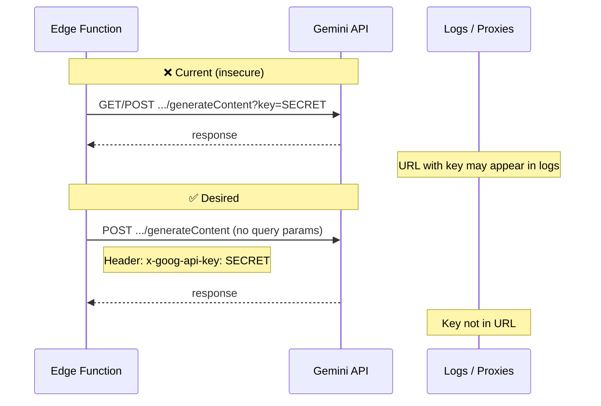

# 071: Move Gemini API key to header (security)

> **Audit ref:** `tasks/audit/07-supa-audit.md` § 1.1 — Blocker.  
> **File:** `src/supabase/functions/server/gemini.tsx`.

---

## Goal

Stop passing the Gemini API key in the request URL. Send it only in the `x-goog-api-key` header so it is not logged in server access logs, referrers, or proxy logs.

---

## Current vs desired flow



---

## Changes required

1. **In `gemini.tsx`**, locate the `generateContent` request (around line 139).
2. **Remove** `?key=${apiKey}` from the URL. Use a constant base URL, e.g.  
   `https://generativelanguage.googleapis.com/v1beta/models/${GEMINI_MODEL}:generateContent`
3. **Add** the API key to the request headers:
   ```ts
   headers: {
     "Content-Type": "application/json",
     "x-goog-api-key": apiKey,
   },
   ```
4. **Verify** no other code path sends the key in the query string (search for `key=` or `apiKey` in URLs in this file).

---

## Acceptance criteria

- [ ] URL has no `key` or `apiKey` query parameter.
- [ ] Every request to Gemini uses `x-goog-api-key` in headers.
- [ ] Existing behavior unchanged (same model, body, response handling).
- [ ] Audit § 1.1 can be marked fixed.
