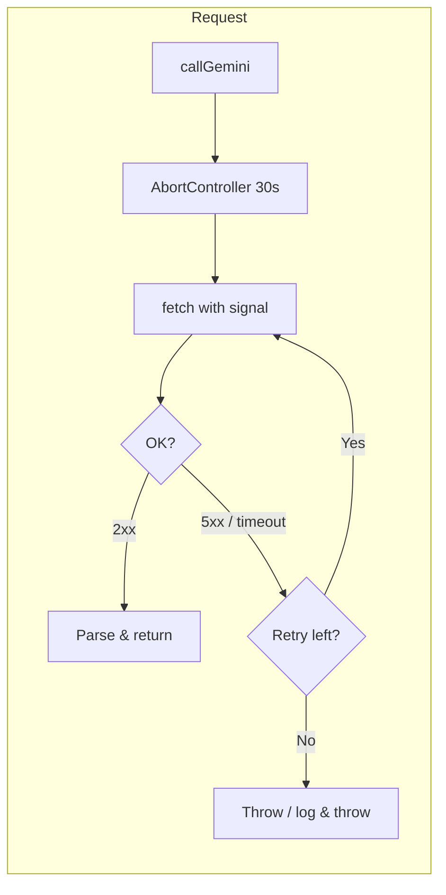
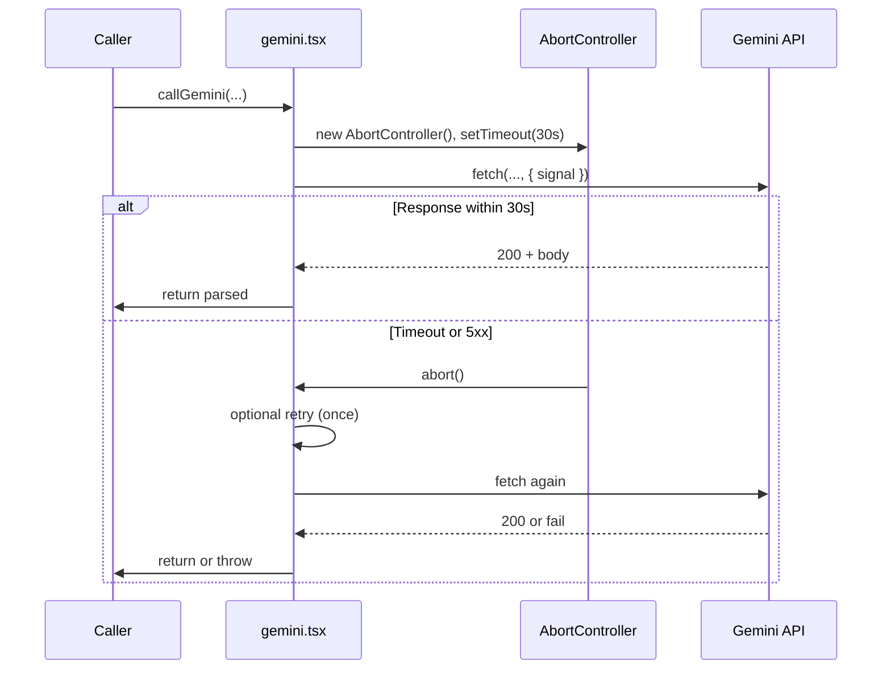

# 072: Add timeout (and optional retry) for Gemini generateContent

> **Audit ref:** `tasks/audit/07-supa-audit.md` § 1.2 — Blocker.  
> **File:** `src/supabase/functions/server/gemini.tsx`.

---

## Goal

Prevent the Edge Function from hanging on slow or stuck Gemini requests. Use a hard timeout (e.g. 30s) via `AbortController` and optionally retry once on 5xx or timeout.

---

## Request flow with timeout and retry

---

## Changes required

1. **AbortController + timeout**  
   Before `fetch`, create `AbortController`, set a timeout (e.g. 30s) that calls `controller.abort()`, and pass `signal: controller.signal` to `fetch`. Clear the timeout on success or after throw.

2. **Handle abort in catch**  
   On `fetch` reject (or throw), check for `error.name === 'AbortError'` and throw a clear message (e.g. "Gemini request timed out after 30s").

3. **Optional retry**  
   If the rule allows: on 5xx or timeout, retry once with the same timeout. Use a short delay (e.g. 1s) before retry to avoid thundering herd. Do not retry on 4xx.

4. **No change** to cache or log logic — run timeout around the single `fetch` (and retry if present), then proceed with existing response handling.

---

## Acceptance criteria

- [ ] Every `generateContent` fetch uses an AbortSignal with a 30s (or configured) deadline.
- [ ] On timeout, the function fails with a clear error (no silent hang).
- [ ] Optional: one retry on 5xx/timeout; no retry on 4xx.
- [ ] Audit § 1.2 can be marked fixed.
