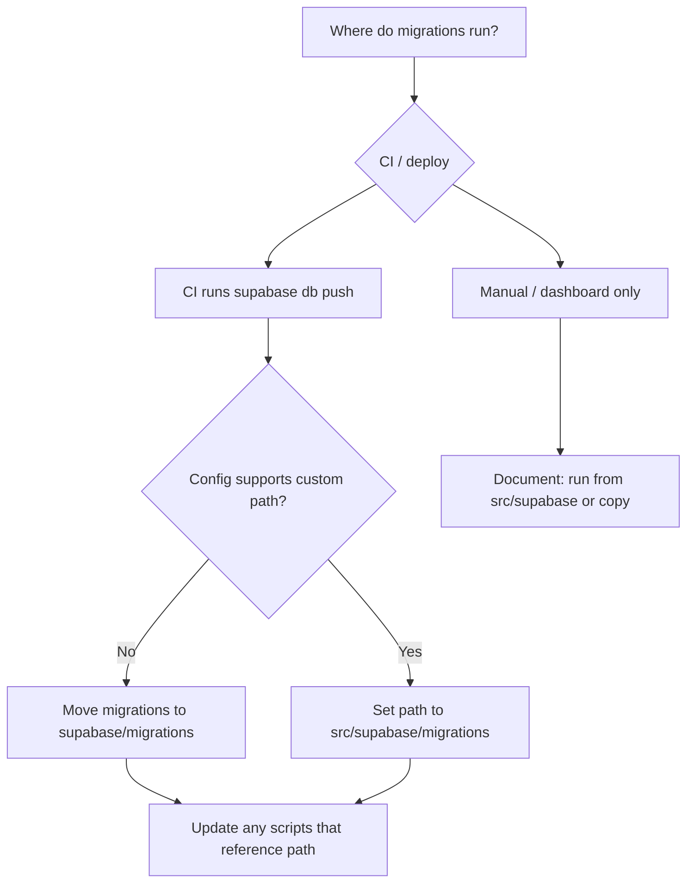
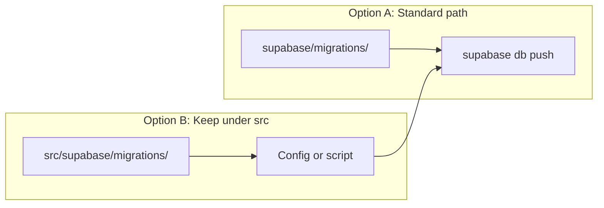

# 073: Align migrations path with Supabase CLI

> **Audit ref:** `tasks/audit/07-supa-audit.md` § 2.1 — Amber.  
> **Current:** `src/supabase/migrations/*.sql`.

---

## Goal

Ensure production and local dev apply the same migrations. Supabase CLI and dashboard typically expect `supabase/migrations/` at repo root; this project uses `src/supabase/migrations/`. Either move migrations to the standard path or configure the CLI to use the current path.

---

## Migration path decision

---

## Steps

1. **Confirm** how migrations are applied today: CLI (`supabase db push`), CI script, or manual SQL. Document it in this prompt or in a README.
2. **If using CLI at repo root:**  
   - **Option A:** Create `supabase/migrations/` at repo root and move (or copy) all `*.sql` from `src/supabase/migrations/` into it, preserving names (`YYYYMMDDHHmmss_description.sql`). Update CI/docs to run from repo root.  
   - **Option B:** If your Supabase config supports a custom migrations directory, set it to `src/supabase/migrations` and ensure `supabase db push` (or link) uses that config.
3. **Update** any CI, docs, or scripts that reference `src/supabase/migrations` so they stay correct.
4. **Verify** one migration runs successfully (e.g. on a branch or local linked project) with the chosen approach.

---

## Acceptance criteria

- [ ] Single documented way to apply migrations (CLI path or script).
- [ ] Production and local use the same migration files (no drift).
- [ ] Audit § 2.1 can be marked addressed.
