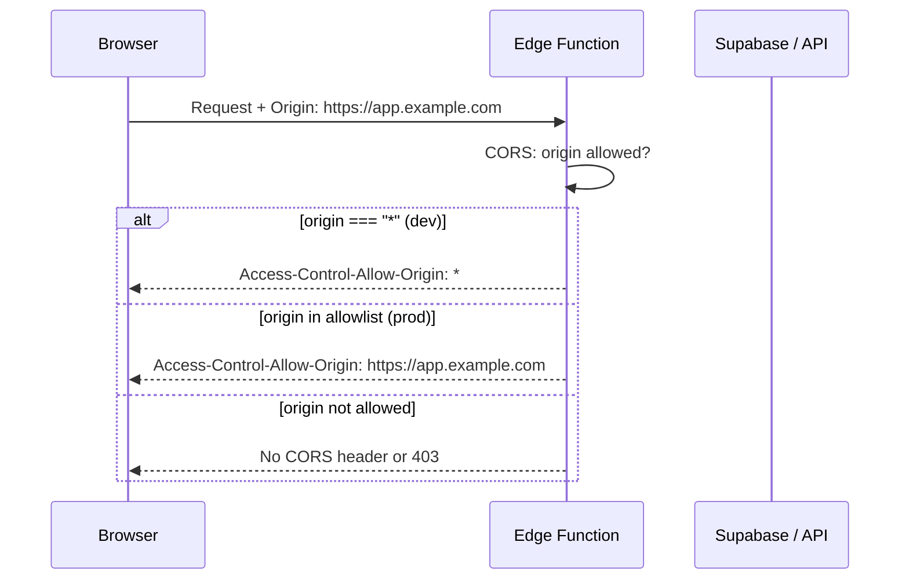

# 074: Restrict CORS origin in production

> **Audit ref:** `tasks/audit/07-supa-audit.md` § 2.2 — Amber.  
> **File:** `src/supabase/functions/server/index.tsx`.

---

## Goal

Keep `origin: "*"` for local dev; in production, restrict CORS to your real front-end origins so only your app can call the Edge Function from the browser.

---

## CORS flow and origin check



```mermaid
flowchart TD
  A[Incoming request] --> B{Environment}
  B -->|development| C[origin: "*"]
  B -->|production| D[origin: allowlist]
  D --> E[Allow only configured origins]
  E --> F[ e.g. https://yourdomain.com ]
  C --> G[Respond with CORS headers]
  E --> G
```

---

## Changes required

1. **Environment**  
   Use an env var (e.g. `ENVIRONMENT` or `NODE_ENV`) or `Deno.env.get("ENVIRONMENT")` to distinguish development vs production. Default to `"development"` if unset.

2. **Origin allowlist**  
   In production, set allowed origins from env, e.g. `ALLOWED_ORIGINS=https://yourdomain.com,https://www.yourdomain.com`, split by comma. No trailing slashes.

3. **CORS config in `index.tsx`**  
   - If development: keep `origin: "*"` (or a dev URL).  
   - If production: set `origin: (origin) => allowlist.includes(origin) ? origin : allowlist[0]` (or return `false` to reject). Use the same `allowMethods`, `allowHeaders`, etc. as today.

4. **Document** in README or env example: which vars to set for prod and example values.

---

## Acceptance criteria

- [ ] Dev/local: CORS still allows browser requests (e.g. `*` or dev origin).
- [ ] Production: only configured front-end origins get `Access-Control-Allow-Origin`.
- [ ] Audit § 2.2 can be marked addressed.
