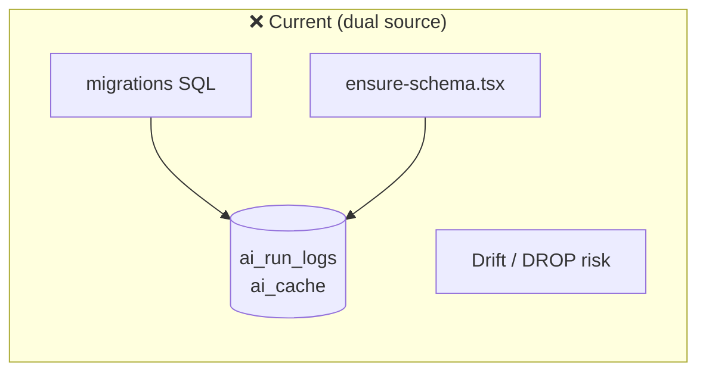
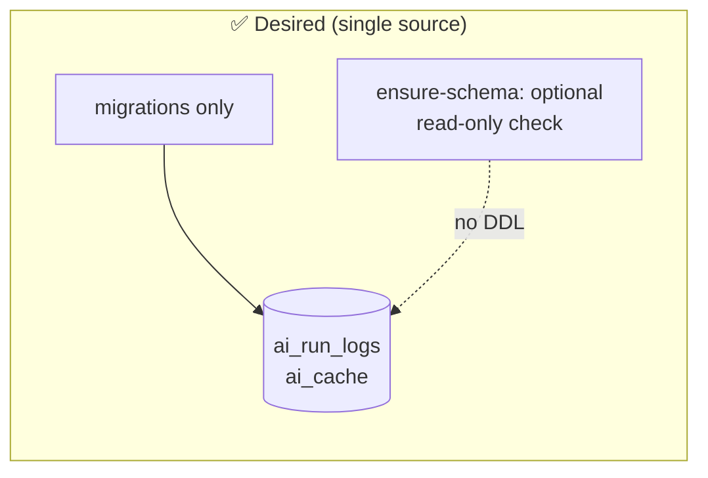
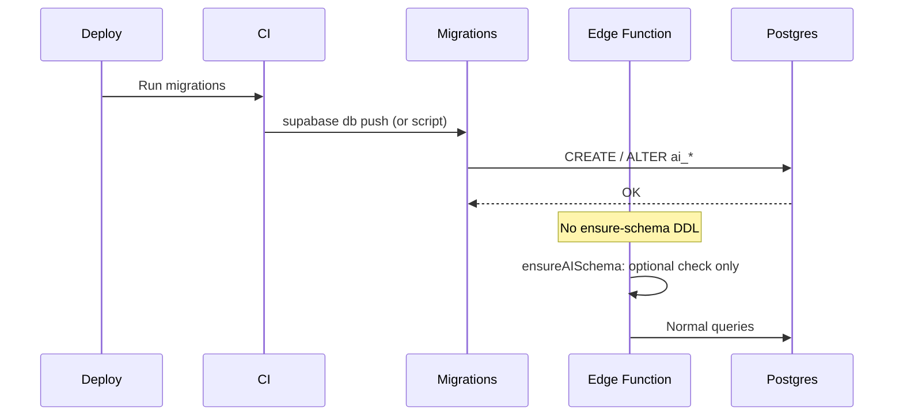

# 075: AI schema — migrations as single source of truth

> **Audit ref:** `tasks/audit/07-supa-audit.md` § 2.3 — Amber.  
> **Files:** `src/supabase/migrations/20260307120100_create_ai_tables.sql`, `src/supabase/functions/server/ensure-schema.tsx`.

---

## Goal

Use migrations as the only place that creates or alters `ai_run_logs` and `ai_cache`. Remove or narrow `ensure-schema.tsx` so it does not run DDL (no CREATE/ALTER/DROP); optionally keep a read-only “schema ok” check or remove it once migrations are guaranteed to run on deploy.

---

## Current vs desired schema ownership

---

## Changes required

1. **Migrations**  
   Ensure `20260307120100_create_ai_tables.sql` (and any follow-ups) define the full schema for `ai_run_logs` and `ai_cache` (columns, PK, indexes, RLS). All new changes go into new migration files, not into code.

2. **ensure-schema.tsx**  
   Choose one:
   - **Option A (preferred):** Remove all DDL. Export `ensureAISchema()` that either does nothing and returns `{ ok: true }`, or only runs a read-only check (e.g. `SELECT 1 FROM ai_cache LIMIT 1` and catch missing table) and returns `{ ok }` / `{ ok: false, error }`. No CREATE, ALTER, or DROP.
   - **Option B:** Keep a minimal “create if not exists” for a single table only if you have a hard requirement for zero-migration deploys; document why and still prefer migrations for all other changes.

3. **Startup / health**  
   If `index.tsx` or health still calls `ensureAISchema()`, keep the call for compatibility; the function no longer mutates schema. Remove any reliance on `ensure-schema` for column existence in other code (they rely on migrations having run).

4. **Deploy**  
   Ensure CI or deploy runs migrations before (or when) deploying Edge Functions so the tables exist. Document this in the prompt or in 073.

---

## Acceptance criteria

- [ ] No DDL in `ensure-schema.tsx` (no CREATE/ALTER/DROP), or only a documented exception.
- [ ] All schema changes for `ai_run_logs` and `ai_cache` are in migration files.
- [ ] Health/startup still works; no regression in AI routes.
- [ ] Audit § 2.3 can be marked addressed.
