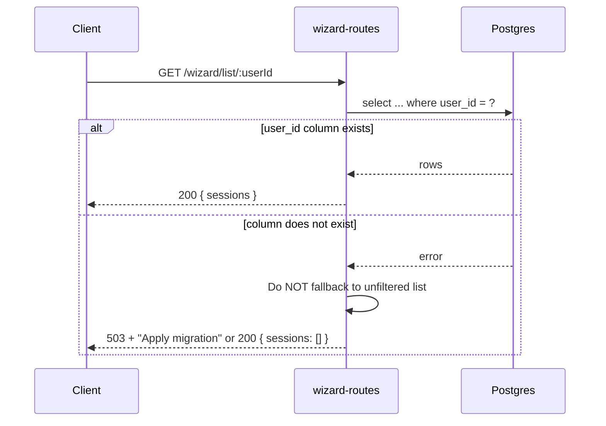

# 076: Wizard list — safe behavior when user_id column missing

> **Audit ref:** `tasks/audit/07-supa-audit.md` § 2.4 — Amber.  
> **File:** `src/supabase/functions/server/wizard-routes.tsx`.

---

## Goal

Avoid returning all users’ sessions when the `user_id` column does not exist. Prefer failing safe (503 or empty list) instead of unfiltered data.

---

## List endpoint decision flow

```mermaid
flowchart TD
  A[GET /wizard/list/:userId] --> B[Query with .eq("user_id", userId)]
  B --> C{Query result}
  C -->|Success| D[Return filtered sessions]
  C -->|Error: column missing| E{Choose behavior}
  E --> F[Option A: Return 503 + message]
  E --> G[Option B: Return empty list]
  E --> H[Option C: Keep fallback but log warning]
  F --> I[No unfiltered data exposed]
  G --> I
  H --> J[Document: apply migration first]
```



---

## Changes required

1. **Remove or change fallback**  
   In the list endpoint, when the user-scoped query fails with a “column does not exist” (or similar) error, do **not** run the unfiltered query that returns all sessions.

2. **Choose safe behavior** (pick one and implement):
   - **Option A (recommended):** Return `503 Service Unavailable` with a JSON body like `{ error: "Database schema outdated; please apply migrations (wizard_sessions.user_id)." }`. This forces clients to surface a clear message and encourages applying `20260307120000_enhance_wizard_sessions.sql`.
   - **Option B:** Return `200 { sessions: [] }` so the UI shows no sessions until migrations are applied. Simpler but less visible that something is wrong.
   - **Option C:** Keep the unfiltered fallback only in development (e.g. check an env var) and in production always return 503 or empty; document the risk.

3. **Ensure migration is applied**  
   Rely on the same migration path as in prompt 073; ensure `20260307120000_enhance_wizard_sessions.sql` adds `user_id` before or when deploying this change.

4. **Logging**  
   When hitting the “column missing” path, log a warning so operators see that migrations may be missing.

---

## Acceptance criteria

- [ ] No response with unfiltered sessions when `user_id` is missing (or only in a documented dev-only path).
- [ ] Either 503 with clear message or 200 with empty list when column is missing.
- [ ] Audit § 2.4 can be marked addressed.
