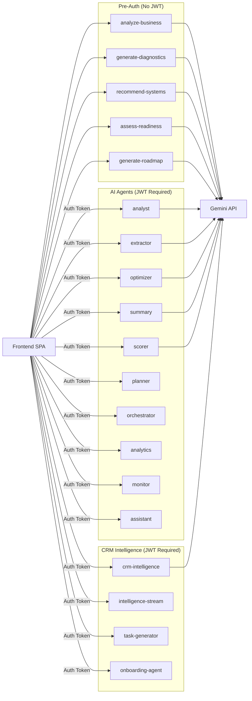

# 057: Edge Function Catalog — All 20 Deployed Functions

> Complete inventory of Supabase Edge Functions with endpoints, purpose, and wiring status

---

## Wizard Functions (verify_jwt: false)

These serve the pre-auth wizard flow. No JWT required — session-based auth via wizard_sessions.

| # | Slug | Purpose | Frontend Caller | Tables |
|---|------|---------|-----------------|--------|
| 1 | `analyze-business` | Step 1: Analyze company from URL/name | `aiApi.analyzeBusiness()` | wizard_sessions, ai_cache |
| 2 | `generate-diagnostics` | Step 2: Industry diagnostic signals | `aiApi.industryDiagnostics()` | wizard_sessions, ai_run_logs |
| 3 | `recommend-systems` | Step 3: AI system ranking | `aiApi.systemRecommendations()` | wizard_sessions, ai_run_logs |
| 4 | `assess-readiness` | Step 4: Readiness score + brief content | `aiApi.readinessScore()` | wizard_sessions, ai_run_logs |
| 5 | `generate-roadmap` | Step 5: Implementation roadmap | `aiApi.generateRoadmap()` | wizard_sessions, ai_run_logs |

**RED FLAG:** `verify_jwt: false` means these are publicly accessible. Rate limiting and input validation are critical.

---

## AI Agent Functions (verify_jwt: true)

Dashboard AI agents requiring authentication.

| # | Slug | Purpose | Frontend Wiring | Status |
|---|------|---------|-----------------|--------|
| 6 | `analyst` | Business analysis agent | Pending (P4) | Deployed |
| 7 | `extractor` | Data extraction from documents | Pending (P4) | Deployed |
| 8 | `optimizer` | Process optimization recommendations | Pending (P4) | Deployed |
| 9 | `summary` | Generate executive summaries | Pending (P4) | Deployed |
| 10 | `scorer` | Scoring/rating engine | Pending (P4) | Deployed |
| 11 | `planner` | Project planning agent | Pending (P4) | Deployed |
| 12 | `orchestrator` | Multi-agent coordination | Pending (P4) | Deployed |
| 13 | `analytics` | Data analytics agent | Pending (P4) | Deployed |
| 14 | `monitor` | Performance monitoring agent | Pending (P4) | Deployed |
| 15 | `assistant` | General AI assistant | Pending (P4) | Deployed |

---

## CRM & Intelligence Functions (verify_jwt: true)

| # | Slug | Purpose | Frontend Wiring | Status |
|---|------|---------|-----------------|--------|
| 16 | `crm-intelligence` | CRM health scoring, deal prediction | Pending | Deployed |
| 17 | `intelligence-stream` | Streaming AI responses | Pending | Deployed |
| 18 | `task-generator` | Auto-generate project tasks | Pending | Deployed |
| 19 | `onboarding-agent` | New client onboarding flow | Pending | Deployed |

---

## Infrastructure Functions

| # | Slug | Purpose | Notes |
|---|------|---------|-------|
| 20 | `make-server-283466b6` | Figma Make server | Auto-generated, manages KV store |

---

## Function Architecture

---

## Security Audit

| Concern | Status | Action |
|---------|--------|--------|
| Wizard functions no JWT | By design | Add rate limiting + CORS restriction |
| CORS `origin: "*"` | Active | P2: Restrict to production domains |
| Gemini API key exposure | Server-side only | OK — key in Supabase secrets |
| Input validation | Partial | Add Zod schemas to all functions |
| Error messages | Verbose in dev | Sanitize for production |
