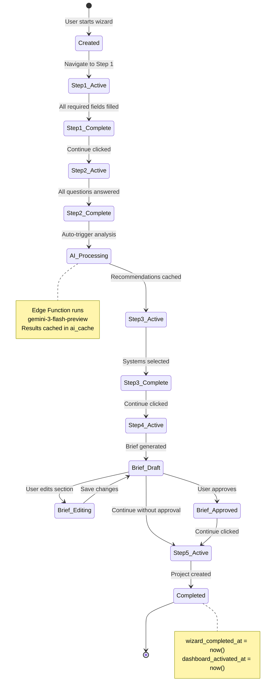
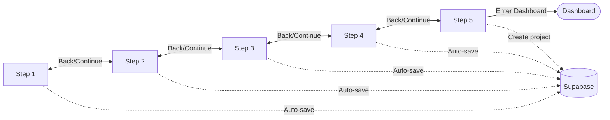

# Wizard Flow Diagrams

## Complete Wizard Flow

```mermaid
flowchart TD
    Start([User Signs Up / Logs In]) --> CheckSession{Existing Wizard Session?}

    CheckSession -->|Yes| Resume[Resume at current_step]
    CheckSession -->|No| CreateSession[Create wizard_session]
    CreateSession --> S1
    Resume --> S1

    S1[Step 1: Business Context] --> V1{Required Fields Complete?}
    V1 -->|No| S1
    V1 -->|Yes| SaveS1[Auto-save to wizard_answers]
    SaveS1 --> S2

    S2[Step 2: Industry Diagnostics] --> V2{All Questions Answered?}
    V2 -->|No| S2
    V2 -->|Yes| SaveS2[Auto-save to wizard_answers]
    SaveS2 --> AITrigger[Trigger AI Analysis Edge Function]
    AITrigger --> CacheResults[Cache Recommendations in ai_cache]
    CacheResults --> S3

    S3[Step 3: System Recommendations] --> UserSelect[User Selects/Deselects Systems]
    UserSelect --> V3{At Least 1 System Selected?}
    V3 -->|No| S3
    V3 -->|Yes| SaveS3[Save to project_systems]
    SaveS3 --> S4

    S4[Step 4: Executive Brief] --> Review[User Reviews Brief]
    Review --> Edit{Wants to Edit?}
    Edit -->|Yes| InlineEdit[Edit Section Inline]
    InlineEdit --> SaveVersion[Save brief_version]
    SaveVersion --> Review
    Edit -->|No| Approve{Approve Brief?}
    Approve -->|Optional| SetApproved[Set status: approved]
    Approve -->|Skip| S5
    SetApproved --> S5

    S5[Step 5: Dashboard Entry] --> CreateProject[Create Project]
    CreateProject --> CreateSnapshot[Create context_snapshot]
    CreateSnapshot --> CreateRoadmap[Create roadmap + phases]
    CreateRoadmap --> SeedTasks[Seed initial tasks]
    SeedTasks --> MarkComplete[Set wizard_completed_at]
    MarkComplete --> Dashboard([Enter Client Dashboard])

    style S1 fill:#F1EEEA,stroke:#0A211F,stroke-width:2px
    style S2 fill:#F1EEEA,stroke:#0A211F,stroke-width:2px
    style S3 fill:#F1EEEA,stroke:#0A211F,stroke-width:2px
    style S4 fill:#F1EEEA,stroke:#0A211F,stroke-width:2px
    style S5 fill:#F1EEEA,stroke:#0A211F,stroke-width:2px
    style Dashboard fill:#84CC16,stroke:#0A211F,stroke-width:2px,color:#fff
    style AITrigger fill:#84CC16,stroke:#0A211F,stroke-width:1px
```

## Wizard Session State Machine

```mermaid
stateDiagram-v2
    [*] --> Created: User starts wizard

    Created --> Step1_Active: Navigate to Step 1

    Step1_Active --> Step1_Complete: All required fields filled
    Step1_Complete --> Step2_Active: Continue clicked

    Step2_Active --> Step2_Complete: All questions answered
    Step2_Complete --> AI_Processing: Auto-trigger analysis
    AI_Processing --> Step3_Active: Recommendations cached

    Step3_Active --> Step3_Complete: Systems selected
    Step3_Complete --> Step4_Active: Continue clicked

    Step4_Active --> Brief_Draft: Brief generated
    Brief_Draft --> Brief_Editing: User edits section
    Brief_Editing --> Brief_Draft: Save changes
    Brief_Draft --> Brief_Approved: User approves
    Brief_Draft --> Step5_Active: Continue without approval
    Brief_Approved --> Step5_Active: Continue clicked

    Step5_Active --> Completed: Project created
    Completed --> [*]

    note right of AI_Processing
        Edge Function runs
        gemini-3-flash-preview
        Results cached in ai_cache
    end note

    note right of Completed
        wizard_completed_at = now()
        dashboard_activated_at = now()
    end note
```

## Navigation & Back Flow

```mermaid
flowchart LR
    S1[Step 1] <-->|Back/Continue| S2[Step 2]
    S2 <-->|Back/Continue| S3[Step 3]
    S3 <-->|Back/Continue| S4[Step 4]
    S4 <-->|Back/Continue| S5[Step 5]
    S5 -->|Enter Dashboard| D([Dashboard])

    S1 -.->|Auto-save| DB[(Supabase)]
    S2 -.->|Auto-save| DB
    S3 -.->|Auto-save| DB
    S4 -.->|Auto-save| DB
    S5 -.->|Create project| DB
```
