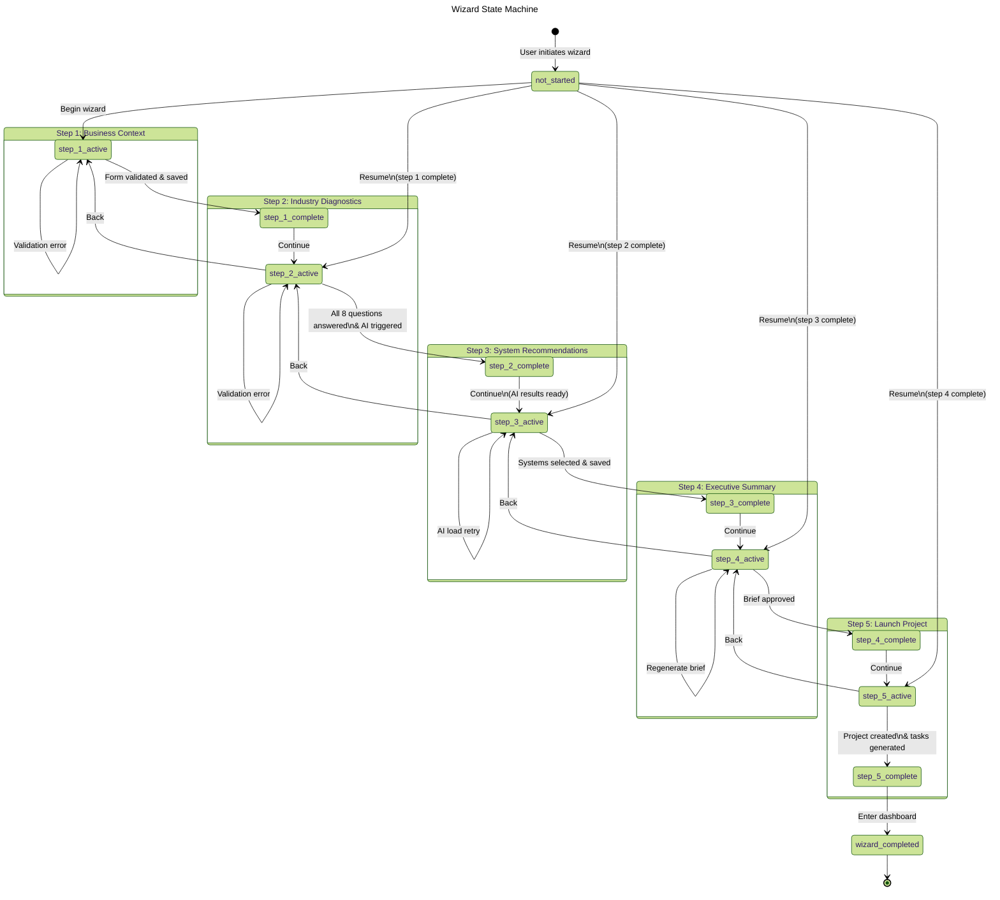
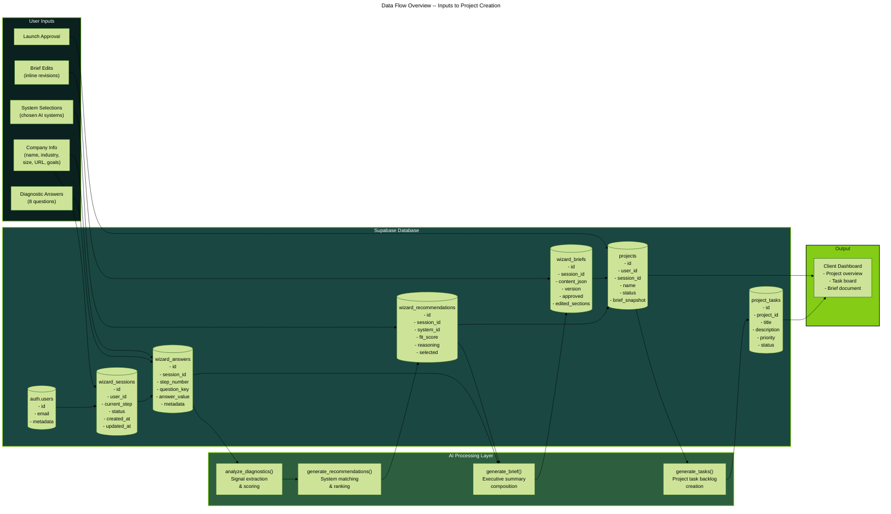
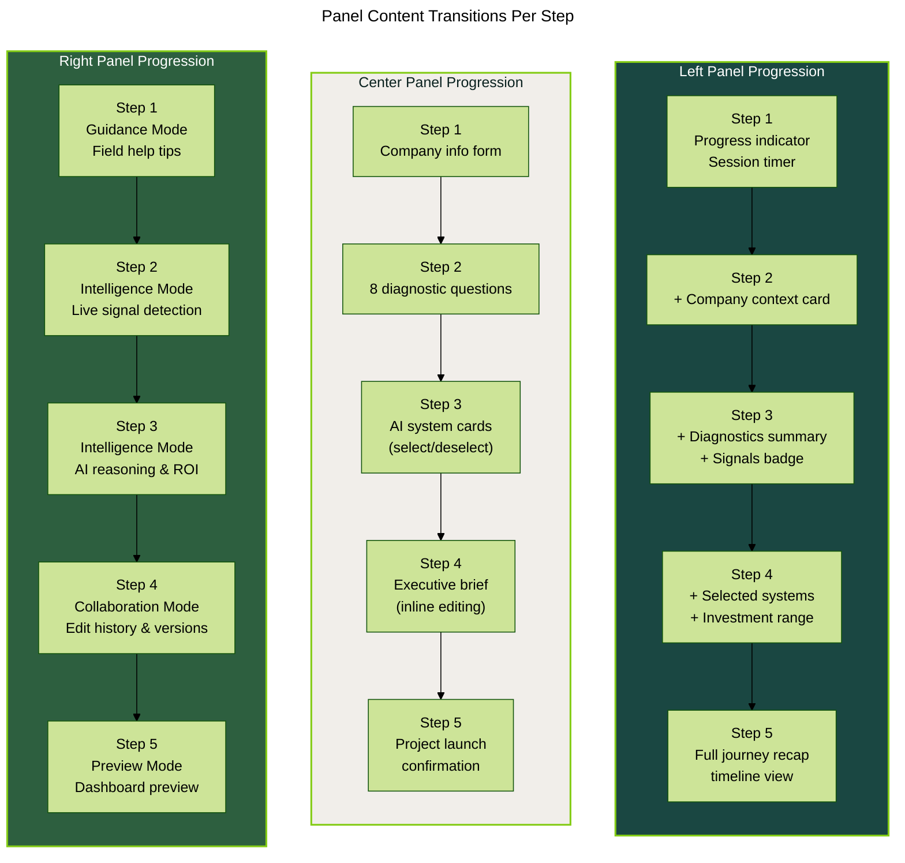

# Sun AI Agency -- Wizard Flow Overview

Comprehensive Mermaid diagrams covering the full 5-step premium onboarding wizard.

---

## 1. Main Wizard Flow

Complete user journey from authentication through project launch.

```mermaid
---
config:
  theme: forest
  flowchart:
    curve: basis
title: Main Wizard Flow -- Complete User Journey
---
flowchart TD
    %% ── Step 0: Auth & Entry ──
    subgraph S0["Step 0: Auth & Entry"]
        direction TB
        LANDING["Landing Page / CTA"]
        LOGIN_CHECK{"Authenticated?"}
        LOGIN["Login / Signup"]
        AUTH_CB["Auth Callback"]
        ROUTE{"Has existing\nwizard session?"}
        WELCOME["Welcome Screen\n(premium intro)"]

        LANDING --> LOGIN_CHECK
        LOGIN_CHECK -- No --> LOGIN
        LOGIN --> AUTH_CB
        AUTH_CB --> ROUTE
        LOGIN_CHECK -- Yes --> ROUTE
        ROUTE -- Yes --> RESUME["Resume at\nlast completed step + 1"]
        ROUTE -- No --> WELCOME
    end

    %% ── Step 1: Business Context ──
    subgraph S1["Step 1: Business Context"]
        direction TB
        S1_FORM["Company Info Form\n- Company name\n- Industry vertical\n- Company size\n- Website URL\n- Business description\n- Primary goals"]
        S1_VALIDATE{"All required\nfields valid?"}
        S1_SAVE["Save to wizard_sessions\n& wizard_answers"]

        S1_FORM --> S1_VALIDATE
        S1_VALIDATE -- No --> S1_FORM
        S1_VALIDATE -- Yes --> S1_SAVE
    end

    %% ── Step 2: Industry Diagnostics ──
    subgraph S2["Step 2: Industry Diagnostics"]
        direction TB
        S2_Q["8 Diagnostic Questions\n(industry-tailored)"]
        S2_PROGRESS["Progress through\nquestions 1-8"]
        S2_SIGNALS["Signal Detection\n(pain points, maturity,\nurgency indicators)"]
        S2_VALIDATE2{"All 8 questions\nanswered?"}
        S2_SAVE["Save answers"]
        S2_AI_TRIGGER["Background AI Trigger:\nanalyze_diagnostics()"]

        S2_Q --> S2_PROGRESS
        S2_PROGRESS --> S2_SIGNALS
        S2_SIGNALS --> S2_VALIDATE2
        S2_VALIDATE2 -- No --> S2_Q
        S2_VALIDATE2 -- Yes --> S2_SAVE
        S2_SAVE --> S2_AI_TRIGGER
    end

    %% ── Step 3: System Recommendations ──
    subgraph S3["Step 3: System Recommendations"]
        direction TB
        S3_LOAD["Load AI-Generated\nRecommendations"]
        S3_DISPLAY["Display Recommended\nAI Systems\n(ranked by fit score)"]
        S3_SELECT["User Selects Systems\n(toggle on/off)"]
        S3_VALIDATE3{"At least 1 system\nselected?"}
        S3_SAVE["Save selected_systems"]

        S3_LOAD --> S3_DISPLAY
        S3_DISPLAY --> S3_SELECT
        S3_SELECT --> S3_VALIDATE3
        S3_VALIDATE3 -- No --> S3_SELECT
        S3_VALIDATE3 -- Yes --> S3_SAVE
    end

    %% ── Step 4: Executive Summary ──
    subgraph S4["Step 4: Executive Summary"]
        direction TB
        S4_GEN["AI Generates\nExecutive Brief"]
        S4_DISPLAY["Display Brief\n- Business overview\n- Key findings\n- Recommended approach\n- Timeline & investment"]
        S4_EDIT["Inline Editing\n(user refines sections)"]
        S4_APPROVE{"User approves\nbrief?"}
        S4_SAVE["Save approved brief"]

        S4_GEN --> S4_DISPLAY
        S4_DISPLAY --> S4_EDIT
        S4_EDIT --> S4_APPROVE
        S4_APPROVE -- No --> S4_EDIT
        S4_APPROVE -- Yes --> S4_SAVE
    end

    %% ── Step 5: Launch Project ──
    subgraph S5["Step 5: Launch Project"]
        direction TB
        S5_CREATE["Create Project Record\nin Supabase"]
        S5_TASKS["AI Generates\nInitial Task Backlog"]
        S5_CONFIRM["Confirmation Screen\n(project summary)"]
        S5_DASHBOARD["Enter Client Dashboard"]

        S5_CREATE --> S5_TASKS
        S5_TASKS --> S5_CONFIRM
        S5_CONFIRM --> S5_DASHBOARD
    end

    %% ── Connections between steps ──
    WELCOME --> S1_FORM
    RESUME --> S1_FORM
    RESUME --> S2_Q
    RESUME --> S3_LOAD
    RESUME --> S4_GEN
    RESUME --> S5_CREATE

    S1_SAVE --> S2_Q
    S2_AI_TRIGGER --> S3_LOAD
    S3_SAVE --> S4_GEN
    S4_SAVE --> S5_CREATE

    %% ── Back navigation ──
    S2_Q -. "Back" .-> S1_FORM
    S3_SELECT -. "Back" .-> S2_Q
    S4_EDIT -. "Back" .-> S3_SELECT
    S5_CONFIRM -. "Back" .-> S4_EDIT

    %% ── Styling ──
    style S0 fill:#0A211F,color:#FFFFFF,stroke:#84CC16,stroke-width:2px
    style S1 fill:#0f2e2b,color:#FFFFFF,stroke:#84CC16,stroke-width:2px
    style S2 fill:#143a36,color:#FFFFFF,stroke:#84CC16,stroke-width:2px
    style S3 fill:#1a4742,color:#FFFFFF,stroke:#84CC16,stroke-width:2px
    style S4 fill:#1f534e,color:#FFFFFF,stroke:#84CC16,stroke-width:2px
    style S5 fill:#84CC16,color:#0A211F,stroke:#0A211F,stroke-width:2px
```

---

## 2. Wizard State Machine

All wizard states and their transitions, including error and resume paths.

---

## 3. Data Flow Overview

How user inputs traverse the system, interact with Supabase tables, and feed AI processing.

---

## 4. AI Processing Pipeline

Sequence diagram showing exactly when and how AI functions are triggered across wizard steps.

```mermaid
---
config:
  theme: forest
title: AI Processing Pipeline -- Trigger Sequence
---
sequenceDiagram
    actor User
    participant WizardUI as Wizard UI
    participant State as Wizard State
    participant Supabase as Supabase DB
    participant AI as AI Engine<br>(Edge Functions)

    Note over User,AI: Step 1 -- Business Context (no AI)

    User->>WizardUI: Fill company info form
    WizardUI->>State: Validate fields
    State->>Supabase: INSERT wizard_answers (step 1)
    Supabase-->>State: Confirmation
    State-->>WizardUI: Advance to Step 2

    Note over User,AI: Step 2 -- Industry Diagnostics + Background AI Trigger

    loop 8 Diagnostic Questions
        User->>WizardUI: Answer question N
        WizardUI->>State: Store answer locally
    end
    User->>WizardUI: Complete Step 2
    WizardUI->>State: Validate all 8 answered
    State->>Supabase: INSERT wizard_answers (step 2)

    rect rgb(45, 95, 63)
        Note over State,AI: Background AI Trigger (non-blocking)
        State->>AI: analyze_diagnostics(session_id)
        AI->>Supabase: READ wizard_answers (steps 1 & 2)
        Supabase-->>AI: All answers
        AI->>AI: Extract signals<br>(pain points, maturity,<br>urgency, budget indicators)
        AI->>AI: Score industry fit<br>for each AI system
        AI->>AI: generate_recommendations()
        AI->>Supabase: INSERT wizard_recommendations<br>(ranked systems with fit_scores)
        AI-->>State: Processing complete
    end

    State-->>WizardUI: Advance to Step 3

    Note over User,AI: Step 3 -- System Recommendations (AI results loaded)

    WizardUI->>Supabase: SELECT wizard_recommendations<br>WHERE session_id = ?
    Supabase-->>WizardUI: Ranked AI system list

    alt AI still processing
        WizardUI->>WizardUI: Show loading state<br>(intelligence panel animation)
        AI-->>Supabase: Results ready
        WizardUI->>Supabase: Poll / realtime subscription
        Supabase-->>WizardUI: Ranked AI system list
    end

    User->>WizardUI: Toggle systems on/off
    User->>WizardUI: Confirm selections
    WizardUI->>Supabase: UPDATE wizard_recommendations<br>SET selected = true/false
    State-->>WizardUI: Advance to Step 4

    Note over User,AI: Step 4 -- Executive Summary (AI generates brief)

    rect rgb(45, 95, 63)
        Note over WizardUI,AI: Brief Generation
        WizardUI->>AI: generate_brief(session_id)
        AI->>Supabase: READ wizard_answers + wizard_recommendations (selected)
        Supabase-->>AI: Full context
        AI->>AI: Compose executive brief<br>(overview, findings,<br>approach, timeline, investment)
        AI->>Supabase: INSERT wizard_briefs<br>(content_json, version=1)
        AI-->>WizardUI: Brief ready
    end

    WizardUI-->>User: Display executive brief

    opt User edits sections
        User->>WizardUI: Inline edit section
        WizardUI->>Supabase: UPDATE wizard_briefs<br>SET edited_sections, version++
    end

    User->>WizardUI: Approve brief
    WizardUI->>Supabase: UPDATE wizard_briefs<br>SET approved = true

    State-->>WizardUI: Advance to Step 5

    Note over User,AI: Step 5 -- Launch Project (project + task generation)

    WizardUI->>Supabase: INSERT projects<br>(user_id, session_id,<br>brief_snapshot)
    Supabase-->>WizardUI: project_id

    rect rgb(45, 95, 63)
        Note over WizardUI,AI: Task Generation
        WizardUI->>AI: generate_tasks(project_id, session_id)
        AI->>Supabase: READ wizard_briefs + wizard_recommendations (selected)
        Supabase-->>AI: Brief + systems
        AI->>AI: Generate initial task backlog<br>(broken down by system,<br>prioritized, estimated)
        AI->>Supabase: INSERT project_tasks (batch)
        AI-->>WizardUI: Tasks created
    end

    WizardUI-->>User: Show confirmation + project summary
    User->>WizardUI: Enter Dashboard
    WizardUI->>WizardUI: Navigate to /dashboard
```

---

## 5. Three-Panel Layout Architecture

How the left, center, and right panels adapt their content at each wizard step.

```mermaid
---
config:
  theme: forest
  block:
    padding: 8
title: Three-Panel Layout Architecture
---
block-beta
    columns 3

    %% ── Header row ──
    block:HEADER:3
        columns 3
        H1["LEFT PANEL\n(Progress + Context)"]
        H2["CENTER PANEL\n(Main Content)"]
        H3["RIGHT PANEL\n(Intelligence / Guidance)"]
    end

    %% ── Step 1 row ──
    block:L1
        columns 1
        L1A["Step Indicator\n1 of 5 active"]
        L1B["Progress: 0%"]
        L1C["Session Timer"]
    end
    block:C1
        columns 1
        C1A["STEP 1"]
        C1B["Company Info Form"]
        C1C["- Name, Industry\n- Size, URL\n- Description, Goals"]
    end
    block:R1
        columns 1
        R1A["Guidance Mode"]
        R1B["'Tell us about\nyour business'"]
        R1C["Field-level help\ntips & examples"]
    end

    %% ── Step 2 row ──
    block:L2
        columns 1
        L2A["Step Indicator\n2 of 5 active"]
        L2B["Progress: 20%"]
        L2C["Company Context\nSummary Card"]
    end
    block:C2
        columns 1
        C2A["STEP 2"]
        C2B["8 Diagnostic Questions"]
        C2C["Question progress\n(3/8 answered)\nSignal indicators"]
    end
    block:R2
        columns 1
        R2A["Intelligence Mode"]
        R2B["Signal Detection\nLive Feed"]
        R2C["Detected patterns:\n- Pain points\n- Maturity level\n- Urgency signals"]
    end

    %% ── Step 3 row ──
    block:L3
        columns 1
        L3A["Step Indicator\n3 of 5 active"]
        L3B["Progress: 50%"]
        L3C["Diagnostics\nSummary Card\n+ Signals Found"]
    end
    block:C3
        columns 1
        C3A["STEP 3"]
        C3B["AI System\nRecommendations"]
        C3C["Cards with fit scores\nToggle select/deselect\nSystem details expand"]
    end
    block:R3
        columns 1
        R3A["Intelligence Mode"]
        R3B["AI Reasoning"]
        R3C["'Why we recommend\nthis system'\nFit score breakdown\nROI projections"]
    end

    %% ── Step 4 row ──
    block:L4
        columns 1
        L4A["Step Indicator\n4 of 5 active"]
        L4B["Progress: 75%"]
        L4C["Selected Systems\nSummary Card\n+ Investment Range"]
    end
    block:C4
        columns 1
        C4A["STEP 4"]
        C4B["Executive Brief"]
        C4C["Editable sections:\n- Overview\n- Findings\n- Approach\n- Timeline\n- Investment"]
    end
    block:R4
        columns 1
        R4A["Collaboration Mode"]
        R4B["Edit History"]
        R4C["Section-level\nversion tracking\nRegenerate section\nRevert to AI draft"]
    end

    %% ── Step 5 row ──
    block:L5
        columns 1
        L5A["Step Indicator\n5 of 5 active"]
        L5B["Progress: 95%"]
        L5C["Full Journey\nRecap Timeline"]
    end
    block:C5
        columns 1
        C5A["STEP 5"]
        C5B["Launch Project"]
        C5C["Project confirmation\nTask preview\nTeam assignment\nLaunch button"]
    end
    block:R5
        columns 1
        R5A["Preview Mode"]
        R5B["Dashboard Preview"]
        R5C["What your dashboard\nwill look like\nNext steps after\nlaunch"]
    end

    %% ── Styling ──
    style HEADER fill:#0A211F,color:#FFFFFF,stroke:#84CC16,stroke-width:2px
    style L1 fill:#1a4742,color:#FFFFFF,stroke:#84CC16
    style C1 fill:#F1EEEA,color:#0A211F,stroke:#84CC16
    style R1 fill:#2d5f3f,color:#FFFFFF,stroke:#84CC16
    style L2 fill:#1a4742,color:#FFFFFF,stroke:#84CC16
    style C2 fill:#F1EEEA,color:#0A211F,stroke:#84CC16
    style R2 fill:#2d5f3f,color:#FFFFFF,stroke:#84CC16
    style L3 fill:#1a4742,color:#FFFFFF,stroke:#84CC16
    style C3 fill:#F1EEEA,color:#0A211F,stroke:#84CC16
    style R3 fill:#2d5f3f,color:#FFFFFF,stroke:#84CC16
    style L4 fill:#1a4742,color:#FFFFFF,stroke:#84CC16
    style C4 fill:#F1EEEA,color:#0A211F,stroke:#84CC16
    style R4 fill:#2d5f3f,color:#FFFFFF,stroke:#84CC16
    style L5 fill:#1a4742,color:#FFFFFF,stroke:#84CC16
    style C5 fill:#F1EEEA,color:#0A211F,stroke:#84CC16
    style R5 fill:#2d5f3f,color:#FFFFFF,stroke:#84CC16
```

---

## 6. Panel Content Transition Flow

Supplementary flowchart showing how each panel transitions its content as the user progresses.

---

## Quick Reference

| Step | Center Panel | Left Panel Adds | Right Panel Mode | AI Trigger |
|------|-------------|----------------|-----------------|------------|
| 0 | Auth / Welcome | -- | -- | None |
| 1 | Company info form | Progress indicator, timer | Guidance (field tips) | None |
| 2 | 8 diagnostic questions | Company context card | Intelligence (signal detection) | `analyze_diagnostics()` on completion |
| 3 | AI system recommendations | Diagnostics summary | Intelligence (AI reasoning) | Loads `generate_recommendations()` results |
| 4 | Executive brief (editable) | Selected systems card | Collaboration (edit history) | `generate_brief()` on entry |
| 5 | Launch project | Full journey recap | Preview (dashboard preview) | `generate_tasks()` on project creation |
