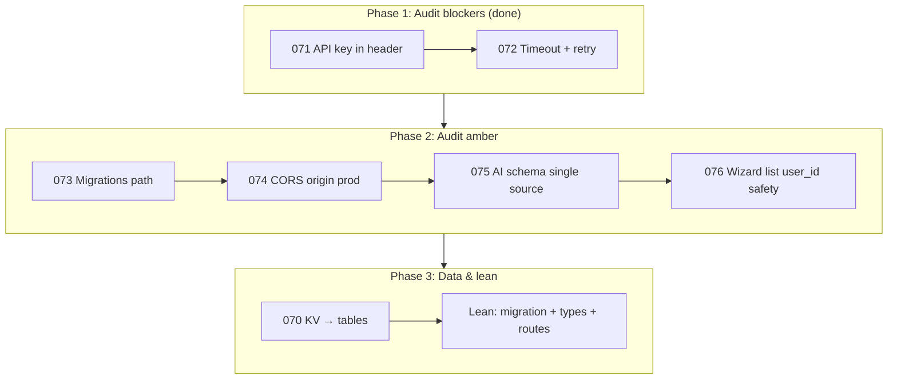

# Next steps: implementation order and verification

Systematic, production-ready sequence with verification at each stage.  
**Refs:** `tasks/audit/07-supa-audit.md`, `tasks/prompts/data/README-audit-07-prompts.md`, `tasks/lean/11-plan.md`.

---

## Implementation order (sequential)

| Step | Prompt / task | Owner | Verify |
|------|----------------|-------|--------|
| **1** | 071 Gemini API key in header | ✅ Done | Grep: no `?key=` in gemini.tsx; header `x-goog-api-key` present |
| **2** | 072 Gemini timeout + retry | ✅ Done | AbortController 30s; retry on 5xx/timeout; clear timeout in catch |
| **3** | 073 Migrations path vs CLI | ✅ Done | All migrations in supabase/migrations; README + doc |
| **4** | 074 CORS origin in production | ✅ Done | ENVIRONMENT + ALLOWED_ORIGINS; corsOrigin() in index.tsx |
| **5** | 075 AI schema single source | ✅ Done | ensure-schema read-only check; no DDL |
| **6** | 076 Wizard list when user_id missing | ✅ Done | 503 + message when column missing; no unfiltered fallback |
| **7** | 070 KV → workflow/financial tables | Pending | New migrations; routes use Supabase; kv_store removed/stubbed |
| **8** | Lean: strategy engine (11-plan) | Pending | Migration 20260308120000; types; strategy-routes; agents |

---

## Verification checklist (per step)

- **Code:** Changes in correct files; no regressions (same API surface).
- **Security:** No secrets in URLs or logs; auth/RLS where required.
- **Run:** Build passes (`npm run build`); Edge Functions deploy (Supabase CLI or dashboard).
- **Proof:** Grep/script or manual test; document in this file or in prompt.

---

## Phase 1 verification (071 + 072) — proof

| Check | Command / method | Result |
|-------|------------------|--------|
| No API key in URL | `grep -n "key=\$\{\|generateContent?" src/supabase/functions/server/gemini.tsx` | No matches ✅ |
| Key in header | `grep -n "x-goog-api-key" src/supabase/functions/server/gemini.tsx` | Present ✅ |
| Timeout constant | `grep -n "GEMINI_REQUEST_TIMEOUT_MS\|AbortController\|controller.abort" src/supabase/functions/server/gemini.tsx` | 30_000 ms, AbortController used ✅ |
| Retry on 5xx | Logic: `response.status >= 500 && attempt < maxAttempts - 1` → continue | Implemented ✅ |
| Retry on timeout | Inner catch: `isAbort && attempt < maxAttempts - 1` → lastError; continue | Implemented ✅ |
| Clear timeout | `clearTimeout(timeoutId)` in success path and inner catch | No leak ✅ |

---

## How to run tests (this repo)

- **Vite app:** `npm run build` — ensures frontend and any shared code compile.  
  **Last run:** `npm run build` succeeded (exit 0, 3.19s).
- **Edge Functions:** Deno; not built by Vite. To validate:
  - Deploy to Supabase (e.g. `supabase functions deploy`) and hit an AI route that uses `callGemini`, or
  - Run `deno check src/supabase/functions/server/gemini.tsx` if Deno is installed (optional).
- **Manual:** After deploy, call an endpoint that triggers Gemini (e.g. wizard analysis); confirm 200 and no key in server logs.

---

## Phase 2 verification (073–076) — proof

| Step | Check | Command / method | Result |
|------|--------|------------------|--------|
| **073** | Migrations in one place | `ls supabase/migrations/*.sql` includes 2026030712* | 5 files copied ✅ |
| **073** | Doc exists | `supabase/migrations/README.md` | Present ✅ |
| **074** | CORS env-based | `grep -n "ENVIRONMENT\|ALLOWED_ORIGINS\|corsOrigin" src/supabase/functions/server/index.tsx` | Present ✅ |
| **074** | Dev keeps * | Logic: `!isProd \|\| allowedOrigins.length === 0` → `"*"` | Implemented ✅ |
| **075** | No DDL in ensure-schema | `grep "CREATE \|ALTER \|DROP " src/supabase/functions/server/ensure-schema.tsx` | No matches ✅ |
| **075** | Read-only check | ensure-schema uses adminClient().from().select().limit(1) | Implemented ✅ |
| **076** | No unfiltered fallback | `grep "getByPrefix\|all sessions" wizard-routes.tsx` (excl. comment) | No matches ✅ |
| **076** | 503 when column missing | wizard list returns 503 + schema message on column error | Implemented ✅ |
| **Build** | App builds | `npm run build` | Exit 0 ✅ |

**Edge Functions env (production):** Set `ENVIRONMENT=production` and `ALLOWED_ORIGINS=https://yourdomain.com,https://www.yourdomain.com` (comma-separated, no trailing slashes). Omit or use `ENVIRONMENT=development` for local; CORS then allows `*`.

**Deploy and test:** See **`docs/DEPLOY-EDGE-FUNCTIONS.md`** for: syncing function code to `supabase/functions/server/`, linking project, applying migrations, setting secrets, deploying `server`, and curl tests for CORS and wizard list (200 vs 503).

**Deploy verification (2026-03-09):** Edge Function `server` deployed successfully. Health returns `{"status":"ok","schema":"migrated"}`. Wizard list returns **503** with message "Database schema outdated; please apply migrations (wizard_sessions.user_id)." when `user_id` column is missing (076 behavior confirmed). CORS returns `access-control-allow-origin: *` when `ENVIRONMENT` is not production; set `ENVIRONMENT=production` and `ALLOWED_ORIGINS` for production CORS.

---

## Suggested improvements (post–Phase 1)

1. **Configurable timeout:** Read `GEMINI_REQUEST_TIMEOUT_MS` from env (e.g. `Deno.env.get("GEMINI_TIMEOUT_MS")`) with fallback 30_000.
2. **Audit doc update:** In `07-supa-audit.md`, mark § 1.1 and § 1.2 as fixed; optionally bump gemini.tsx % and status.
3. **Optional:** Add a minimal integration test (e.g. script that mocks fetch and asserts URL has no `key=` and request has `x-goog-api-key` header).

---

## Status summary

| Phase | Steps | Status |
|-------|-------|--------|
| 1 – Blockers | 071, 072 | ✅ Implemented and verified |
| 2 – Amber | 073–076 | ✅ Implemented and verified |
| 3 – Data + Lean | 070, 11-plan | Pending |

Next: Phase 3 — 070 (KV → tables), then Lean strategy engine from 11-plan. After each step, run the relevant verification and record in this doc.

---

## Phase 2 improvements applied

- **073:** Single canonical path `supabase/migrations/` (16 total files including README); README documents `supabase db push` from repo root.
- **074:** CORS origin callback compatible with Hono `(origin, c)`; returns `undefined` when origin not allowed (per Hono docs).
- **075:** ensure-schema no longer uses `postgres` or `SUPABASE_DB_URL`; uses `adminClient()` for a lightweight read-only check.
- **076:** Wizard list returns 503 with explicit message when `user_id` column is missing; no code path returns unfiltered sessions.
