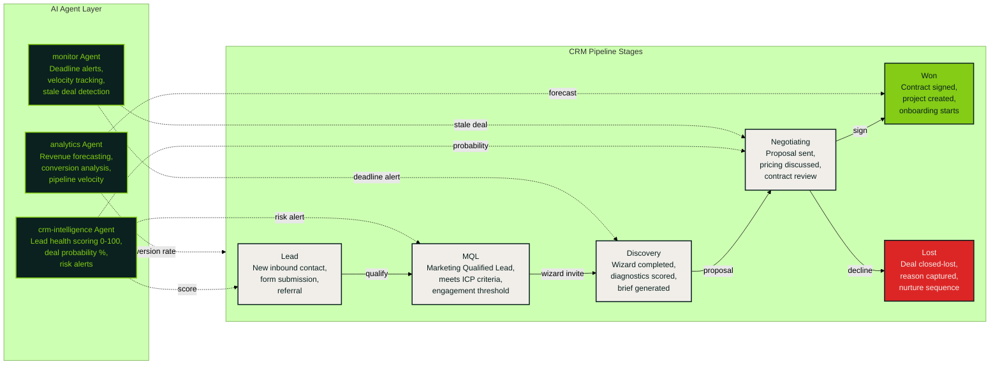
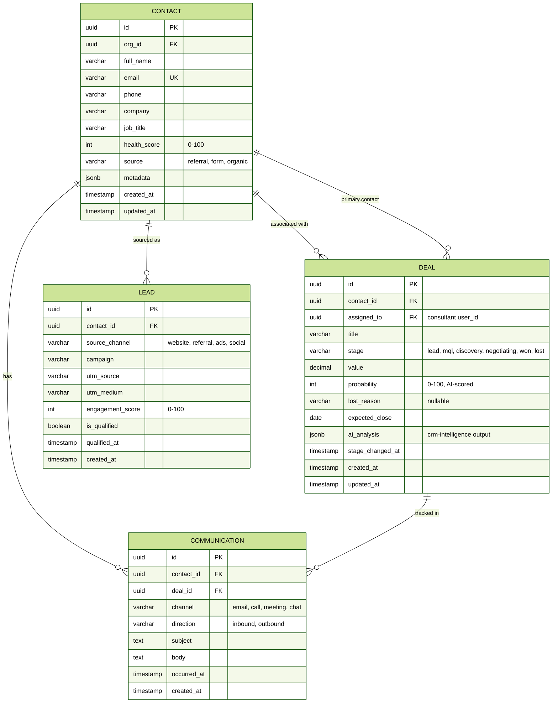

# Agency Dashboard & CRM Pipeline

The agency-facing dashboard provides executive KPIs, client management, deal pipeline, project tracking, task execution, wizard session management, and analytics. Role-based access separates Owner (full) from Consultant (assigned clients only).

## Dashboard Route Structure

```mermaid
---
config:
  theme: forest
---
flowchart TB
    subgraph Admin["/admin — Agency Dashboard"]
        direction TB
        Overview["Overview<br/>Executive KPIs: clients, projects,<br/>revenue, pipeline value, velocity"]

        subgraph Routes["Dashboard Routes"]
            direction TB
            Clients["/admin/clients<br/>Client list, health scores 0-100,<br/>detail view, activity timeline"]
            Pipeline["/admin/pipeline<br/>Deal kanban board,<br/>5-stage pipeline"]
            Projects["/admin/projects<br/>Project list by phase,<br/>delivery tracking, team task board"]
            Tasks["/admin/tasks<br/>Daily execution board,<br/>workload view per consultant"]
            Wizards["/admin/wizards<br/>Wizard session management,<br/>review client discovery data"]
            Analytics["/admin/analytics<br/>Revenue trends via Recharts,<br/>conversion funnel, AI usage"]
            Settings["/admin/settings<br/>Org profile, team members,<br/>roles, service catalog config"]
        end
    end

    subgraph RBAC["Role-Based Access Control"]
        direction LR
        Owner["Owner Role<br/>Full access to all routes,<br/>all clients, settings, billing"]
        Consultant["Consultant Role<br/>Assigned clients only,<br/>own tasks, limited analytics"]
    end

    Owner -->|full access| Admin
    Consultant -->|filtered access| Clients
    Consultant -->|filtered access| Tasks
    Consultant -->|filtered access| Projects

    Overview --> Clients
    Overview --> Pipeline
    Overview --> Projects
    Overview --> Tasks
    Overview --> Wizards
    Overview --> Analytics
    Overview --> Settings

    classDef adminNode fill:#0A211F,stroke:#84CC16,stroke-width:2px,color:#F1EEEA
    classDef routeNode fill:#F1EEEA,stroke:#0A211F,stroke-width:2px,color:#0A211F
    classDef roleNode fill:#1a5c3a,stroke:#84CC16,stroke-width:2px,color:#F1EEEA

    class Admin,Overview adminNode
    class Clients,Pipeline,Projects,Tasks,Wizards,Analytics,Settings routeNode
    class Owner,Consultant roleNode
```

## CRM Pipeline — Deal Flow & AI Agents

## CRM Data Model

