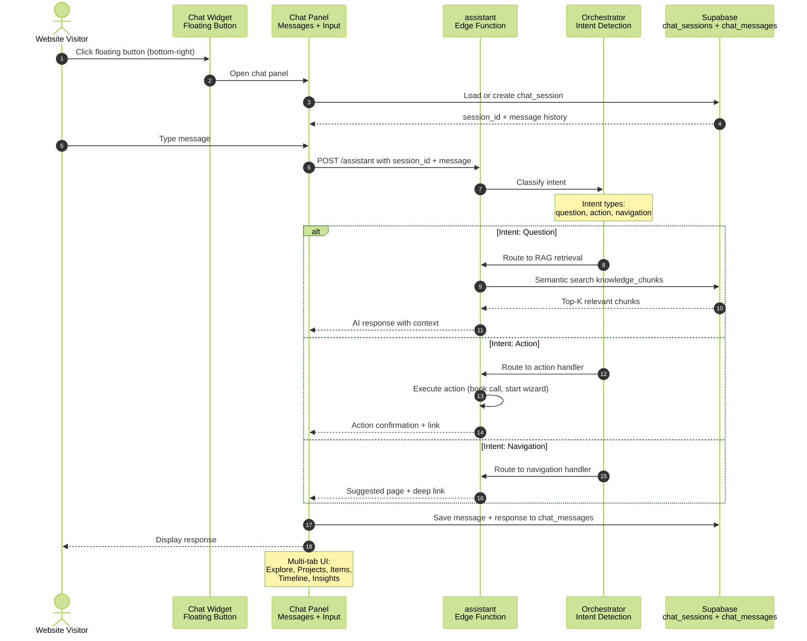
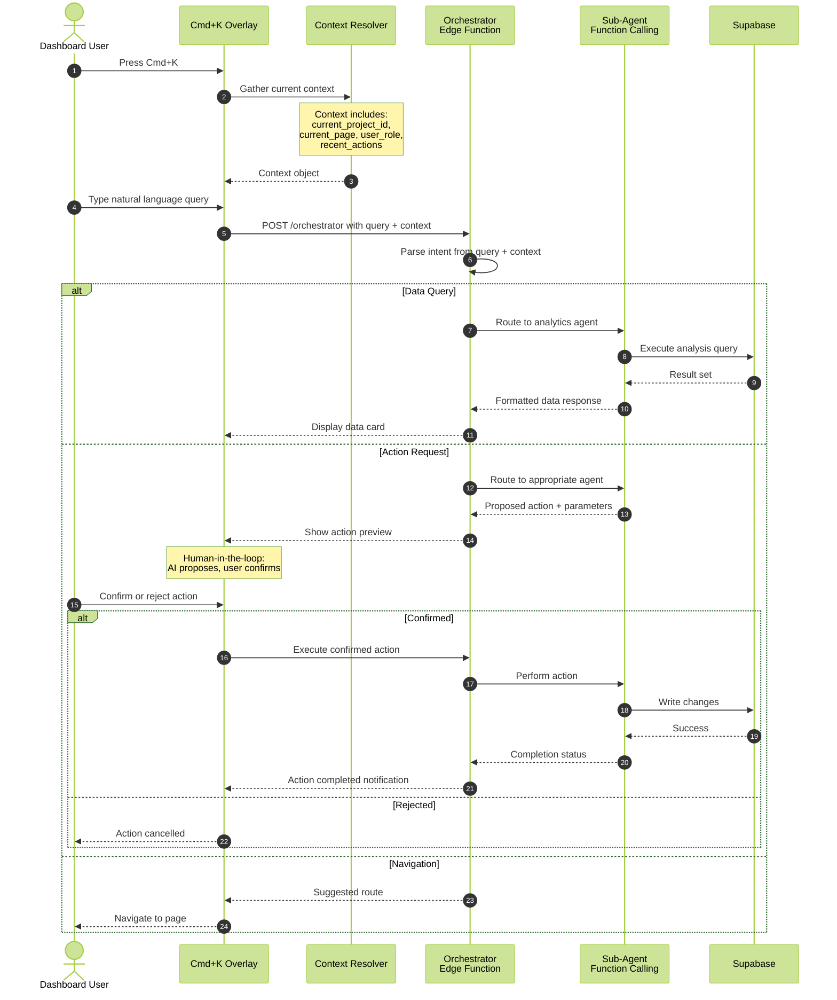
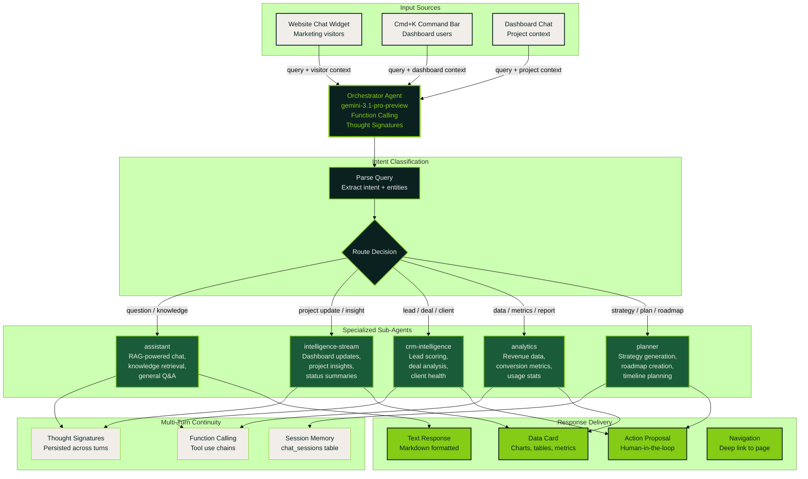

# Chatbot System & Command Bar

Three interactive AI interfaces: a website chatbot widget for marketing visitors, a Cmd+K command bar for dashboard power users, and an intent orchestrator that routes queries to specialized sub-agents.

## Website Chatbot Widget — Chat Flow

## Dashboard Cmd+K Command Bar — Interaction Flow

## Intent Orchestrator — Agent Routing

