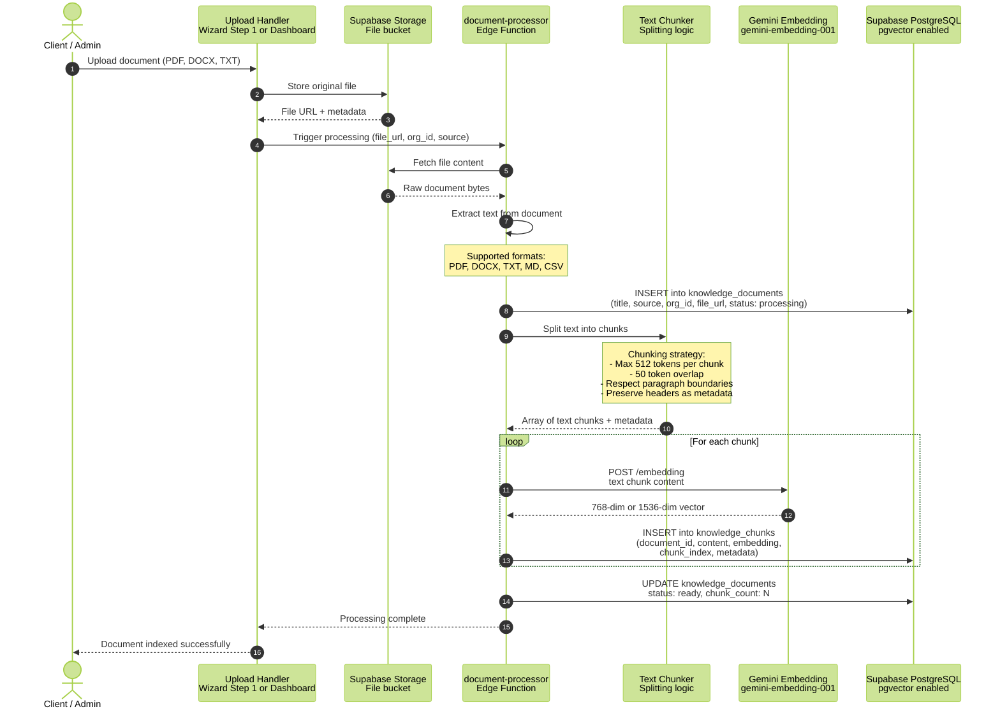
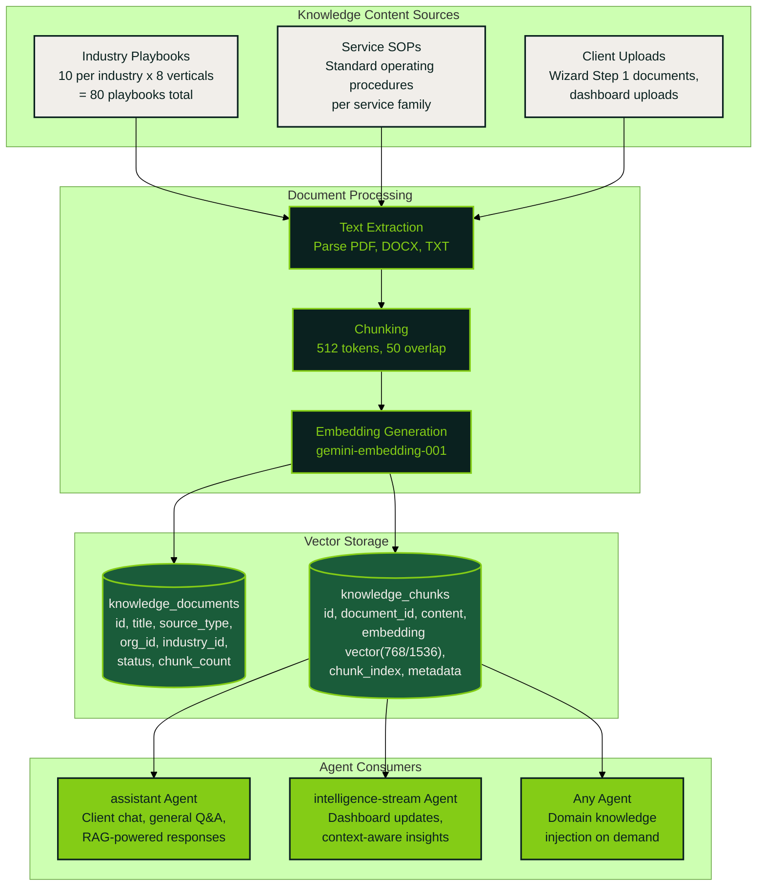
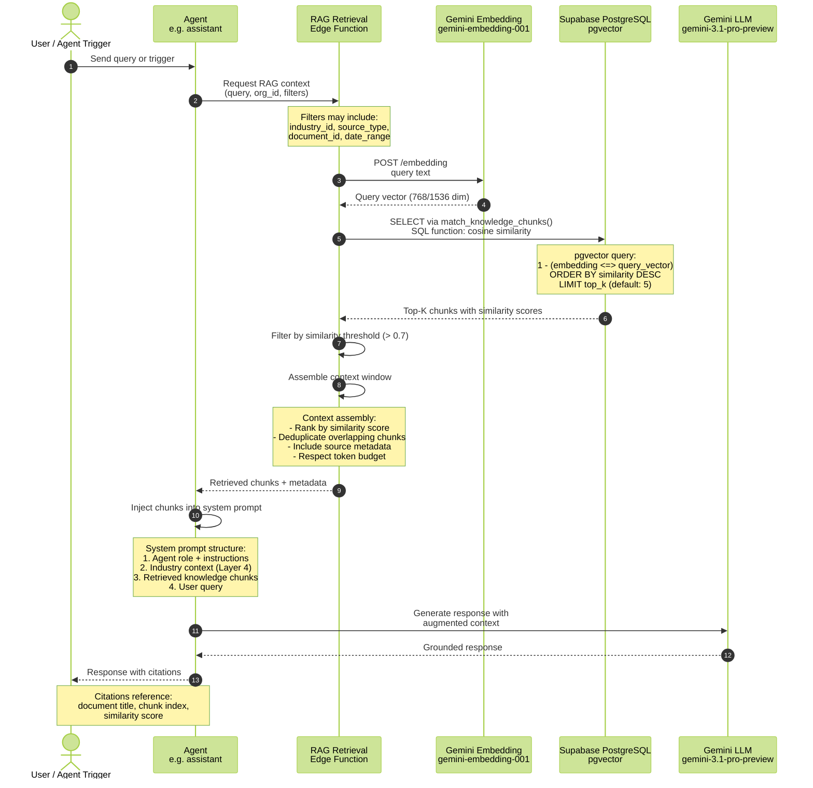
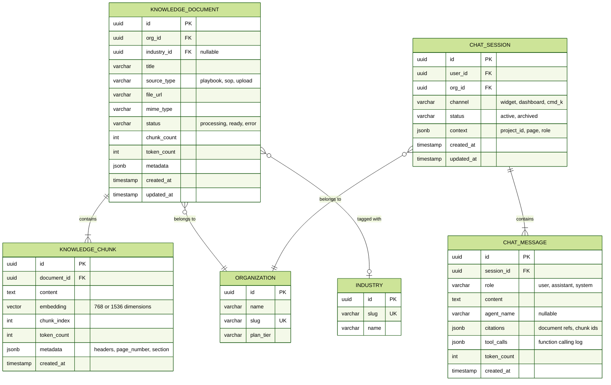

# RAG Pipeline & Knowledge Base

Document processing pipeline ingests uploads, chunks text, generates embeddings via `gemini-embedding-001`, and stores vectors in pgvector. The RAG retrieval flow enables agents to answer questions grounded in domain-specific knowledge.

## Document Processing Pipeline

## Content Seeding — Industry Playbooks

## RAG Retrieval Flow

## Knowledge Base Data Model

