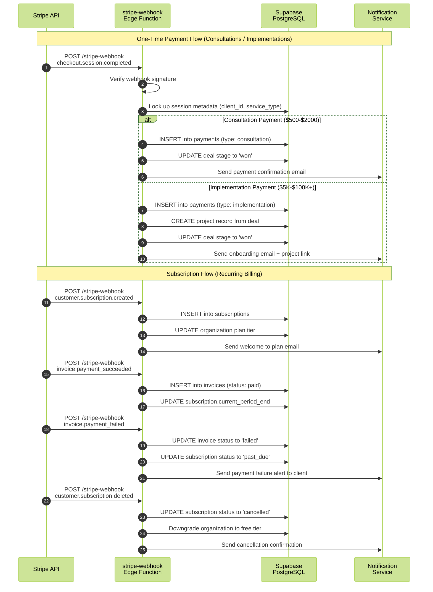
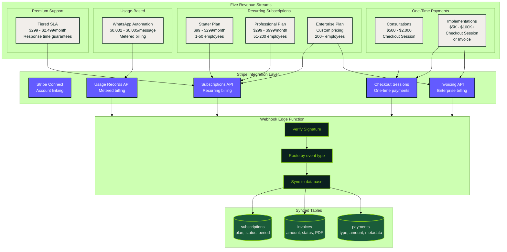
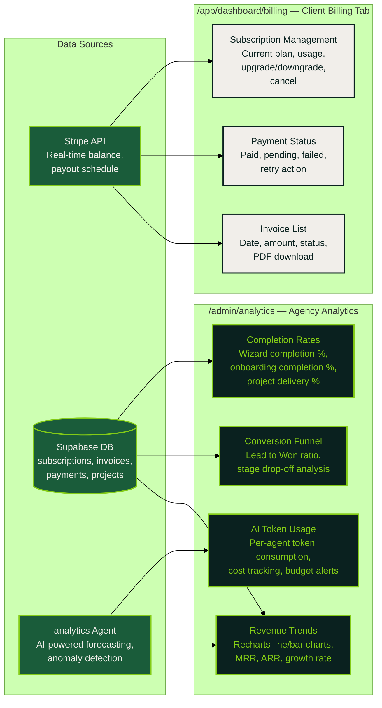

# Revenue & Billing — Stripe Integration

Stripe powers all payment processing: Checkout Sessions for one-time payments, Subscriptions for recurring billing, and Webhooks for event-driven state synchronization. The agency earns through five distinct revenue streams.

## Stripe Webhook Processing Flow

## Revenue Streams & Billing Pipeline

## Client Billing & Agency Analytics Views

