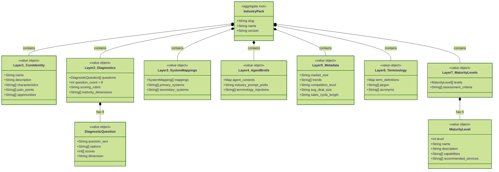
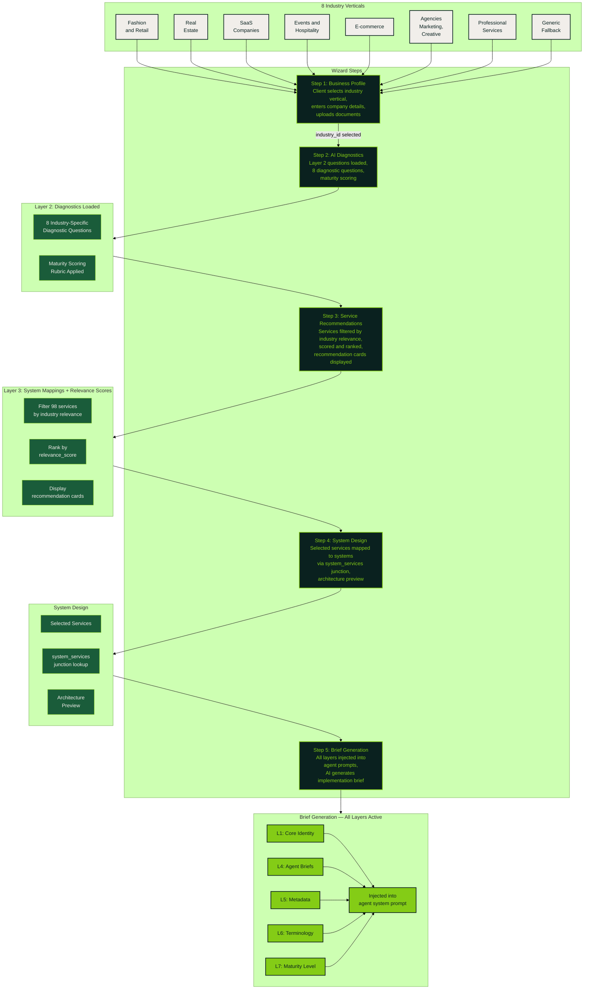

# Services Catalog & Industry Packs

98 services across 15 families, mapped to AI systems and scored for industry relevance. Industry packs provide a 7-layer configuration structure per vertical, feeding context into the wizard and agent system.

## Service / System / Industry Relationships

```mermaid
---
config:
  theme: forest
---
classDiagram
    class Service {
        <<entity>>
        +uuid id
        +String name
        +String description
        +String family
        +String complexity
        +int base_hours
        +decimal base_price
        +boolean is_active
    }

    class ServiceFamily {
        <<enumeration>>
        Strategy
        CRM
        WhatsApp
        Social_Media
        Content
        Onboarding
        Operations
        Compliance
        Booking
        Data
        Loyalty
        Sales
        Support
        Recommendations
        Growth
    }

    class System {
        <<entity>>
        +uuid id
        +String name
        +String description
        +String category
        +jsonb capabilities
        +boolean is_active
    }

    class SystemService {
        <<junction>>
        +uuid system_id FK
        +uuid service_id FK
        +int priority
        +String role
    }

    class Industry {
        <<entity>>
        +uuid id
        +String slug
        +String name
        +String description
        +jsonb characteristics
        +jsonb market_data
    }

    class IndustryServiceRelevance {
        <<junction>>
        +uuid industry_id FK
        +uuid service_id FK
        +int relevance_score
        +String rationale
    }

    class Project {
        <<entity>>
        +uuid id
        +uuid client_id FK
        +String name
        +String phase
        +String status
    }

    class ProjectService {
        <<junction>>
        +uuid project_id FK
        +uuid service_id FK
        +String status
        +int hours_estimated
        +int hours_actual
    }

    class WizardSession {
        <<entity>>
        +uuid id
        +uuid user_id FK
        +uuid industry_id FK
        +int current_step
        +jsonb responses
    }

    Service "1" --> "1" ServiceFamily : belongs to
    System "1" --> "*" SystemService : maps via
    Service "1" --> "*" SystemService : maps via
    Industry "1" --> "*" IndustryServiceRelevance : scores via
    Service "1" --> "*" IndustryServiceRelevance : scored in
    Project "1" --> "*" ProjectService : tracks via
    Service "1" --> "*" ProjectService : assigned to
    WizardSession "1" --> "1" Industry : selects
    WizardSession ..> IndustryServiceRelevance : "Step 3: recommends services by relevance"
```

## Industry Packs — 7-Layer Structure



## Industry Packs Flow Through the Wizard


