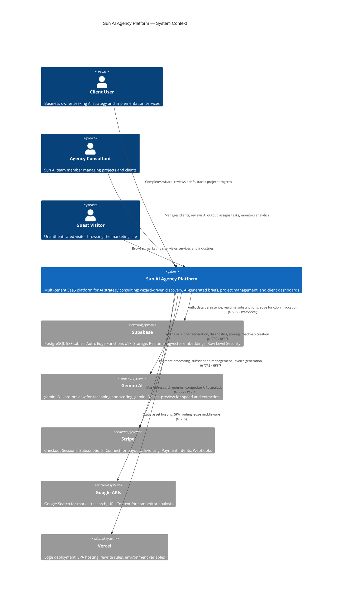
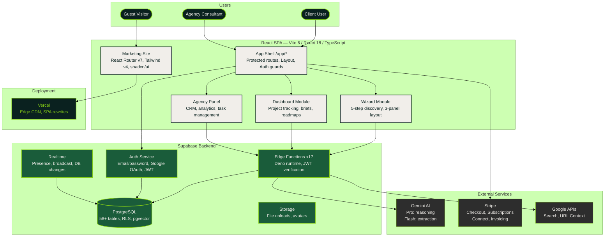

# System Architecture — C4 Context Level

High-level view of the Sun AI Agency platform showing all actors, the core system, and external dependencies.

## C4 Context Diagram

## Container-Level Overview (Flowchart)

