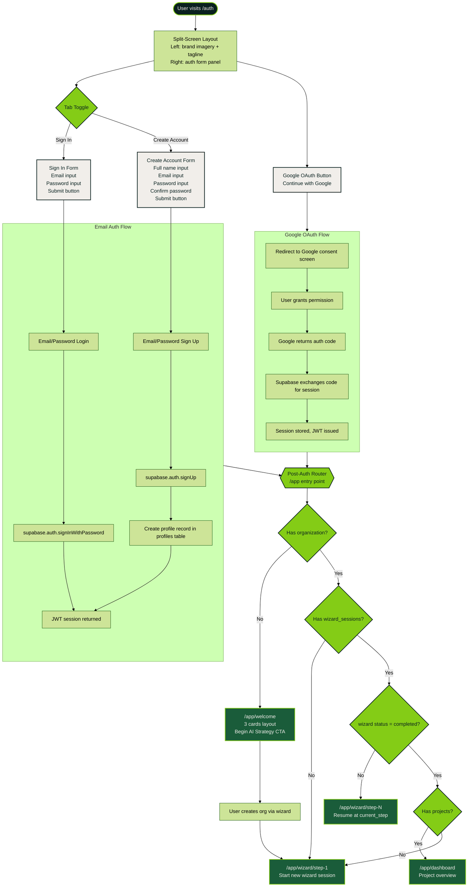
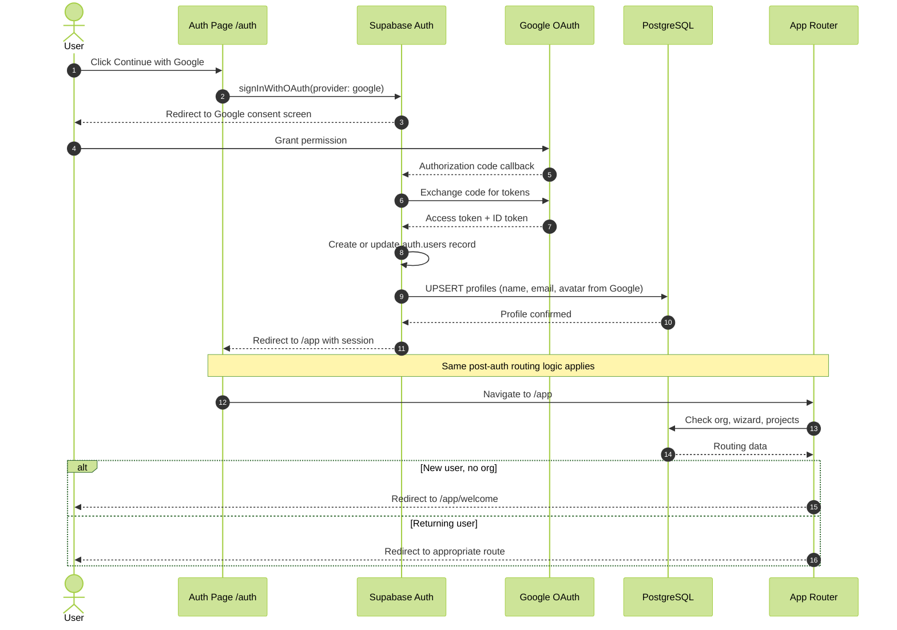
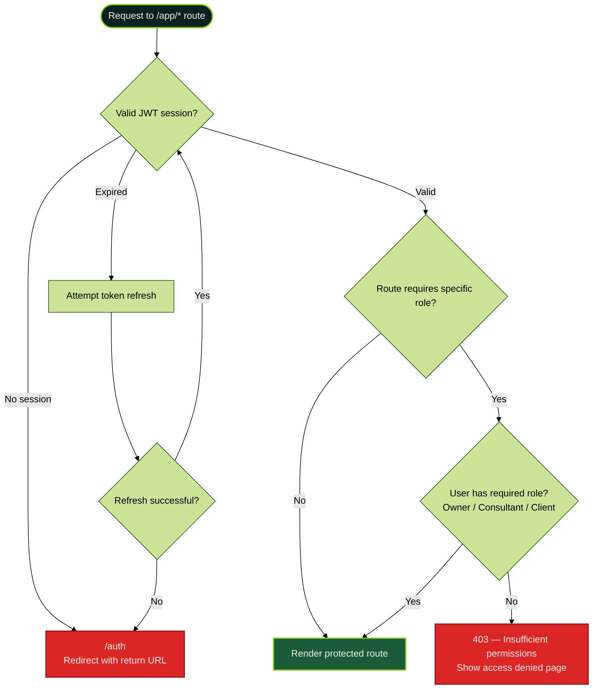

# Authentication and Entry Flow

Covers the `/auth` route UI, sign-in/sign-up flows, Google OAuth, and post-authentication routing logic that determines where the user lands.

## Auth Page Layout and Flow

## Auth Sequence Diagram — Email Sign In

```mermaid
---
config:
  theme: forest
---
sequenceDiagram
    autonumber
    actor User
    participant AuthPage as Auth Page /auth
    participant SBAuth as Supabase Auth
    participant DB as PostgreSQL
    participant Router as App Router

    User->>AuthPage: Navigate to /auth
    AuthPage-->>User: Render split-screen with Sign In tab active

    User->>AuthPage: Enter email and password
    User->>AuthPage: Click Sign In

    AuthPage->>+SBAuth: signInWithPassword(email, password)

    alt Invalid credentials
        SBAuth-->>AuthPage: Error: Invalid login credentials
        AuthPage-->>User: Show error toast
    else Valid credentials
        SBAuth-->>-AuthPage: Session object with JWT + user
        AuthPage->>AuthPage: Store session in auth context

        AuthPage->>+Router: Navigate to /app
        Router->>+DB: SELECT * FROM organizations WHERE owner_id = user.id
        DB-->>-Router: Organization record or null

        alt No organization found
            Router-->>User: Redirect to /app/welcome
        else Organization exists
            Router->>+DB: SELECT * FROM wizard_sessions WHERE org_id = org.id ORDER BY created_at DESC LIMIT 1
            DB-->>-Router: Latest wizard session or null

            alt No wizard session
                Router-->>User: Redirect to /app/wizard/step-1
            else Wizard session exists
                alt status != completed
                    Router-->>User: Redirect to /app/wizard/step-{current_step}
                else status = completed
                    Router->>+DB: SELECT * FROM projects WHERE org_id = org.id LIMIT 1
                    DB-->>-Router: Project record or null

                    alt Has projects
                        Router-->>User: Redirect to /app/dashboard
                    else No projects
                        Router-->>-User: Redirect to /app/wizard/step-1
                    end
                end
            end
        end
    end
```

## Auth Sequence Diagram — Google OAuth

## Protected Route Guard

