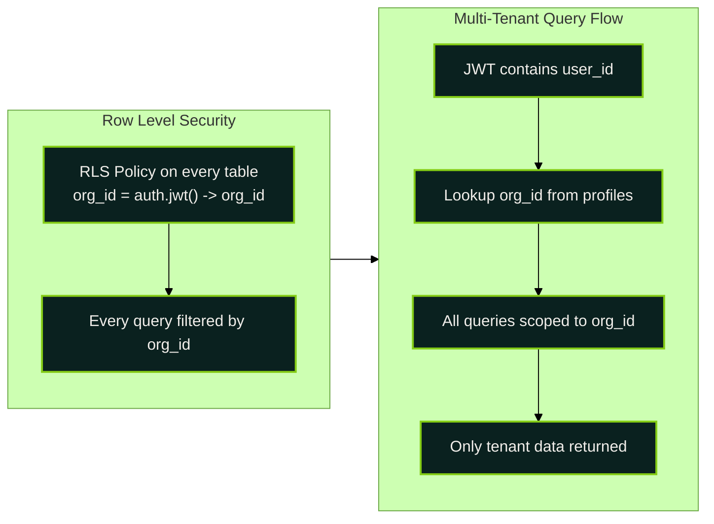

# Core Database ERD

Essential tables and relationships for the Sun AI Agency platform. All tables use RLS with org_id tenant isolation. Timestamps use `timestamptz` with defaults.

## Primary Entity Relationships

```mermaid
---
config:
  theme: forest
---
erDiagram
    ORGANIZATIONS ||--o{ PROFILES : "has members"
    ORGANIZATIONS ||--o{ TEAM_MEMBERS : "has team"
    ORGANIZATIONS ||--o{ WIZARD_SESSIONS : "owns"
    ORGANIZATIONS ||--o{ PROJECTS : "owns"
    ORGANIZATIONS ||--o{ BRIEFS : "owns"
    ORGANIZATIONS ||--o{ ROADMAPS : "owns"
    ORGANIZATIONS ||--o{ TASKS : "owns"
    ORGANIZATIONS ||--o{ AI_CACHE : "owns"
    ORGANIZATIONS ||--o{ AI_RUN_LOGS : "owns"

    PROFILES ||--o{ TEAM_MEMBERS : "assigned as"

    WIZARD_SESSIONS ||--|{ WIZARD_ANSWERS : "contains"
    WIZARD_SESSIONS ||--o{ CONTEXT_SNAPSHOTS : "versioned as"

    PROJECTS ||--o{ BRIEFS : "has"
    PROJECTS ||--o{ ROADMAPS : "has"
    PROJECTS ||--o{ TASKS : "has"
    PROJECTS ||--o{ PROJECT_SYSTEMS : "uses"
    PROJECTS ||--o{ PROJECT_SERVICES : "includes"

    BRIEFS ||--o{ BRIEF_VERSIONS : "versioned as"

    ROADMAPS ||--|{ ROADMAP_PHASES : "contains"

    SYSTEMS ||--o{ SYSTEM_SERVICES : "provides"
    SERVICES ||--o{ SYSTEM_SERVICES : "belongs to"
    SYSTEMS ||--o{ PROJECT_SYSTEMS : "selected in"
    SERVICES ||--o{ PROJECT_SERVICES : "selected in"

    ORGANIZATIONS {
        uuid id PK
        text name "NOT NULL"
        text slug UK
        text industry
        text website_url
        text description
        jsonb settings
        uuid owner_id FK "references auth.users"
        timestamptz created_at "DEFAULT now()"
        timestamptz updated_at
    }

    PROFILES {
        uuid id PK "references auth.users"
        uuid org_id FK
        text full_name
        text email "NOT NULL"
        text avatar_url
        text role "DEFAULT client"
        jsonb preferences
        timestamptz created_at "DEFAULT now()"
        timestamptz updated_at
    }

    TEAM_MEMBERS {
        uuid id PK
        uuid org_id FK "NOT NULL"
        uuid profile_id FK "NOT NULL"
        text role "NOT NULL: Owner, Consultant, Client"
        text status "DEFAULT active"
        jsonb permissions
        timestamptz invited_at
        timestamptz joined_at
        timestamptz created_at "DEFAULT now()"
    }

    WIZARD_SESSIONS {
        uuid id PK
        uuid org_id FK "NOT NULL"
        uuid created_by FK "references auth.users"
        int current_step "DEFAULT 1, range 1-5"
        text status "DEFAULT in_progress"
        jsonb metadata
        timestamptz started_at "DEFAULT now()"
        timestamptz completed_at
        timestamptz updated_at
        timestamptz created_at "DEFAULT now()"
    }

    WIZARD_ANSWERS {
        uuid id PK
        uuid session_id FK "NOT NULL"
        int step_number "NOT NULL, range 1-5"
        jsonb data "NOT NULL, step-specific payload"
        text status "DEFAULT draft"
        timestamptz created_at "DEFAULT now()"
        timestamptz updated_at
    }

    CONTEXT_SNAPSHOTS {
        uuid id PK
        uuid session_id FK "NOT NULL"
        int version "NOT NULL, auto-increment"
        jsonb snapshot_data "NOT NULL, full wizard state"
        text trigger "manual or auto"
        timestamptz created_at "DEFAULT now()"
    }

    PROJECTS {
        uuid id PK
        uuid org_id FK "NOT NULL"
        uuid wizard_session_id FK
        uuid brief_id FK
        text name "NOT NULL"
        text status "DEFAULT draft"
        text phase "DEFAULT discovery"
        int progress "DEFAULT 0, range 0-100"
        jsonb config
        timestamptz started_at
        timestamptz target_date
        timestamptz created_at "DEFAULT now()"
        timestamptz updated_at
    }

    BRIEFS {
        uuid id PK
        uuid org_id FK "NOT NULL"
        uuid project_id FK
        uuid wizard_session_id FK
        jsonb content "NOT NULL, structured brief data"
        text status "DEFAULT draft"
        int version "DEFAULT 1"
        text generated_by "ai or manual"
        timestamptz approved_at
        timestamptz created_at "DEFAULT now()"
        timestamptz updated_at
    }

    BRIEF_VERSIONS {
        uuid id PK
        uuid brief_id FK "NOT NULL"
        int version_number "NOT NULL"
        jsonb content "NOT NULL, snapshot of brief"
        jsonb diff "changes from previous version"
        uuid changed_by FK "references auth.users"
        text change_reason
        timestamptz created_at "DEFAULT now()"
    }

    ROADMAPS {
        uuid id PK
        uuid project_id FK "NOT NULL"
        uuid org_id FK "NOT NULL"
        text title "NOT NULL"
        text status "DEFAULT draft"
        int total_weeks
        jsonb metadata
        timestamptz created_at "DEFAULT now()"
        timestamptz updated_at
    }

    ROADMAP_PHASES {
        uuid id PK
        uuid roadmap_id FK "NOT NULL"
        text name "NOT NULL"
        text description
        int phase_order "NOT NULL"
        int duration_weeks
        text status "DEFAULT pending"
        jsonb deliverables
        timestamptz start_date
        timestamptz end_date
        timestamptz created_at "DEFAULT now()"
    }

    TASKS {
        uuid id PK
        uuid project_id FK "NOT NULL"
        uuid org_id FK "NOT NULL"
        uuid roadmap_phase_id FK
        uuid assigned_to FK "references auth.users"
        text title "NOT NULL"
        text description
        text status "DEFAULT todo"
        text priority "DEFAULT medium"
        boolean ai_generated "DEFAULT false"
        jsonb metadata
        timestamptz due_date
        timestamptz completed_at
        timestamptz created_at "DEFAULT now()"
        timestamptz updated_at
    }

    PROJECT_SYSTEMS {
        uuid id PK
        uuid project_id FK "NOT NULL"
        uuid system_id FK "NOT NULL"
        text priority "high, medium, low"
        jsonb config
        timestamptz created_at "DEFAULT now()"
    }

    PROJECT_SERVICES {
        uuid id PK
        uuid project_id FK "NOT NULL"
        uuid service_id FK "NOT NULL"
        text scope
        jsonb config
        timestamptz created_at "DEFAULT now()"
    }

    SYSTEMS {
        uuid id PK
        text name UK "NOT NULL"
        text category "NOT NULL"
        text description
        jsonb capabilities
        boolean is_active "DEFAULT true"
        timestamptz created_at "DEFAULT now()"
    }

    SERVICES {
        uuid id PK
        text name UK "NOT NULL"
        text category "NOT NULL"
        text description
        jsonb pricing
        boolean is_active "DEFAULT true"
        timestamptz created_at "DEFAULT now()"
    }

    SYSTEM_SERVICES {
        uuid id PK
        uuid system_id FK "NOT NULL"
        uuid service_id FK "NOT NULL"
        text relationship_type
        timestamptz created_at "DEFAULT now()"
    }

    AI_CACHE {
        uuid id PK
        uuid org_id FK "NOT NULL"
        text operation "NOT NULL"
        text context_hash "NOT NULL"
        jsonb result "NOT NULL, cached AI output"
        int token_count
        timestamptz expires_at
        timestamptz created_at "DEFAULT now()"
    }

    AI_RUN_LOGS {
        uuid id PK
        uuid org_id FK
        text agent "NOT NULL, edge function name"
        text model "NOT NULL, pro or flash"
        int input_tokens
        int output_tokens
        int latency_ms
        text status "success or error"
        text error_message
        jsonb metadata
        timestamptz created_at "DEFAULT now()"
    }
```

## Tenant Isolation Pattern

