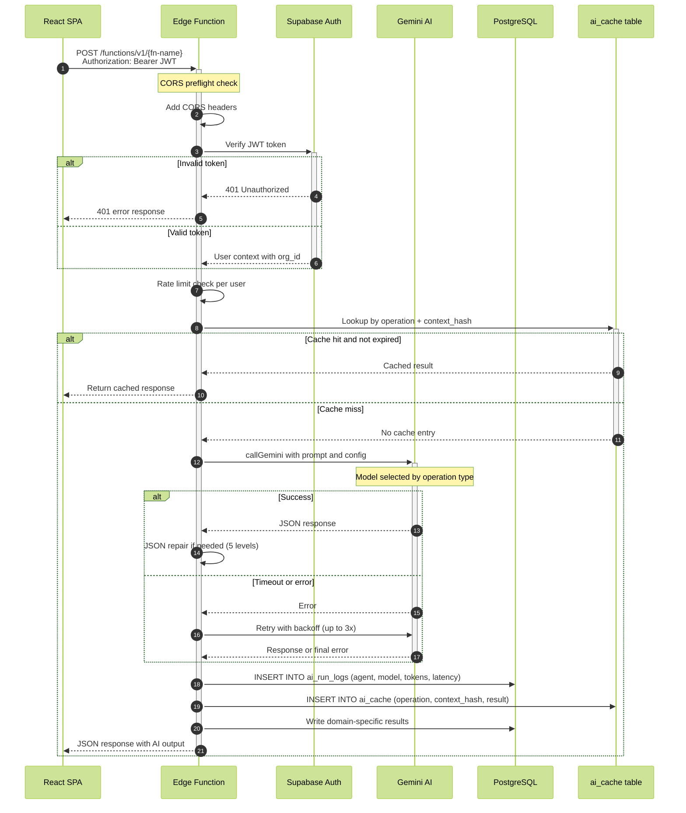
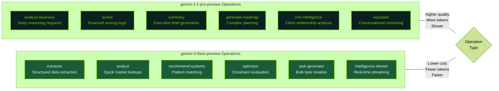

# Edge Function Architecture

All 17+ Supabase Edge Functions organized by domain, showing shared infrastructure patterns and the Gemini AI client layer.

## Edge Function Domain Map

```mermaid
---
config:
  theme: forest
---
flowchart TB
    subgraph ClientLayer["React SPA Client"]
        SPA["App Shell<br/>supabase.functions.invoke()"]
    end

    subgraph SharedInfra["Shared Infrastructure Layer"]
        direction LR
        CORS["CORS Headers<br/>preflight + response"]
        JWT["JWT Verification<br/>supabase.auth.getUser(token)"]
        RateLimit["Rate Limiting<br/>per-user, per-function"]
        ErrorHandler["Error Handling<br/>try/catch, status codes, logging"]
    end

    subgraph WizardFunctions["Wizard Domain — 10 Functions"]
        direction TB
        AnalyzeBusiness["analyze-business<br/>Deep business analysis from wizard inputs"]
        Analyst["analyst<br/>Industry and market analysis"]
        GenDiagnostics["generate-diagnostics<br/>Gap analysis and opportunity mapping"]
        Extractor["extractor<br/>Extract structured data from URLs and text"]
        RecommendSystems["recommend-systems<br/>Match systems to business needs"]
        Optimizer["optimizer<br/>Optimize recommendations for constraints"]
        Scorer["scorer<br/>Score and rank recommendations"]
        Summary["summary<br/>Generate executive summary"]
        GenRoadmap["generate-roadmap<br/>Create phased implementation plan"]
        WizTaskGen["task-generator<br/>Break roadmap phases into tasks"]
    end

    subgraph DashFunctions["Dashboard Domain — 3 Functions"]
        direction TB
        Assistant["assistant<br/>AI chat for project questions"]
        IntelStream["intelligence-stream<br/>Real-time insights and alerts"]
        DashTaskGen["dashboard-task-generator<br/>Generate tasks from brief updates"]
    end

    subgraph AgencyFunctions["Agency Domain — 5 Functions"]
        direction TB
        CRMIntel["crm-intelligence<br/>Client scoring and insights"]
        Planner["planner<br/>Resource and timeline planning"]
        Orchestrator["orchestrator<br/>Multi-agent workflow coordination"]
        Analytics["analytics<br/>Agency-wide metrics and trends"]
        Monitor["monitor<br/>Health checks and performance tracking"]
    end

    subgraph GeminiClient["Gemini AI Client — callGemini()"]
        direction TB
        ModelSelect{"Model Selection"}
        ModelSelect -->|Reasoning, Scoring, Brief Gen| ProModel["gemini-3.1-pro-preview<br/>High quality, slower"]
        ModelSelect -->|Extraction, Speed, Streaming| FlashModel["gemini-3-flash-preview<br/>Fast, cost-effective"]

        RetryLogic["Retry Logic<br/>Exponential backoff, max 3 attempts"]
        Timeout["Timeout Handling<br/>30s default, 60s for complex ops"]
        TruncRecovery["Truncation Recovery<br/>Detect incomplete JSON, re-request"]
        JSONRepair["5-Level JSON Repair<br/>1. Direct parse<br/>2. Trim trailing chars<br/>3. Close open braces<br/>4. Extract JSON block<br/>5. Regex key-value extraction"]
    end

    subgraph Tools["Gemini Tool Capabilities"]
        direction LR
        URLContext["URL Context<br/>Analyze competitor sites"]
        GoogleSearch["Google Search<br/>Market research grounding"]
        StructuredOutput["Structured Output<br/>JSON schema enforcement"]
        ThinkingMode["Thinking Mode<br/>Chain-of-thought reasoning"]
        FnCalling["Function Calling<br/>Tool-use patterns"]
        Streaming["Streaming<br/>Server-sent events"]
    end

    SPA --> SharedInfra
    SharedInfra --> WizardFunctions
    SharedInfra --> DashFunctions
    SharedInfra --> AgencyFunctions

    WizardFunctions --> GeminiClient
    DashFunctions --> GeminiClient
    AgencyFunctions --> GeminiClient

    GeminiClient --> Tools

    classDef clientNode fill:#F1EEEA,stroke:#0A211F,stroke-width:2px,color:#0A211F
    classDef infraNode fill:#0A211F,stroke:#84CC16,stroke-width:2px,color:#F1EEEA
    classDef wizardNode fill:#1a5c3a,stroke:#84CC16,stroke-width:1px,color:#F1EEEA
    classDef dashNode fill:#2a6e4e,stroke:#84CC16,stroke-width:1px,color:#F1EEEA
    classDef agencyNode fill:#3a8562,stroke:#84CC16,stroke-width:1px,color:#F1EEEA
    classDef geminiNode fill:#4a3a6e,stroke:#84CC16,stroke-width:2px,color:#F1EEEA
    classDef toolNode fill:#5c4a80,stroke:#84CC16,stroke-width:1px,color:#F1EEEA

    class SPA clientNode
    class CORS,JWT,RateLimit,ErrorHandler infraNode
    class AnalyzeBusiness,Analyst,GenDiagnostics,Extractor,RecommendSystems,Optimizer,Scorer,Summary,GenRoadmap,WizTaskGen wizardNode
    class Assistant,IntelStream,DashTaskGen dashNode
    class CRMIntel,Planner,Orchestrator,Analytics,Monitor agencyNode
    class ModelSelect,ProModel,FlashModel,RetryLogic,Timeout,TruncRecovery,JSONRepair geminiNode
    class URLContext,GoogleSearch,StructuredOutput,ThinkingMode,FnCalling,Streaming toolNode
```

## Shared Request Pipeline

## Model Selection Matrix

