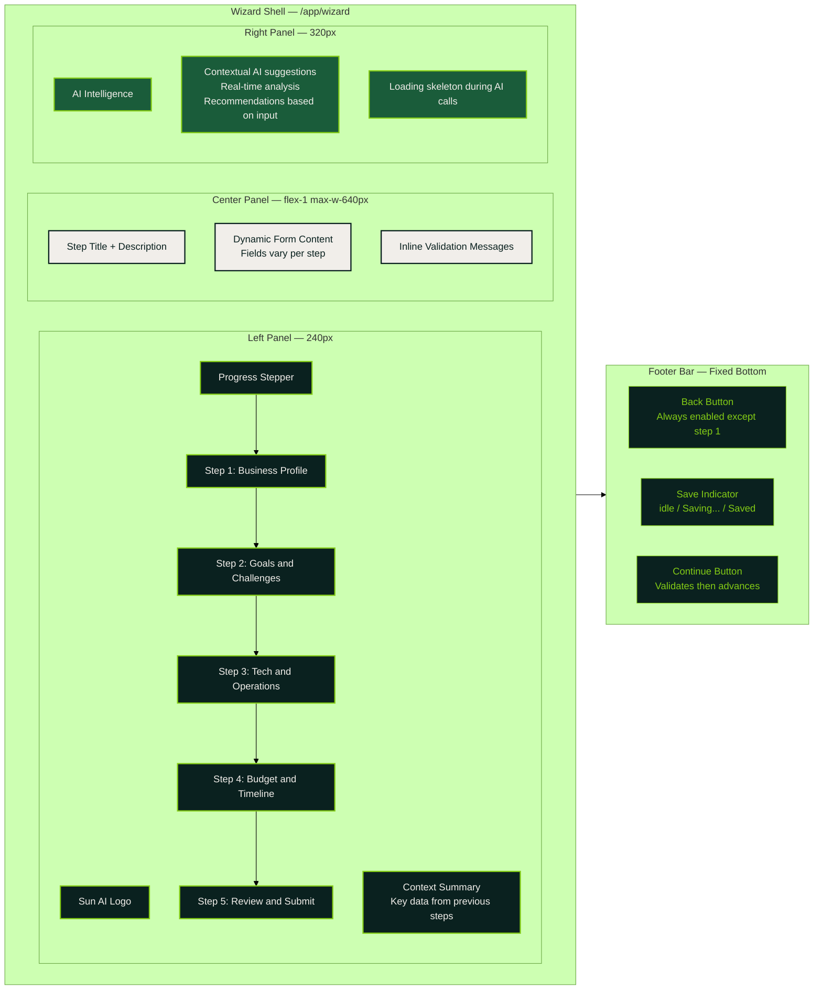
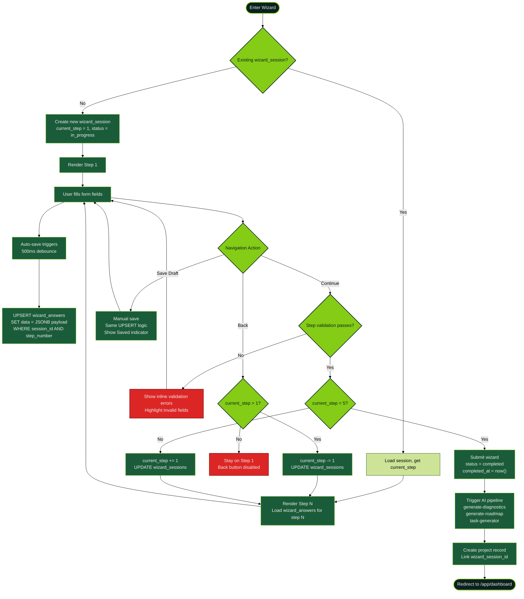
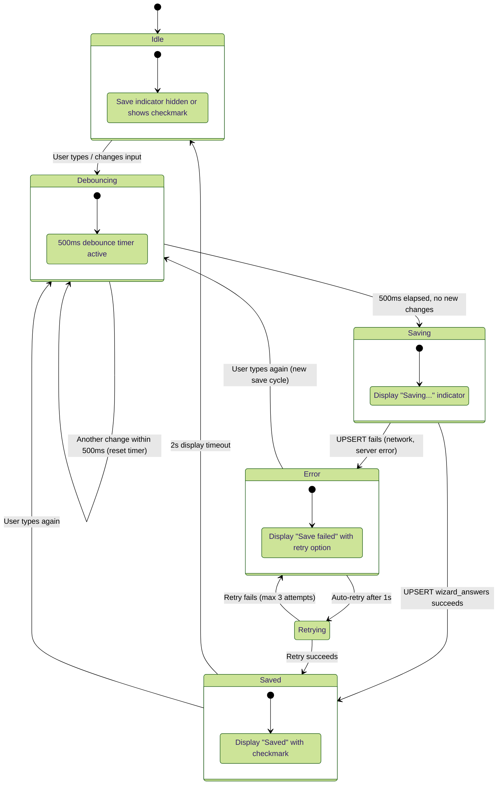
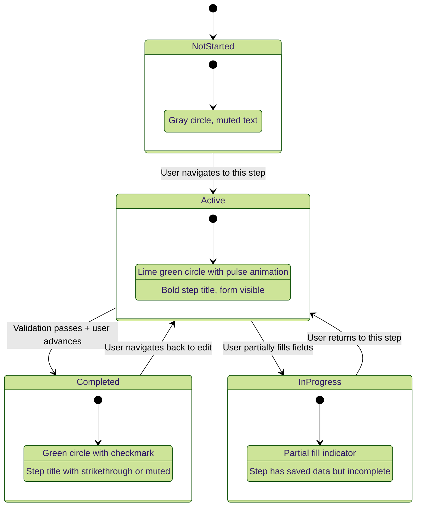

# Wizard Shell and Navigation

Three-panel layout, progress stepper, footer navigation, auto-save with debounce, responsive breakpoints, and step 5 layout exception.

## Three-Panel Layout

## Step Navigation Flow

## Auto-Save State Machine

## Responsive Breakpoints

```mermaid
---
config:
  theme: forest
---
flowchart TB
    subgraph Mobile["Mobile — under 768px"]
        direction TB
        M_Layout["Single Column Layout"]
        M_Center["Center panel only<br/>Full width"]
        M_Left["Left panel: collapsed to<br/>hamburger menu with stepper"]
        M_Right["Right panel: collapsed to<br/>expandable bottom sheet"]
        M_Footer["Footer bar: sticky bottom<br/>Back + Continue only"]
    end

    subgraph Tablet["Tablet — 768px to 1024px"]
        direction TB
        T_Layout["Two Panel Layout"]
        T_Left["Left panel: 200px<br/>Stepper visible, no context"]
        T_Center["Center panel: flex-1<br/>Form content"]
        T_Right["Right panel: hidden<br/>Toggle via icon button"]
        T_Footer["Footer bar: full width<br/>All 3 elements"]
    end

    subgraph Desktop["Desktop — over 1024px"]
        direction TB
        D_Layout["Three Panel Layout"]
        D_Left["Left panel: 240px<br/>Stepper + context summary"]
        D_Center["Center panel: flex-1 max-640px<br/>Form content"]
        D_Right["Right panel: 320px<br/>AI intelligence feed"]
        D_Footer["Footer bar: full width<br/>All 3 elements"]
    end

    subgraph Step5Exception["Step 5 Exception — All Breakpoints"]
        direction TB
        S5_Layout["Single centered column<br/>max-width: 800px"]
        S5_NoSide["Left and right panels hidden"]
        S5_Content["Review summary<br/>Edit buttons per section<br/>Submit CTA centered"]
    end

    classDef mobileNode fill:#dc2626,stroke:#991b1b,stroke-width:1px,color:#F1EEEA
    classDef tabletNode fill:#d97706,stroke:#92400e,stroke-width:1px,color:#F1EEEA
    classDef desktopNode fill:#1a5c3a,stroke:#84CC16,stroke-width:1px,color:#F1EEEA
    classDef step5Node fill:#0A211F,stroke:#84CC16,stroke-width:2px,color:#84CC16

    class M_Layout,M_Center,M_Left,M_Right,M_Footer mobileNode
    class T_Layout,T_Left,T_Center,T_Right,T_Footer tabletNode
    class D_Layout,D_Left,D_Center,D_Right,D_Footer desktopNode
    class S5_Layout,S5_NoSide,S5_Content step5Node
```

## Step Progress Indicators

