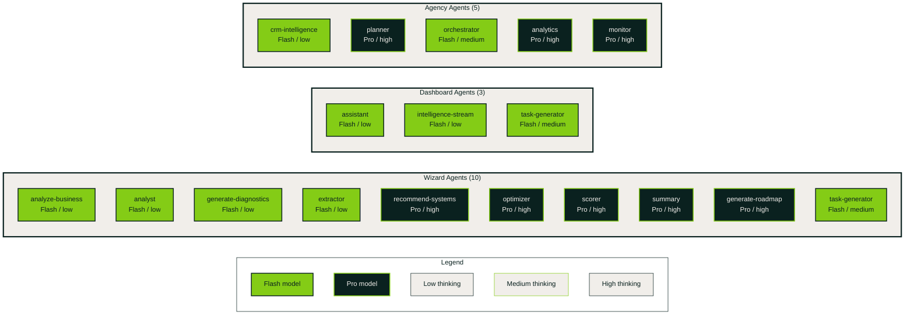

# AI Agent Pipeline - All 17 Agents

Architecture diagram showing all 17 AI agents across three domains (Wizard, Dashboard, Agency),
their model configurations, tools, and triggers. Also maps the Gemini tools each agent uses.

## Agent Architecture

```mermaid
---
config:
  theme: forest
  themeVariables:
    primaryColor: "#0A211F"
    primaryTextColor: "#F1EEEA"
    primaryBorderColor: "#84CC16"
    lineColor: "#84CC16"
    secondaryColor: "#F1EEEA"
    tertiaryColor: "#84CC16"
---
classDiagram
    direction TB

    %% ============================================================
    %% WIZARD AGENTS (10)
    %% ============================================================

    namespace WizardAgents {
        class AnalyzeBusiness {
            <<Flash / low>>
            +tools: URL Context, Google Search
            +trigger: URL blur (Step 1)
            +output: Company analysis card
            +caches: ai_cache
            +fallback: URL fail -> Search only -> static
        }

        class Analyst {
            <<Flash / low>>
            +tools: Google Search
            +trigger: With analyze-business
            +output: Market context, competitors, trends
        }

        class GenerateDiagnostics {
            <<Flash / low>>
            +tools: none
            +trigger: Step 2 load
            +output: 8 industry-specific questions
            +input: Step 1 industry selection
        }

        class Extractor {
            <<Flash / low>>
            +tools: none
            +trigger: Real-time on answer (Step 2)
            +output: Detected signal badges
            +mode: Streaming
        }

        class RecommendSystems {
            <<Pro / high>>
            +tools: none
            +trigger: Step 3 load
            +output: 3-5 recommendation cards
            +caches: ai_cache
            +input: ai_cache diagnostics + answers
        }

        class Optimizer {
            <<Pro / high>>
            +tools: none
            +trigger: With recommend-systems
            +output: Refined cost and effort estimates
        }

        class Scorer {
            <<Pro / high>>
            +tools: none
            +trigger: Step 4 load
            +output: Readiness score 0-100, dimensions
        }

        class Summary {
            <<Pro / high>>
            +tools: none
            +trigger: Step 4 load
            +output: Executive narrative
        }

        class GenerateRoadmap {
            <<Pro / high>>
            +tools: none
            +trigger: Step 4 load
            +output: 3-phase plan, milestones, tasks, KPIs
        }

        class TaskGenerator {
            <<Flash / medium>>
            +tools: none
            +trigger: Project creation (Step 5)
            +output: 12 tasks (3-5 per phase)
        }
    }

    %% ============================================================
    %% DASHBOARD AGENTS (3)
    %% ============================================================

    namespace DashboardAgents {
        class Assistant {
            <<Flash / low>>
            +tools: RAG
            +trigger: Client chat
            +output: Contextual answers
            +mode: Streaming
        }

        class IntelligenceStream {
            <<Flash / low>>
            +tools: SSE
            +trigger: Real-time updates
            +output: AI insights feed
            +mode: Server-Sent Events
        }

        class DashTaskGenerator {
            <<Flash / medium>>
            +tools: none
            +trigger: Task creation
            +output: Generated tasks
        }
    }

    %% ============================================================
    %% AGENCY AGENTS (5)
    %% ============================================================

    namespace AgencyAgents {
        class CRMIntelligence {
            <<Flash / low>>
            +tools: none
            +trigger: Lead scoring
            +output: Lead scores, qualification
        }

        class Planner {
            <<Pro / high>>
            +tools: none
            +trigger: Strategic planning
            +output: Strategic plans, resource allocation
        }

        class Orchestrator {
            <<Flash / medium>>
            +tools: Function Calling
            +trigger: Agent coordination
            +output: Coordinated agent actions
        }

        class Analytics {
            <<Pro / high>>
            +tools: none
            +trigger: Revenue forecasting
            +output: Revenue projections, trends
        }

        class Monitor {
            <<Pro / high>>
            +tools: none
            +trigger: Deadline alerts
            +output: Alerts, risk warnings
        }
    }

    %% ============================================================
    %% GEMINI TOOLS
    %% ============================================================

    namespace GeminiTools {
        class GoogleSearch {
            <<tool>>
            +type: Grounding
            +desc: Web search for real-time data
        }

        class URLContext {
            <<tool>>
            +type: Grounding
            +desc: Read full website content
            +limit: 34MB (HTML, PDF, images)
        }

        class StructuredOutput {
            <<tool>>
            +type: Output
            +desc: JSON schema enforcement
        }

        class ThinkingMode {
            <<tool>>
            +type: Reasoning
            +levels: low, medium, high
        }

        class FunctionCalling {
            <<tool>>
            +type: Orchestration
            +desc: Call other agents/functions
        }

        class StreamingSSE {
            <<tool>>
            +type: Delivery
            +desc: Server-Sent Events streaming
        }
    }

    %% ============================================================
    %% RELATIONSHIPS: Agents -> Tools
    %% ============================================================

    AnalyzeBusiness --> GoogleSearch : uses
    AnalyzeBusiness --> URLContext : uses
    AnalyzeBusiness --> ThinkingMode : low
    AnalyzeBusiness --> StructuredOutput : JSON

    Analyst --> GoogleSearch : uses
    Analyst --> ThinkingMode : low

    GenerateDiagnostics --> ThinkingMode : low
    GenerateDiagnostics --> StructuredOutput : JSON

    Extractor --> ThinkingMode : low
    Extractor --> StreamingSSE : real-time

    RecommendSystems --> ThinkingMode : high
    RecommendSystems --> StructuredOutput : JSON

    Optimizer --> ThinkingMode : high
    Optimizer --> StructuredOutput : JSON

    Scorer --> ThinkingMode : high
    Scorer --> StructuredOutput : JSON

    Summary --> ThinkingMode : high

    GenerateRoadmap --> ThinkingMode : high
    GenerateRoadmap --> StructuredOutput : JSON

    TaskGenerator --> ThinkingMode : medium
    TaskGenerator --> StructuredOutput : JSON

    Assistant --> StreamingSSE : streaming
    Assistant --> ThinkingMode : low

    IntelligenceStream --> StreamingSSE : SSE
    IntelligenceStream --> ThinkingMode : low

    DashTaskGenerator --> ThinkingMode : medium
    DashTaskGenerator --> StructuredOutput : JSON

    Orchestrator --> FunctionCalling : calls agents
    Orchestrator --> ThinkingMode : medium

    CRMIntelligence --> ThinkingMode : low
    CRMIntelligence --> StructuredOutput : JSON

    Planner --> ThinkingMode : high

    Analytics --> ThinkingMode : high
    Analytics --> StructuredOutput : JSON

    Monitor --> ThinkingMode : high

    %% ============================================================
    %% WIZARD STEP FLOW (chained agents)
    %% ============================================================

    AnalyzeBusiness <.. Analyst : fires together
    RecommendSystems <.. Optimizer : fires together
    Scorer <.. Summary : parallel at Step 4
    Scorer <.. GenerateRoadmap : parallel at Step 4
```

## Agent Summary Table

