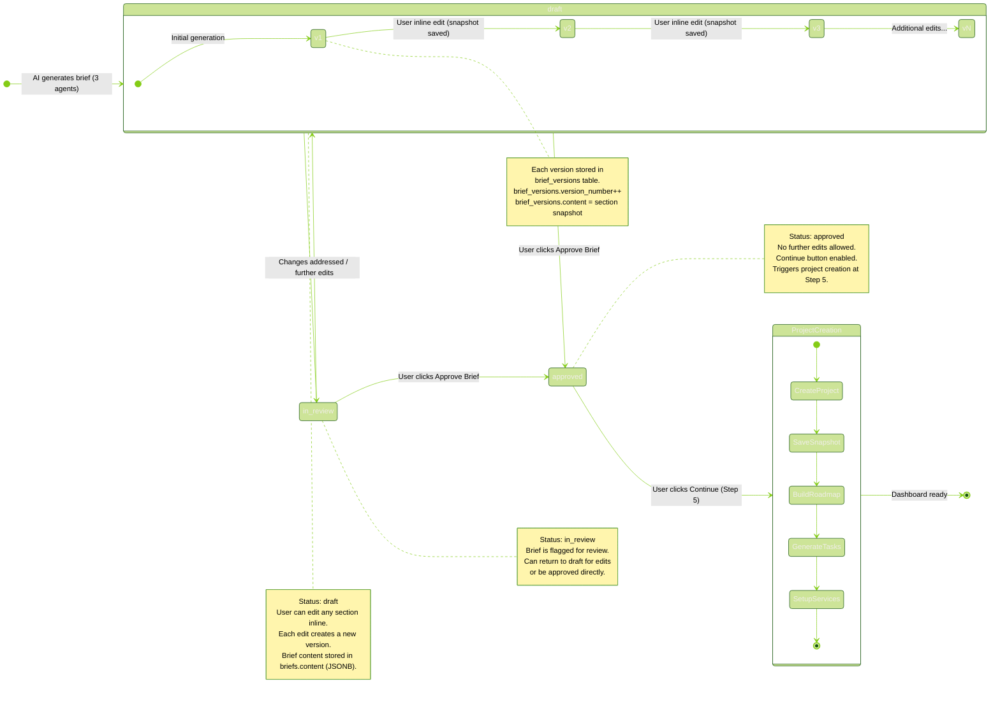
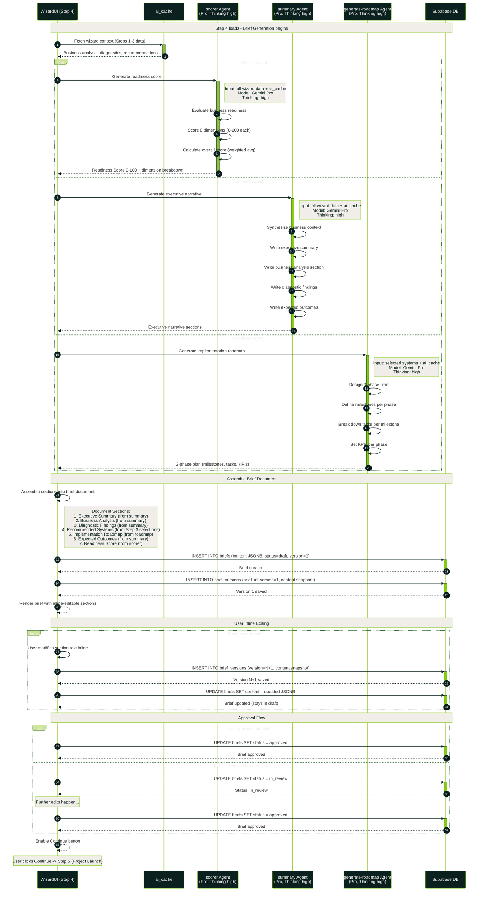
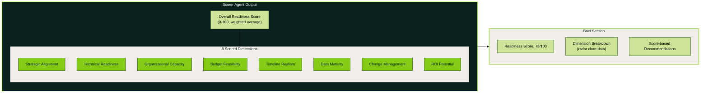

# Brief Approval Workflow

Two diagrams: (1) state machine for brief status transitions with versioning,
and (2) the brief generation sequence showing 3 parallel AI agents.

## Brief Status State Machine

## Brief Generation Sequence (3 Parallel AI Agents)

## Readiness Score Dimensions

