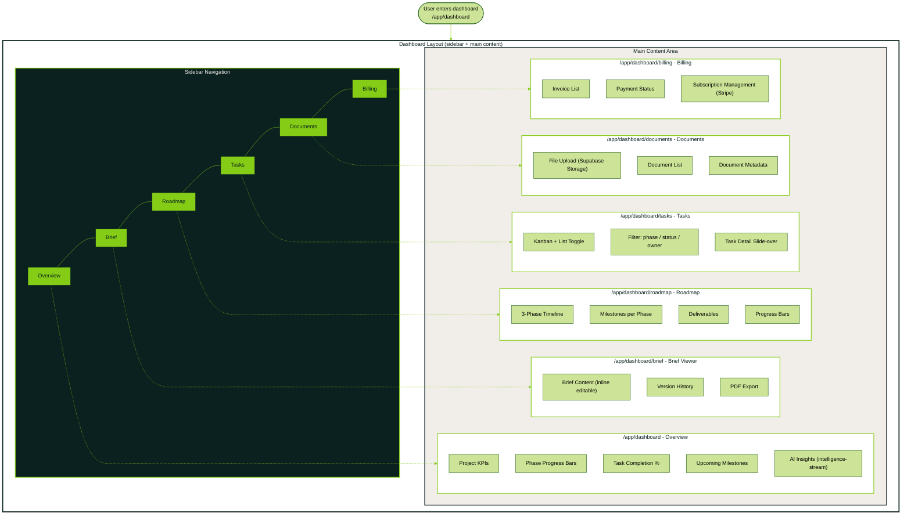
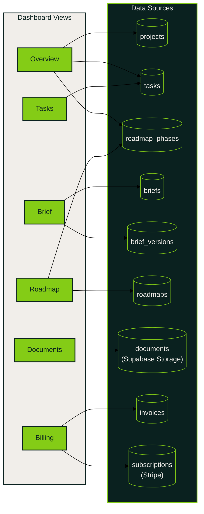

# Client Dashboard

Two diagrams: (1) routing/layout flowchart showing all dashboard routes and sidebar navigation,
and (2) ERD showing the data sources backing each dashboard view.

## Dashboard Routing and Layout

## Dashboard Data Sources (ERD)

```mermaid
---
config:
  theme: forest
  themeVariables:
    primaryColor: "#0A211F"
    primaryTextColor: "#F1EEEA"
    primaryBorderColor: "#84CC16"
---
erDiagram
    PROJECT ||--|| CONTEXT_SNAPSHOT : has
    PROJECT ||--|| ROADMAP : has
    PROJECT ||--|| BRIEF : has
    PROJECT ||--o{ TASK : contains
    PROJECT ||--o{ PROJECT_SYSTEM : includes
    PROJECT ||--o{ PROJECT_SERVICE : includes
    PROJECT ||--o{ DOCUMENT : stores
    PROJECT ||--o{ INVOICE : billed_via
    PROJECT |o--o| SUBSCRIPTION : managed_by

    ROADMAP ||--|{ ROADMAP_PHASE : divided_into
    BRIEF ||--o{ BRIEF_VERSION : versioned_as

    %% ============================================================
    %% CORE: Overview page
    %% ============================================================
    PROJECT {
        uuid id PK
        uuid user_id FK
        varchar name
        varchar status
        int readiness_score "0-100"
        jsonb metadata
        timestamp created_at
        timestamp updated_at
    }

    CONTEXT_SNAPSHOT {
        uuid id PK
        uuid project_id FK
        jsonb wizard_data "All wizard answers"
        jsonb ai_analysis "Cached AI results"
        timestamp created_at
    }

    %% ============================================================
    %% BRIEF: Brief page
    %% ============================================================
    BRIEF {
        uuid id PK
        uuid project_id FK
        jsonb content "All sections as JSONB"
        varchar status "draft | in_review | approved"
        int current_version
        timestamp created_at
        timestamp updated_at
    }

    BRIEF_VERSION {
        uuid id PK
        uuid brief_id FK
        int version_number
        jsonb content "Section snapshot"
        uuid edited_by FK
        timestamp created_at
    }

    %% ============================================================
    %% ROADMAP: Roadmap page
    %% ============================================================
    ROADMAP {
        uuid id PK
        uuid project_id FK
        varchar title
        jsonb summary
        timestamp created_at
        timestamp updated_at
    }

    ROADMAP_PHASE {
        uuid id PK
        uuid roadmap_id FK
        int phase_number "1, 2, or 3"
        varchar name
        text description
        jsonb milestones "Array of milestones"
        jsonb deliverables "Array of deliverables"
        jsonb kpis "Array of KPIs"
        int progress_pct "0-100"
        date start_date
        date end_date
    }

    %% ============================================================
    %% TASKS: Tasks page
    %% ============================================================
    TASK {
        uuid id PK
        uuid project_id FK
        uuid roadmap_phase_id FK
        varchar title
        text description
        varchar status "todo | in_progress | done"
        varchar priority "low | medium | high"
        varchar owner
        int sort_order
        date due_date
        timestamp created_at
        timestamp updated_at
    }

    %% ============================================================
    %% SYSTEMS & SERVICES: Project config
    %% ============================================================
    PROJECT_SYSTEM {
        uuid id PK
        uuid project_id FK
        varchar system_name
        varchar priority_rank
        varchar investment_tier
        jsonb config
    }

    PROJECT_SERVICE {
        uuid id PK
        uuid project_id FK
        varchar service_name
        varchar status
        jsonb config
    }

    %% ============================================================
    %% DOCUMENTS: Documents page
    %% ============================================================
    DOCUMENT {
        uuid id PK
        uuid project_id FK
        varchar name
        varchar file_path "Supabase Storage path"
        varchar mime_type
        bigint file_size
        jsonb metadata
        uuid uploaded_by FK
        timestamp created_at
    }

    %% ============================================================
    %% BILLING: Billing page
    %% ============================================================
    INVOICE {
        uuid id PK
        uuid project_id FK
        varchar stripe_invoice_id UK
        decimal amount
        varchar currency
        varchar status "draft | open | paid | void"
        date due_date
        date paid_date
        timestamp created_at
    }

    SUBSCRIPTION {
        uuid id PK
        uuid project_id FK
        varchar stripe_subscription_id UK
        varchar plan_name
        varchar status "active | past_due | canceled"
        decimal amount
        varchar interval "monthly | annual"
        date current_period_start
        date current_period_end
        timestamp created_at
    }
```

## Data Flow per Dashboard View

