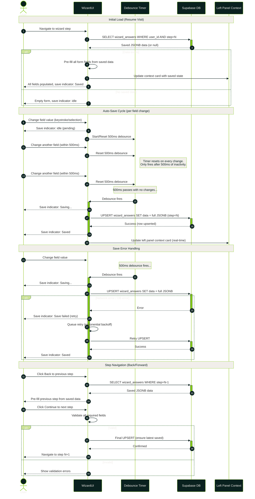

# Auto-Save and Data Persistence Pattern

Two diagrams: (1) the auto-save debounce sequence for real-time field persistence,
and (2) the full data persistence map across all 5 wizard steps.

## Auto-Save Debounce Sequence

## Data Persistence Map Across All 5 Steps

```mermaid
---
config:
  theme: forest
  themeVariables:
    primaryColor: "#0A211F"
    primaryTextColor: "#F1EEEA"
    primaryBorderColor: "#84CC16"
    lineColor: "#84CC16"
    secondaryColor: "#F1EEEA"
    tertiaryColor: "#84CC16"
---
flowchart TD
    %% ============================================================
    %% STEP 1
    %% ============================================================
    subgraph step1["Step 1: Business Context"]
        direction LR
        S1_input["User Input:<br/>Company Name, URL, Industry,<br/>Size, Goals, Timeline, Budget"]
        S1_ai["AI Output:<br/>Company analysis,<br/>market context,<br/>competitor data"]
    end

    subgraph step1_db["Step 1 Storage"]
        direction LR
        S1_wa[("wizard_answers<br/>(step=1, data JSONB)")]
        S1_cache[("ai_cache<br/>(URL analysis result)")]
    end

    S1_input -->|auto-save 500ms| S1_wa
    S1_ai -->|cache on completion| S1_cache

    %% ============================================================
    %% STEP 2
    %% ============================================================
    subgraph step2["Step 2: Industry Diagnostics"]
        direction LR
        S2_input["User Input:<br/>8 diagnostic answers<br/>(select, multi, slider, text)"]
        S2_signals["AI Output:<br/>Extracted signals,<br/>diagnostic analysis"]
    end

    subgraph step2_db["Step 2 Storage"]
        direction LR
        S2_wa[("wizard_answers<br/>(step=2, data JSONB)")]
        S2_cache[("ai_cache<br/>(diagnostic analysis)")]
    end

    S2_input -->|auto-save 500ms| S2_wa
    S2_signals -->|async cache| S2_cache

    %% ============================================================
    %% STEP 3
    %% ============================================================
    subgraph step3["Step 3: System Recommendations"]
        direction LR
        S3_input["User Input:<br/>System selections (1-5),<br/>notes per system"]
        S3_ai["AI Output:<br/>3-5 recommendation cards,<br/>cost/effort estimates"]
    end

    subgraph step3_db["Step 3 Storage"]
        direction LR
        S3_wa[("wizard_answers<br/>(step=3, data JSONB)")]
        S3_cache[("ai_cache<br/>(recommendations)")]
    end

    S3_input -->|auto-save 500ms| S3_wa
    S3_ai -->|cache on generation| S3_cache

    %% ============================================================
    %% STEP 4
    %% ============================================================
    subgraph step4["Step 4: Executive Brief"]
        direction LR
        S4_gen["AI Generated:<br/>Executive Summary,<br/>Business Analysis,<br/>Findings, Roadmap,<br/>Outcomes, Score"]
        S4_edits["User Edits:<br/>Inline section changes,<br/>approval workflow"]
    end

    subgraph step4_db["Step 4 Storage"]
        direction LR
        S4_briefs[("briefs<br/>(content JSONB, status)")]
        S4_versions[("brief_versions<br/>(version snapshots)")]
    end

    S4_gen -->|initial creation| S4_briefs
    S4_edits -->|each edit| S4_versions
    S4_edits -->|status changes| S4_briefs

    %% ============================================================
    %% STEP 5
    %% ============================================================
    subgraph step5["Step 5: Launch Project"]
        direction LR
        S5_action["System Actions:<br/>Create project,<br/>save snapshot,<br/>build roadmap,<br/>generate tasks,<br/>setup services"]
    end

    subgraph step5_db["Step 5 Storage"]
        direction TB
        S5_proj[("projects")]
        S5_snap[("context_snapshots")]
        S5_road[("roadmaps")]
        S5_phases[("roadmap_phases")]
        S5_tasks[("tasks")]
        S5_sys[("project_systems")]
        S5_svc[("project_services")]
    end

    S5_action --> S5_proj
    S5_action --> S5_snap
    S5_action --> S5_road
    S5_action --> S5_phases
    S5_action --> S5_tasks
    S5_action --> S5_sys
    S5_action --> S5_svc

    %% ============================================================
    %% CROSS-STEP DATA FLOW
    %% ============================================================
    S1_cache -.->|feeds| step2
    S1_wa -.->|industry selection| step2
    S2_cache -.->|feeds| step3
    S2_wa -.->|answers| step3
    S3_cache -.->|feeds| step4
    S3_wa -.->|selections| step4
    S4_briefs -.->|approved brief| step5

    %% ============================================================
    %% STYLING
    %% ============================================================
    style step1 fill:#F1EEEA,stroke:#0A211F,stroke-width:2px,color:#0A211F
    style step2 fill:#F1EEEA,stroke:#0A211F,stroke-width:2px,color:#0A211F
    style step3 fill:#F1EEEA,stroke:#0A211F,stroke-width:2px,color:#0A211F
    style step4 fill:#F1EEEA,stroke:#0A211F,stroke-width:2px,color:#0A211F
    style step5 fill:#F1EEEA,stroke:#0A211F,stroke-width:2px,color:#0A211F

    style step1_db fill:#0A211F,stroke:#84CC16,stroke-width:2px,color:#F1EEEA
    style step2_db fill:#0A211F,stroke:#84CC16,stroke-width:2px,color:#F1EEEA
    style step3_db fill:#0A211F,stroke:#84CC16,stroke-width:2px,color:#F1EEEA
    style step4_db fill:#0A211F,stroke:#84CC16,stroke-width:2px,color:#F1EEEA
    style step5_db fill:#0A211F,stroke:#84CC16,stroke-width:2px,color:#F1EEEA
```

