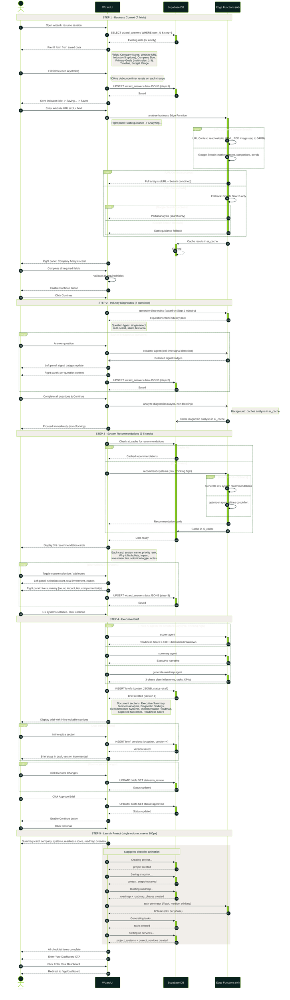

# Wizard Steps 1-5 Complete Sequence

Full happy-path flow through all 5 wizard steps showing participant interactions,
AI agent triggers, caching, auto-save, and data persistence.

```mermaid
---
config:
  theme: forest
  themeVariables:
    actorBkg: "#0A211F"
    actorTextColor: "#F1EEEA"
    actorBorder: "#84CC16"
    signalColor: "#0A211F"
    noteBkgColor: "#F1EEEA"
    noteTextColor: "#0A211F"
    noteBorderColor: "#84CC16"
    activationBkgColor: "#84CC16"
    activationBorderColor: "#0A211F"
---
sequenceDiagram
    autonumber

    actor User
    participant UI as WizardUI
    participant DB as Supabase DB
    participant AI as Edge Functions (AI)

    %% ============================================================
    %% STEP 1 - Business Context
    %% ============================================================
    Note over User,AI: STEP 1 - Business Context (7 fields)

    User->>+UI: Open wizard / resume session
    UI->>+DB: SELECT wizard_answers WHERE user_id & step=1
    DB-->>-UI: Existing data (or empty)
    UI-->>User: Pre-fill form from saved data

    Note right of UI: Fields: Company Name, Website URL,<br/>Industry (8 options), Company Size,<br/>Primary Goals (multi-select 1-3),<br/>Timeline, Budget Range

    User->>UI: Fill fields (each keystroke)
    Note right of UI: 500ms debounce timer resets on each change

    UI->>+DB: UPSERT wizard_answers.data JSONB (step=1)
    DB-->>-UI: Saved
    UI-->>User: Save indicator: idle -> Saving... -> Saved

    User->>UI: Enter Website URL & blur field
    UI->>+AI: analyze-business Edge Function
    Note right of UI: Right panel: static guidance -> Analyzing...

    par URL Context + Google Search
        AI->>AI: URL Context: read website HTML, PDF, images (up to 34MB)
    and
        AI->>AI: Google Search: market context, competitors, trends
    end

    alt URL Context succeeds
        AI-->>UI: Full analysis (URL + Search combined)
    else URL Context fails
        AI->>AI: Fallback: Google Search only
        alt Google Search succeeds
            AI-->>UI: Partial analysis (search only)
        else Google Search also fails
            AI-->>-UI: Static guidance fallback
        end
    end

    AI->>+DB: Cache results in ai_cache
    DB-->>-DB: Cached

    UI-->>User: Right panel: Company Analysis card

    User->>UI: Complete all required fields
    UI->>UI: Validate all required fields
    UI-->>User: Enable Continue button
    User->>UI: Click Continue

    %% ============================================================
    %% STEP 2 - Industry Diagnostics
    %% ============================================================
    Note over User,AI: STEP 2 - Industry Diagnostics (8 questions)

    UI->>+AI: generate-diagnostics (based on Step 1 industry)
    AI-->>-UI: 8 questions from industry pack

    Note right of UI: Question types: single-select,<br/>multi-select, slider, text area

    loop Each of 8 diagnostic questions
        User->>UI: Answer question
        UI-)AI: extractor agent (real-time signal detection)
        AI--)UI: Detected signal badges
        UI-->>User: Left panel: signal badges update
        UI-->>User: Right panel: per-question context
        UI->>+DB: UPSERT wizard_answers.data JSONB (step=2)
        DB-->>-UI: Saved
    end

    User->>UI: Complete all questions & Continue
    UI-)AI: analyze-diagnostics (async, non-blocking)
    Note right of AI: Background: caches analysis in ai_cache
    AI-)DB: Cache diagnostic analysis in ai_cache
    UI-->>User: Proceed immediately (non-blocking)

    %% ============================================================
    %% STEP 3 - System Recommendations
    %% ============================================================
    Note over User,AI: STEP 3 - System Recommendations (3-5 cards)

    UI->>+DB: Check ai_cache for recommendations
    alt Cache hit
        DB-->>UI: Cached recommendations
    else Cache miss
        UI->>+AI: recommend-systems (Pro, Thinking high)
        par Recommend + Optimize
            AI->>AI: Generate 3-5 system recommendations
        and
            AI->>AI: optimizer agent refines cost/effort
        end
        AI-->>-UI: Recommendation cards
        AI->>DB: Cache in ai_cache
    end
    DB-->>-UI: Data ready

    UI-->>User: Display 3-5 recommendation cards

    Note right of UI: Each card: system name, priority rank,<br/>Why it fits bullets, impact,<br/>investment tier, selection toggle, notes

    loop User selects 1-5 systems
        User->>UI: Toggle system selection / add notes
        UI-->>User: Left panel: selection count, total investment, names
        UI-->>User: Right panel: live summary (count, impact, tier, complementarity)
        UI->>+DB: UPSERT wizard_answers.data JSONB (step=3)
        DB-->>-UI: Saved
    end

    User->>UI: 1-5 systems selected, click Continue

    %% ============================================================
    %% STEP 4 - Executive Brief
    %% ============================================================
    Note over User,AI: STEP 4 - Executive Brief

    par Three AI agents fire simultaneously (Pro, Thinking high)
        UI->>+AI: scorer agent
        AI-->>-UI: Readiness Score 0-100 + dimension breakdown
    and
        UI->>+AI: summary agent
        AI-->>-UI: Executive narrative
    and
        UI->>+AI: generate-roadmap agent
        AI-->>-UI: 3-phase plan (milestones, tasks, KPIs)
    end

    UI->>+DB: INSERT briefs (content JSONB, status=draft)
    DB-->>-UI: Brief created (version 1)

    Note right of UI: Document sections: Executive Summary,<br/>Business Analysis, Diagnostic Findings,<br/>Recommended Systems, Implementation Roadmap,<br/>Expected Outcomes, Readiness Score

    UI-->>User: Display brief with inline-editable sections

    loop User edits sections
        User->>UI: Inline edit a section
        UI->>+DB: INSERT brief_versions (snapshot, version++)
        DB-->>-UI: Version saved
        UI-->>User: Brief stays in draft, version incremented
    end

    alt User requests changes
        User->>UI: Click Request Changes
        UI->>+DB: UPDATE briefs SET status=in_review
        DB-->>-UI: Status updated
    end

    User->>UI: Click Approve Brief
    UI->>+DB: UPDATE briefs SET status=approved
    DB-->>-UI: Status updated
    UI-->>User: Enable Continue button
    User->>UI: Click Continue

    %% ============================================================
    %% STEP 5 - Launch Project
    %% ============================================================
    Note over User,AI: STEP 5 - Launch Project (single column, max-w 800px)

    UI-->>User: Summary card: company, systems, readiness score, roadmap overview

    rect rgb(241, 238, 234)
        Note over UI,DB: Staggered checklist animation

        UI->>+DB: Creating project...
        DB-->>-UI: project created

        UI->>+DB: Saving snapshot...
        DB-->>-UI: context_snapshot saved

        UI->>+DB: Building roadmap...
        DB-->>-UI: roadmap + roadmap_phases created

        UI->>+AI: task-generator (Flash, medium thinking)
        AI-->>-UI: 12 tasks (3-5 per phase)

        UI->>+DB: Generating tasks...
        DB-->>-UI: tasks created

        UI->>+DB: Setting up services...
        DB-->>-UI: project_systems + project_services created
    end

    UI-->>User: All checklist items complete
    UI-->>User: Enter Your Dashboard CTA
    User->>UI: Click Enter Your Dashboard
    UI-->>User: Redirect to /app/dashboard
```
