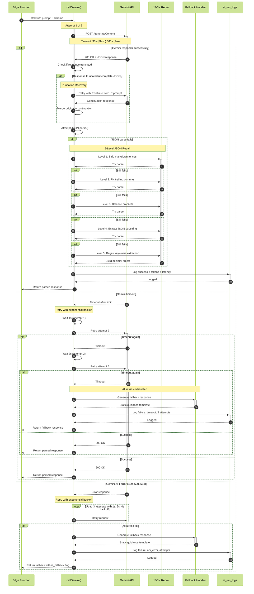
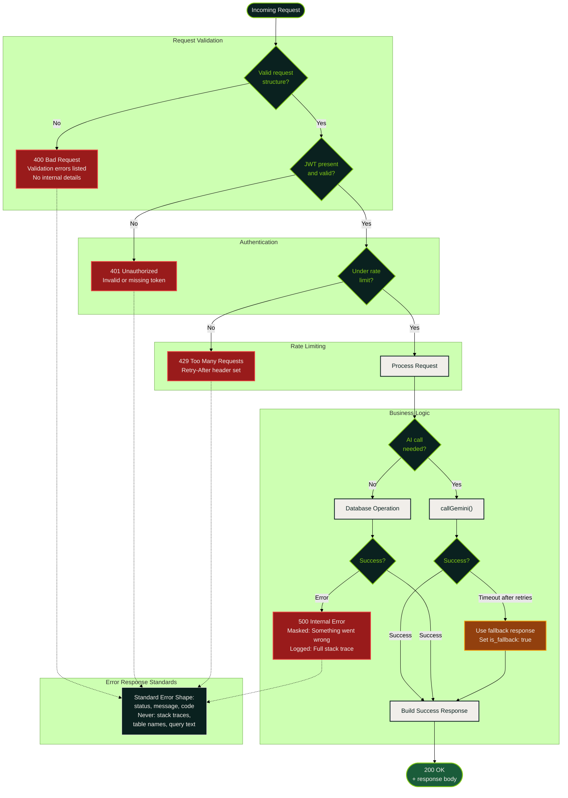
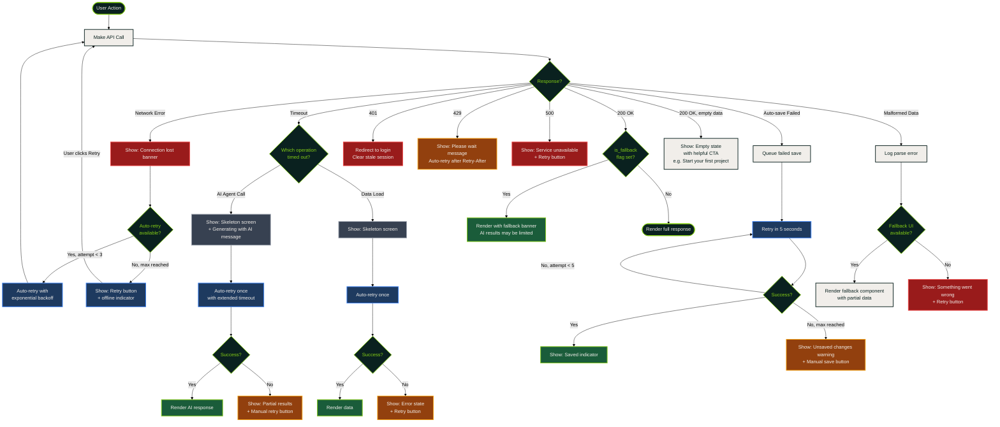

# Error Handling & Recovery Patterns

Production-hardened error handling across the Sun AI Agency platform: the callGemini retry pipeline, Edge Function error responses, frontend error recovery, and fallback chains.

## callGemini Retry Flow — Production-Hardened AI Pipeline

The core AI invocation pattern with 5 levels of defense: retry with backoff, timeout handling, truncation recovery, JSON repair, and fallback responses.

## Edge Function Error Response Patterns

Standardized error responses across all 17 Edge Functions with appropriate HTTP status codes and masked internal details.

## Frontend Error Handling Decision Tree

Client-side error recovery strategy with skeleton screens, retry mechanisms, and graceful degradation.

## Fallback Chains

When primary services fail, the system degrades gracefully through ordered fallback chains.

```mermaid
---
config:
  theme: forest
---
flowchart LR
    subgraph URLContext["URL Context Fallback Chain"]
        direction TB
        UC1["1. URL Context API<br/>Full competitor analysis<br/>from page content"] -->|Fails / Timeout| UC2["2. Google Search API<br/>Search-based insights<br/>from snippets only"]
        UC2 -->|Fails / Timeout| UC3["3. Static Guidance<br/>Generic industry<br/>recommendations"]
    end

    subgraph AICache["AI Cache Fallback Chain"]
        direction TB
        AC1["1. ai_cache Table Lookup<br/>Instant cached response<br/>by input hash"] -->|Cache Miss| AC2["2. Synchronous Gemini Call<br/>Fresh AI generation<br/>with retry logic"]
        AC2 -->|Timeout / Failure| AC3["3. Generic Response<br/>Template-based output<br/>is_fallback: true"]
    end

    subgraph Stripe["Stripe Webhook Fallback Chain"]
        direction TB
        SW1["1. Process Webhook<br/>Immediately on receipt"] -->|Processing Fails| SW2["2. Retry Queue<br/>Exponential backoff<br/>up to 5 attempts"]
        SW2 -->|All Retries Fail| SW3["3. Manual Review Flag<br/>Alert + admin dashboard<br/>entry for manual resolution"]
    end

    subgraph AutoSave["Auto-save Fallback Chain"]
        direction TB
        AS1["1. Immediate Persist<br/>Save to Supabase<br/>on each change"] -->|Network Failure| AS2["2. Local Queue<br/>Store in memory<br/>retry in 5s"]
        AS2 -->|Persistent Failure| AS3["3. localStorage Backup<br/>Prevent data loss<br/>+ unsaved warning"]
    end

    classDef primaryNode fill:#1a5c3a,stroke:#84CC16,stroke-width:2px,color:#F1EEEA
    classDef secondaryNode fill:#0A211F,stroke:#84CC16,stroke-width:2px,color:#84CC16
    classDef fallbackNode fill:#92400e,stroke:#f59e0b,stroke-width:2px,color:#F1EEEA

    class UC1,AC1,SW1,AS1 primaryNode
    class UC2,AC2,SW2,AS2 secondaryNode
    class UC3,AC3,SW3,AS3 fallbackNode
```

