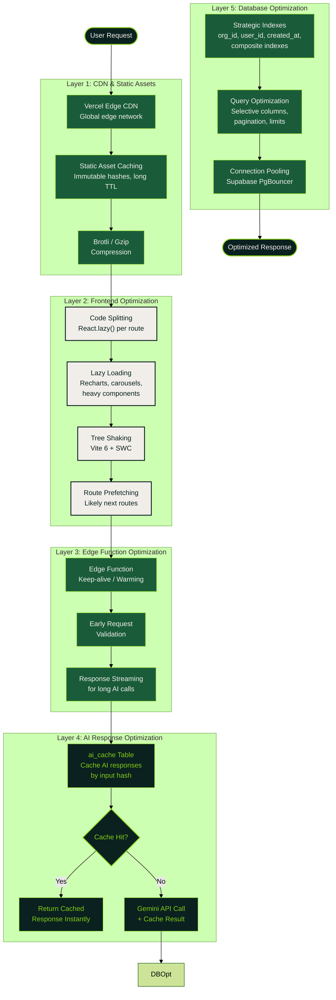
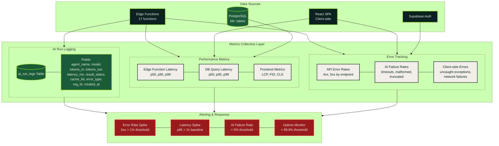
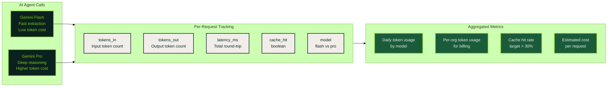

# Performance & Monitoring

Production performance targets, optimization pipeline, scalability goals, and monitoring architecture for the Sun AI Agency platform.

## Performance Targets

```mermaid
---
config:
  theme: forest
---
flowchart LR
    subgraph ResponseTimes["Response Time Targets (95th Percentile)"]
        direction TB
        WizardLoad["Wizard Step Load<br/>TARGET: < 2s"]
        FlashAgent["Flash Agent Response<br/>TARGET: < 3s"]
        ProAgent["Pro Agent + Thinking<br/>TARGET: < 15s"]
        DashLoad["Dashboard Load<br/>TARGET: < 2s"]
        EdgeFn["Edge Function p95<br/>TARGET: < 3s"]
        DBQuery["Database Query p95<br/>TARGET: < 500ms"]
        AutoSave["Auto-save Round-trip<br/>TARGET: < 1s"]
    end

    subgraph ScaleTargets["Scalability Targets"]
        direction TB
        Concurrent["1,000+ concurrent users"]
        WizardSessions["10,000+ wizard sessions/month"]
        AIRequests["100,000+ AI requests/month"]
        Orgs["100+ organizations"]
        Uptime["99.9% uptime<br/>43 min downtime/month max"]
    end

    ResponseTimes ~~~ ScaleTargets

    classDef fastNode fill:#1a5c3a,stroke:#84CC16,stroke-width:2px,color:#F1EEEA
    classDef scaleNode fill:#0A211F,stroke:#84CC16,stroke-width:2px,color:#84CC16

    class WizardLoad,FlashAgent,DashLoad,EdgeFn,DBQuery,AutoSave fastNode
    class ProAgent fastNode
    class Concurrent,WizardSessions,AIRequests,Orgs,Uptime scaleNode
```

## Optimization Pipeline

End-to-end optimization strategy from client request through CDN, code splitting, caching, and database tuning.

## Monitoring Architecture

Observability stack tracking AI usage, performance metrics, errors, and system health.

## AI Token Usage & Cost Monitoring

