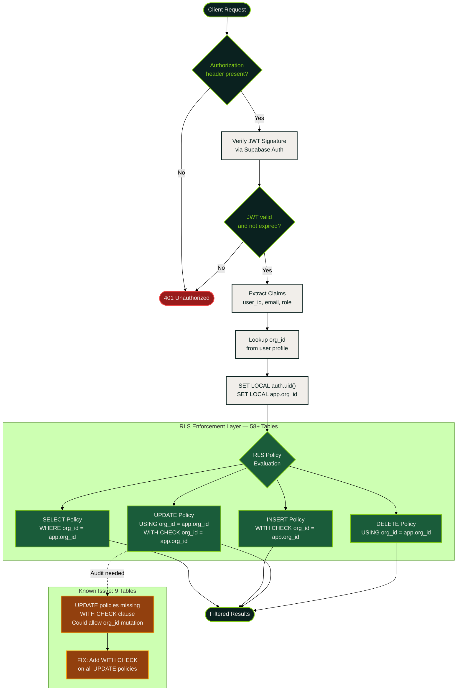
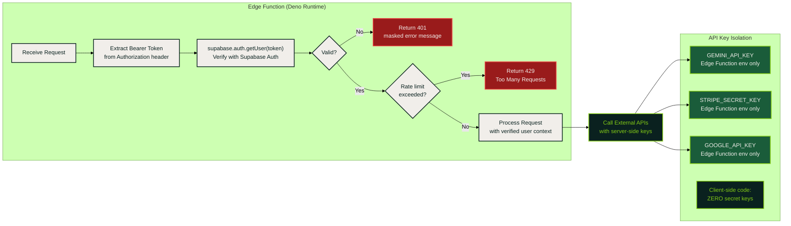
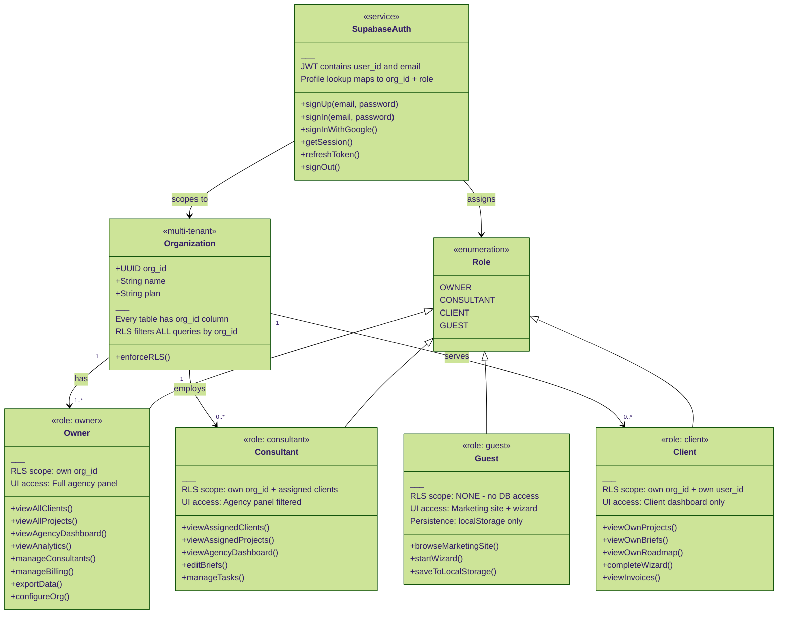

# Security Model — RLS, JWT, Access Control

Production security architecture for the Sun AI Agency platform: Row Level Security enforcement, JWT verification pipeline, role-based access control, and security hardening checklist.

## RLS Policy Flow — Request to Data

Every database query passes through this pipeline. No request reaches data without JWT verification and org-scoped RLS filtering.

## JWT Verification in Edge Functions

All 17 Edge Functions follow the same JWT verification pattern before processing any request.

## Role-Based Access Control Model

Four distinct roles with strictly scoped data access and UI capabilities.

## Security Hardening Checklist

```mermaid
---
config:
  theme: forest
---
flowchart TB
    subgraph Transport["Transport Security"]
        direction LR
        HTTPS["All connections HTTPS/TLS"]
        WSS["WebSocket via WSS"]
        HSTS["HSTS headers enabled"]
    end

    subgraph DataProtection["Data Protection"]
        direction LR
        MaskedLogs["Sensitive data masked in logs<br/>No PII in ai_run_logs"]
        NoLeaks["Error messages do not<br/>leak internal details"]
        EncryptedSecrets["Secrets in env vars only<br/>Never in client bundle"]
    end

    subgraph ClientSecurity["Client-Side Security"]
        direction LR
        NoKeys["Zero API keys in<br/>client-side code"]
        CSP["Content Security Policy<br/>headers configured"]
        XSS["Input sanitization<br/>on all user inputs"]
    end

    subgraph AuthSecurity["Authentication Security"]
        direction LR
        RateLimit["Rate limiting on<br/>auth endpoints"]
        JWTExpiry["Short JWT expiry<br/>with refresh tokens"]
        PasswordHash["Passwords hashed<br/>via Supabase Auth bcrypt"]
    end

    subgraph AuditTrail["Audit & Monitoring"]
        direction LR
        AILogs["ai_run_logs table<br/>tracks all AI calls"]
        AuthEvents["Auth events logged"]
        ErrorTracking["Error tracking<br/>with masked details"]
    end

    Transport --> DataProtection --> ClientSecurity --> AuthSecurity --> AuditTrail

    classDef sectionNode fill:#F1EEEA,stroke:#0A211F,stroke-width:2px,color:#0A211F
    classDef transportNode fill:#1a5c3a,stroke:#84CC16,stroke-width:1px,color:#F1EEEA
    classDef dataNode fill:#0A211F,stroke:#84CC16,stroke-width:1px,color:#F1EEEA
    classDef clientNode fill:#1a5c3a,stroke:#84CC16,stroke-width:1px,color:#F1EEEA
    classDef authNode fill:#0A211F,stroke:#84CC16,stroke-width:1px,color:#F1EEEA
    classDef auditNode fill:#1a5c3a,stroke:#84CC16,stroke-width:1px,color:#F1EEEA

    class HTTPS,WSS,HSTS transportNode
    class MaskedLogs,NoLeaks,EncryptedSecrets dataNode
    class NoKeys,CSP,XSS clientNode
    class RateLimit,JWTExpiry,PasswordHash authNode
    class AILogs,AuthEvents,ErrorTracking auditNode
```

