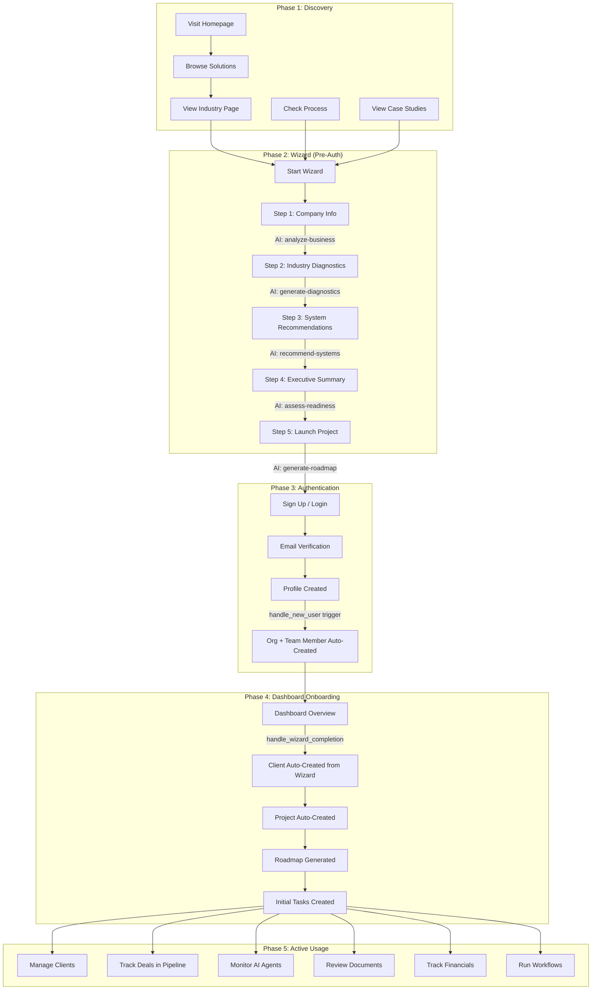
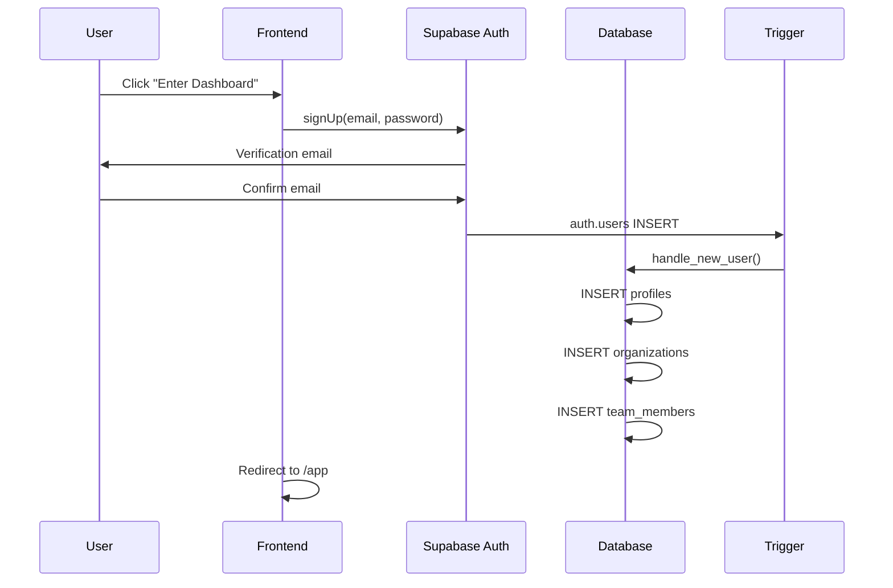
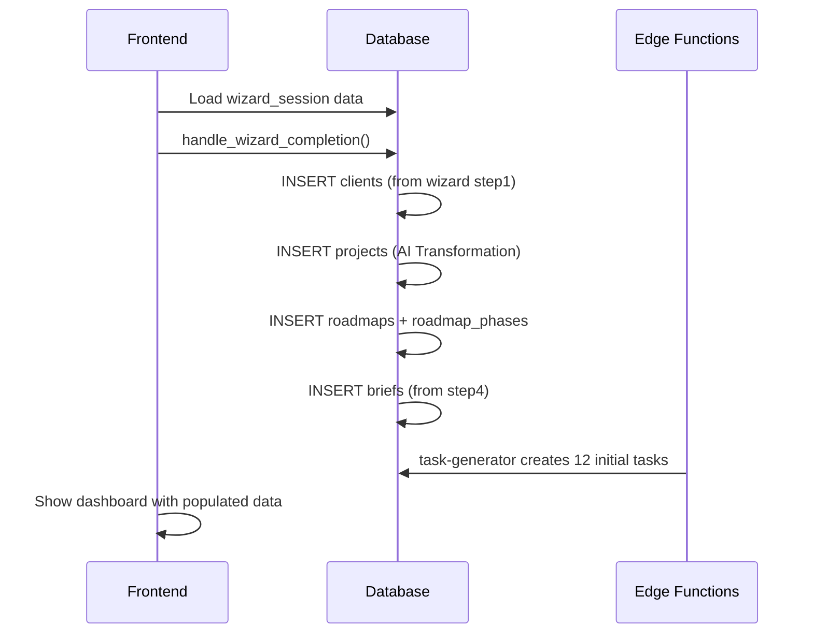

# 059: Complete User Journey — End-to-End Flow

> Every touchpoint from first visit to active dashboard user

---

## Journey Phases

---

## Phase 1: Discovery (Marketing Site)

| Screen | Route | Key Actions | CTA |
|--------|-------|-------------|-----|
| Homepage | `/` | View hero, metrics, testimonials | "Start Discovery" |
| Solutions | `/solutions` | Browse AI service offerings | "Book Consultation" |
| Industry | `/industries/healthcare` etc. | Industry-specific value props | "Start Wizard" |
| Process | `/process` | Understand methodology | "Begin Assessment" |
| Projects | `/projects` | View case studies | "See Results" |
| Booking | `/booking` | Schedule a call | Calendar embed |

**Data:** All static/hardcoded in `src/lib/constants.ts` and `src/lib/data/`

---

## Phase 2: Wizard (5 Steps, Pre-Auth)

| Step | Component | AI Call | Fallback | Time |
|------|-----------|--------|----------|------|
| 1 | StepBusinessContext | analyze-business | Manual input | 2 min |
| 2 | StepIndustryDiagnostics | generate-diagnostics | Local signal detection | 3 min |
| 3 | StepSystemRecommendations | recommend-systems | Static scoring | 2 min |
| 4 | StepExecutiveSummary | assess-readiness | Mock templates | 3 min |
| 5 | StepLaunchProject | generate-roadmap | Static 3-phase | 1 min |

**State:** localStorage primary, cloud backup via wizardApi
**Session:** Created server-side, stored in `sun-ai-wizard-session-id`

---

## Phase 3: Authentication

---

## Phase 4: Dashboard Onboarding

---

## Phase 5: Active Usage

| Feature | Route | Key Operations |
|---------|-------|---------------|
| Client Management | /app/clients | CRUD clients, contacts, health scores |
| CRM Pipeline | /app/pipeline | Drag deals between stages, track revenue |
| AI Agents | /app/agents | Monitor agent runs, view insights |
| Documents | /app/documents | Upload, categorize, search docs |
| Financial | /app/financial | Invoices, payments, revenue tracking |
| Workflows | /app/workflows | Automated task sequences |
| Analytics | /app/analytics | Performance dashboards, metrics |
| Services | /app/services | Service catalog, system assignments |

---

## Conversion Metrics to Track

| Event | Trigger | Measurement |
|-------|---------|-------------|
| Wizard Start | Step 1 loaded | Funnel entry |
| Wizard Complete | Step 5 CTA clicked | Wizard completion rate |
| Sign Up | Auth success | Conversion rate |
| Dashboard Active | First client action | Activation rate |
| Deal Created | First crm_deal INSERT | Revenue engagement |
| Agent Used | First ai_run_log | AI adoption |
