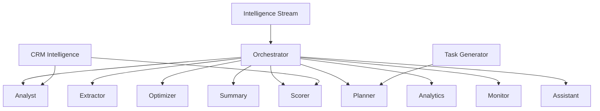
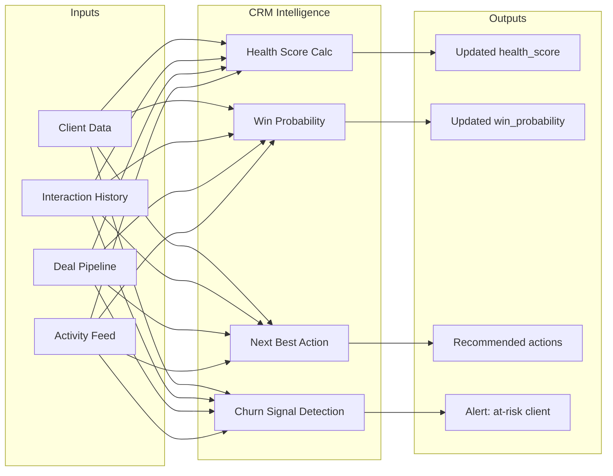
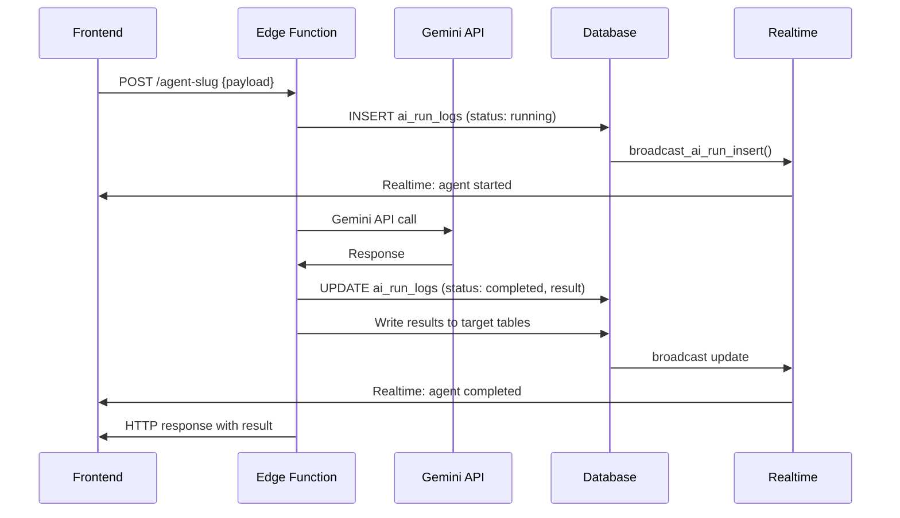

# 060: AI Agent System Architecture

> Architecture for the 10 AI agents + orchestrator + CRM intelligence

---

## Agent Inventory

---

## Agent Definitions

### 1. Analyst
**Purpose:** Deep business analysis from client data, market context, competitive landscape.
**Input:** Client profile, industry data, wizard answers
**Output:** Analysis report with opportunities, risks, recommendations
**Tables Read:** clients, wizard_answers, crm_interactions
**Tables Write:** ai_run_logs, briefs

### 2. Extractor
**Purpose:** Extract structured data from documents, emails, meeting notes.
**Input:** Raw text/document content
**Output:** Structured JSON (contacts, action items, key terms)
**Tables Read:** documents, crm_interactions
**Tables Write:** ai_run_logs, crm_contacts (auto-created)

### 3. Optimizer
**Purpose:** Recommend process improvements and AI implementation priorities.
**Input:** Current workflows, pain points, industry benchmarks
**Output:** Ranked optimization opportunities with ROI estimates
**Tables Read:** projects, tasks, milestones, activities
**Tables Write:** ai_run_logs, context_snapshots

### 4. Summary
**Purpose:** Generate executive summaries, meeting notes, project updates.
**Input:** Raw data, conversation history, project metrics
**Output:** Formatted summary (markdown)
**Tables Read:** activities, crm_interactions, tasks
**Tables Write:** ai_run_logs, briefs/brief_versions

### 5. Scorer
**Purpose:** Multi-dimensional scoring (readiness, health, risk, priority).
**Input:** Entity data (client/project/deal) + scoring rubric
**Output:** Numeric scores with explanations
**Tables Read:** clients, projects, crm_deals
**Tables Write:** ai_run_logs, clients.health_score, crm_deals.win_probability

### 6. Planner
**Purpose:** Generate project plans, task breakdowns, timelines.
**Input:** Brief, roadmap, resource constraints
**Output:** Task list with dependencies, milestones, timeline
**Tables Read:** briefs, roadmaps, roadmap_phases, services
**Tables Write:** ai_run_logs, tasks, milestones

### 7. Orchestrator
**Purpose:** Coordinate multi-agent workflows, route requests.
**Input:** Complex user request requiring multiple agents
**Output:** Aggregated results from multiple agents
**Tables Read:** All (coordinator)
**Tables Write:** ai_run_logs, context_snapshots

### 8. Analytics
**Purpose:** Data analysis, trend detection, metric computation.
**Input:** Time range, metric type, entity scope
**Output:** Charts data, trends, anomalies
**Tables Read:** activities, invoices, payments, crm_deals, tasks
**Tables Write:** ai_run_logs

### 9. Monitor
**Purpose:** Health checks, SLA tracking, anomaly detection.
**Input:** Monitoring config, thresholds
**Output:** Alerts, status reports, trend warnings
**Tables Read:** projects, tasks, clients, ai_run_logs
**Tables Write:** ai_run_logs, activities (alert records)

### 10. Assistant
**Purpose:** General conversational AI for dashboard help.
**Input:** User natural language query
**Output:** Contextual response, suggested actions
**Tables Read:** All (read-only assistant)
**Tables Write:** ai_run_logs

---

## CRM Intelligence Agent

**Purpose:** Specialized CRM agent for deal intelligence and client health.

---

## Agent Execution Pattern

---

## Agent Configuration

All agents use Gemini API via shared `gemini.tsx` utility:
- Model: `gemini-2.0-flash` (default)
- Timeout: 30s per call
- API Key: Stored in Supabase secrets as `GEMINI_API_KEY`
- Retry: 1 retry on 429/500
- Cache: Results cached in `ai_cache` table (TTL: 1 hour)
