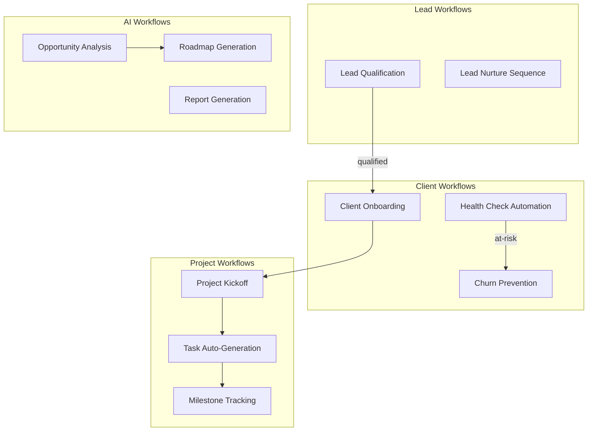
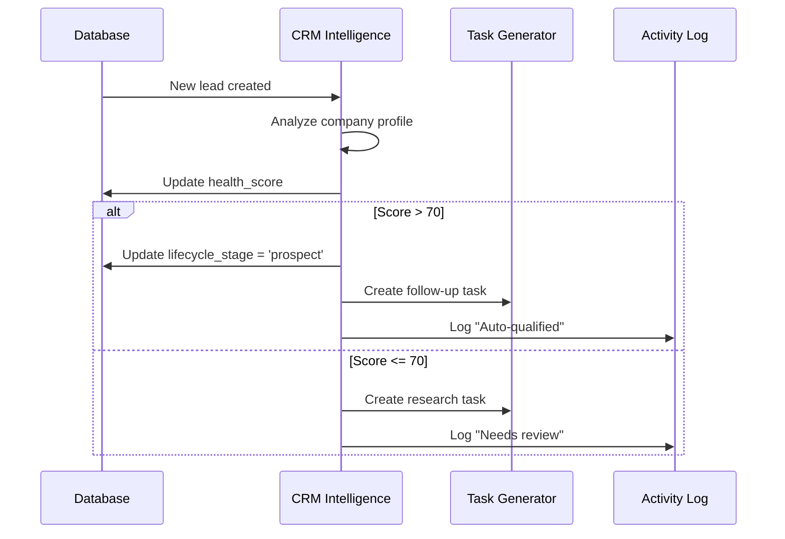

# 061: Workflow Automation Patterns

> Automated workflows connecting CRM, AI agents, and project delivery

---

## Workflow Inventory

---

## Workflow 1: Lead Qualification

**Trigger:** New client INSERT with lifecycle_stage = 'lead'
**Steps:**
1. AI Analyst reviews company data
2. Scorer assigns initial health_score
3. If score > 70: auto-advance to 'prospect'
4. Create follow-up task for assigned_to
5. Log activity: "Lead auto-qualified"

---

## Workflow 2: Client Onboarding

**Trigger:** Deal status changed to 'won'
**Steps:**
1. Update client lifecycle_stage to 'customer'
2. Set onboarded_at timestamp
3. Create project from deal data
4. Generate roadmap via Planner agent
5. Create 12 initial tasks via Task Generator
6. Send welcome notification
7. Schedule kickoff meeting task

---

## Workflow 3: Project Task Auto-Generation

**Trigger:** New project created OR roadmap phase advanced
**Steps:**
1. Task Generator reads roadmap_phases
2. Generates tasks for current phase
3. Assigns based on team_member roles
4. Sets dependencies and deadlines
5. Creates milestones for phase boundaries

---

## Workflow 4: Health Check Automation

**Trigger:** CRON (weekly) or manual
**Steps:**
1. For each active client:
   - Count interactions in last 30 days
   - Check open deal progress
   - Review task completion rate
   - Check last_activity_at freshness
2. CRM Intelligence computes health_score
3. If score dropped > 20 points: alert
4. Update client record
5. Generate activity log entry

---

## Workflow 5: Report Generation

**Trigger:** Manual or scheduled (monthly)
**Steps:**
1. Analytics agent aggregates metrics
2. Summary agent generates narrative
3. Create document in documents table
4. Attach to client/project
5. Notify via activity feed

---

## Workflow Engine Design

Currently NO workflow engine exists. Implementation options:

### Option A: Database Triggers + Edge Functions
- Postgres triggers fire on table changes
- Edge functions handle complex logic
- Simple, Supabase-native
- Limited: no retry, no complex branching

### Option B: State Machine in Edge Functions
- Define workflow steps as JSON config
- Edge function orchestrator manages state
- `context_snapshots` table stores workflow state
- Better: retry support, complex flows

### Option C: External Workflow Engine
- Temporal, Inngest, or Trigger.dev
- Most robust but adds dependency
- Best for production-scale

**Recommendation:** Start with Option B (state machine in edge functions), upgrade to Option C when workflows become complex.

---

## Automation Priority

| # | Workflow | Impact | Complexity | Priority |
|---|----------|--------|------------|----------|
| 1 | Lead Qualification | High | Low | P1 |
| 2 | Client Onboarding | High | Medium | P1 |
| 3 | Task Auto-Generation | Medium | Low | P2 |
| 4 | Health Check | Medium | Medium | P2 |
| 5 | Report Generation | Low | Medium | P3 |
| 6 | Churn Prevention | High | High | P3 |
