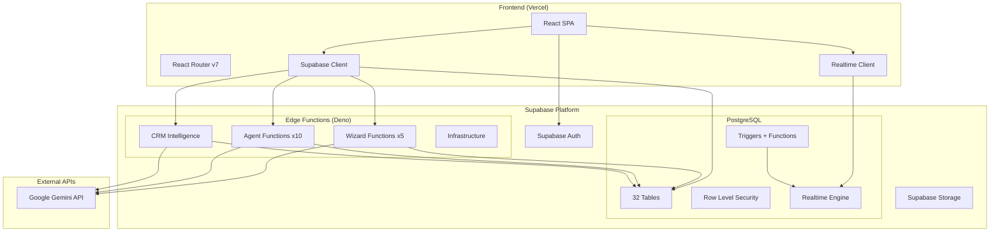
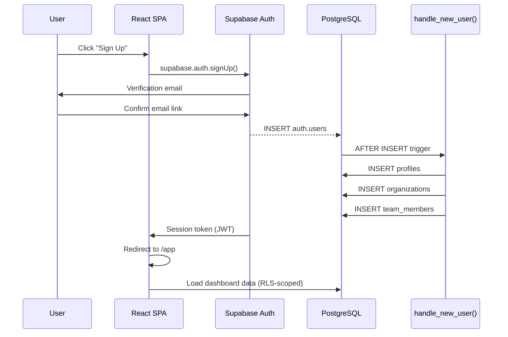
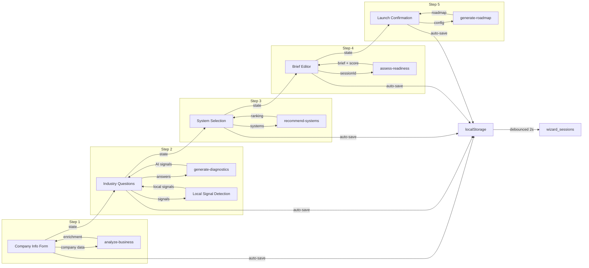
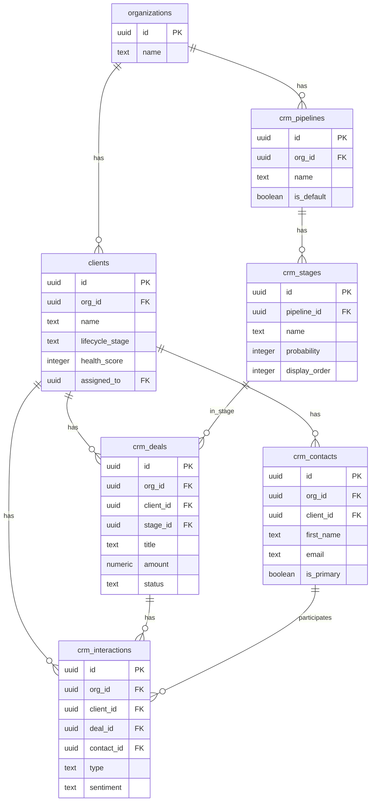
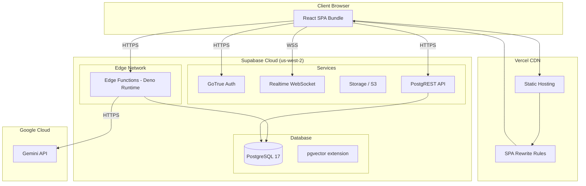
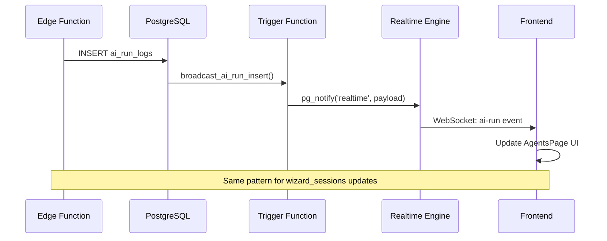

# 062: Architecture Diagrams (Mermaid)

> System architecture, data flows, and deployment topology

---

## 1. High-Level System Architecture



---

## 2. Authentication Flow



---

## 3. Wizard Data Flow



---

## 4. CRM Entity Relationships



---

## 5. Deployment Topology



---

## 6. Realtime Event Flow



---

## 7. Multi-Tenant Data Isolation

```mermaid
flowchart TD
    U[Authenticated User]
    U -->|auth.uid()| TM[team_members]
    TM -->|org_id| ORG[organizations]

    ORG -->|RLS Filter| C[clients WHERE org_id = ...]
    ORG -->|RLS Filter| P[projects WHERE org_id = ...]
    ORG -->|RLS Filter| D[crm_deals WHERE org_id = ...]
    ORG -->|RLS Filter| A[activities WHERE org_id = ...]

    style ORG fill:#e6f4ed,stroke:#00875a
    style TM fill:#e6f4ed,stroke:#00875a
```
