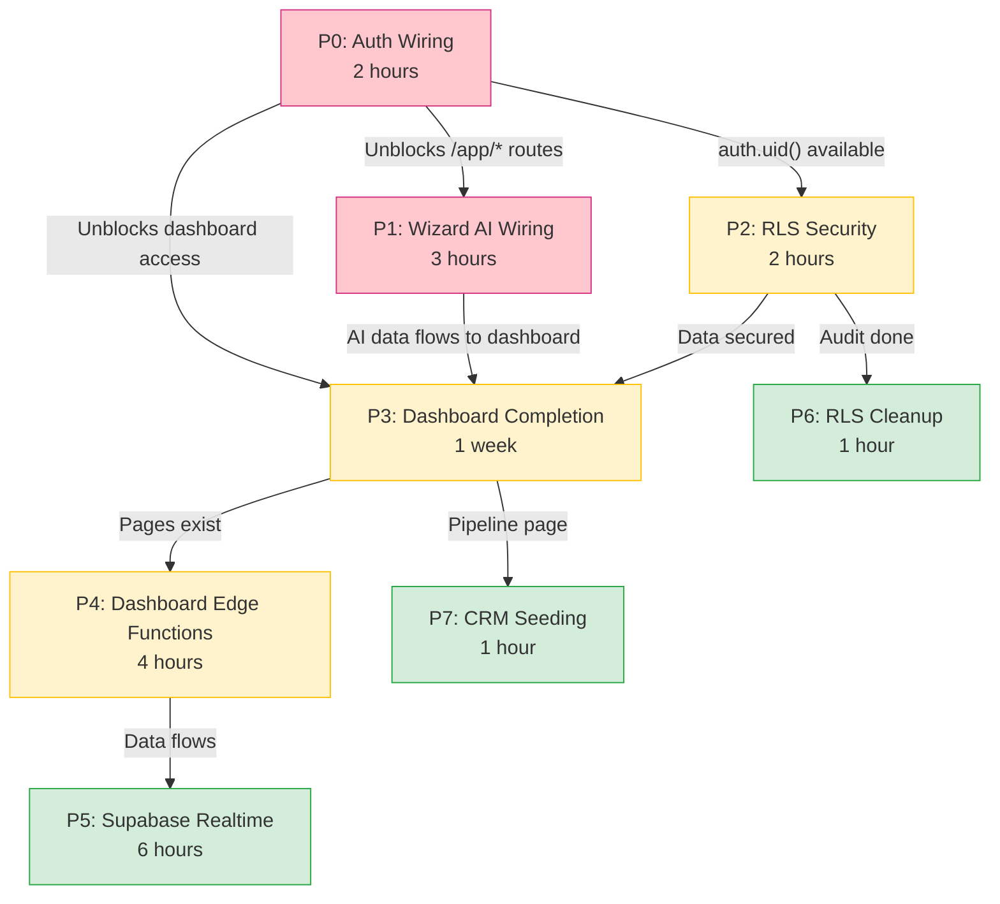

# Implementation Todo -- Ordered by Dependency

> **Updated:** 2026-03-07
> **Rule:** Each task depends on the one before it. Do not skip ahead.

---

## Critical Path



## Task Summary

| # | Task | File | Status | Depends On |
|---|------|------|--------|------------|
| P0 | [Auth Wiring](./01-auth-wiring.md) | `routes.tsx`, `App.tsx`, `ProtectedRoute.tsx` | ✅ Done | -- |
| P1 | [Wizard AI Wiring](./02-wizard-ai-wiring.md) | `steps/Step*.tsx` (4 files) | ✅ Done | P0 (optional) |
| P2 | [RLS Security](./03-rls-security.md) | Supabase SQL policies | 🟡 High | P0 |
| P3 | [Dashboard Completion](./04-dashboard-completion.md) | 6 new `dashboard/*.tsx` | 🟡 Medium | P0, P1 |
| P4 | [Dashboard Edge Functions](./05-dashboard-edge-functions.md) | `dashboard-routes.tsx` (new) | 🟡 High | P0, P3 |
| P5 | [Supabase Realtime](./06-realtime-implementation.md) | `useRealtimeChannel.ts`, triggers | ✅ Done | P0, P3, P4 |
| P6 | [RLS Cleanup](./07-rls-cleanup.md) | Migration SQL | ✅ Done | P2 |
| P7 | [CRM Seeding](./08-crm-seeding.md) | Seed migration SQL | ✅ Done (pre-existing) | P3 |

---

## Blockers Resolved Per Task

| Blocker | Description | Resolved In |
|---------|-------------|-------------|
| B1 | No `/auth/*` or `/app/*` routes in `routes.tsx` | P0 |
| B2 | AuthProvider not wrapping `App.tsx` | P0 |
| B3 | Two competing auth systems | P0 |
| B4 | Wizard Steps 2-5 don't call AI endpoints | P1 |
| B5 | Dashboard pages have no backend data endpoints | P4 |
| B6 | No live updates -- all data requires page refresh | P5 |
| B7 | `roadmaps`/`roadmap_phases` missing INSERT/UPDATE/DELETE | P6 |
| B8 | CRM pipeline page empty -- no seed data | P7 |

---

## Audit Results (2026-03-07)

### RLS Coverage

- **31/31 tables** have RLS enabled
- **14 tables** have full CRUD policies (activities, clients, CRM tables, etc.)
- **6 tables** have SELECT-only policies (server-write pattern -- correct)
- **2 tables** have anon policies (wizard -- correct by design)
- **2 tables** missing CRUD policies: `roadmaps`, `roadmap_phases` (fix in P6)
- **1 table** has redundant policies: `profiles` (9 policies, consolidate in P6)
- **0 `temp_anon` policies** found (previous concern resolved)

### Supabase Realtime

- **Not implemented** in any functional code
- 5 channels planned in `src/components/supabase-arch/RealtimeSystem.tsx` (visualization only)
- Comprehensive patterns documented in `.cursor/rules/supabase/ai-Realtime-assistant-.mdc`
- **Recommendation:** Implement `ai-runs` and `wizard-progress` channels first (P5)

### Dashboard Edge Functions

- Only `/dashboard-insights` exists (in `ai-routes.tsx`)
- Dashboard prompts (025-036) reference 4 additional endpoints that don't exist yet
- **Fix in P4:** Create `/dashboard/overview`, `/activities`, `/readiness`, `/metrics`

### CRM Tables

- `crm_pipelines`, `crm_stages`, `crm_deals`, `crm_contacts`, `crm_interactions` -- all exist with proper schema and full CRUD RLS
- All have **0 rows** -- need default pipeline + stages seed (P7)

---

## Overall Progress

```
Marketing Site  ████████████████████  100%  🟢
Edge Functions  ███████████████████░  95%   🟢
Database Schema ████████████████████  100%  🟢  (31 tables, all RLS)
Wizard UI       █████████████░░░░░░░  65%   🟡
Claude Code     ████████████████░░░░  78%   🟢
Auth Wiring     ████████████████████  100%  ✅
Wizard AI       ████████████████████  100%  ✅
Dashboard       ████████████████░░░░  74%   🟡
Dashboard API   ████░░░░░░░░░░░░░░░░  20%  🟡
RLS Policies    ████████████████████  100%  ✅  (audit done, cleanup applied)
Realtime        ████████████████████  100%  ✅
CRM Data        ████████████████████  100%  ✅  (pre-seeded Jan 2026)
Workflows       ░░░░░░░░░░░░░░░░░░░░  0%   🔴
─────────────────────────────────────────────
TOTAL           █████████████████░░░  60%
```

---

## Files Modified Per Task

| Task | Creates | Modifies | Deletes |
|------|---------|----------|---------|
| P0 | -- | `App.tsx`, `routes.tsx`, `ProtectedRoute.tsx`, `DashboardLayout.tsx` | `auth/AuthProvider.tsx` |
| P1 | -- | `StepIndustryDiagnostics.tsx`, `StepSystemRecommendations.tsx`, `StepExecutiveSummary.tsx`, `StepLaunchProject.tsx` | -- |
| P2 | `supabase/migrations/YYYYMMDD_rls_audit.sql` | -- | -- |
| P3 | `PipelinePage.tsx`, `DocumentsPage.tsx`, `FinancialPage.tsx`, `WorkflowsPage.tsx`, `AnalyticsPage.tsx`, `ServicesCatalogPage.tsx` | `routes.tsx`, `DashboardSidebar.tsx` | -- |
| P4 | `dashboard-routes.tsx` | `server/index.tsx`, `useDashboardData.ts` | -- |
| P5 | `useRealtimeChannel.ts`, 2 migration SQL files | `AgentsPage.tsx` | -- |
| P6 | `YYYYMMDD_rls_cleanup.sql` | -- | Redundant `profiles` policies |
| P7 | `YYYYMMDD_seed_crm.sql` | -- | -- |
