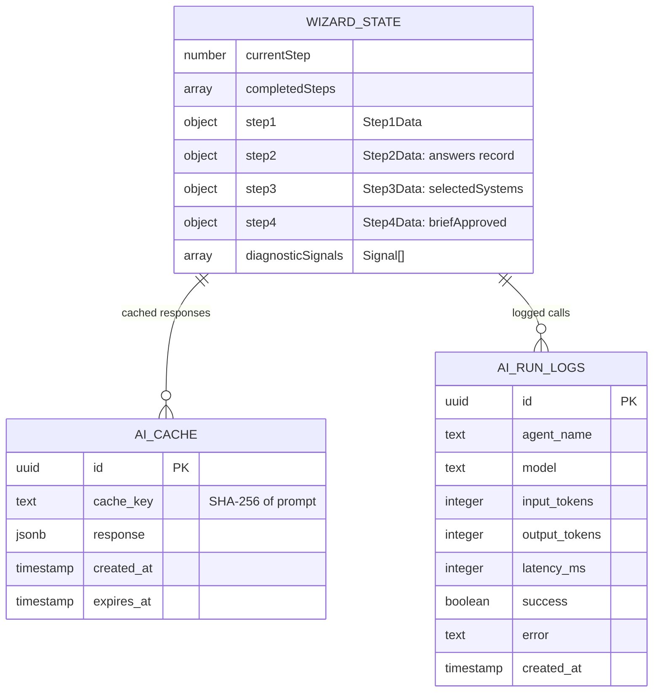
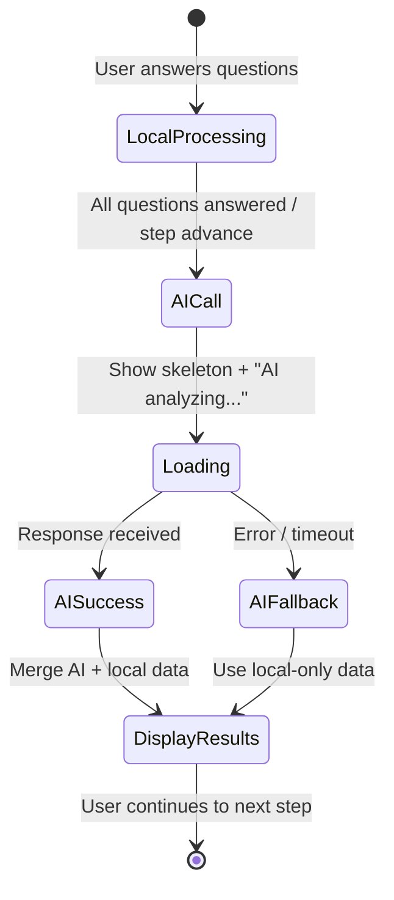

# P1: Wizard AI Wiring

> **Priority:** HIGH -- All 5 AI endpoints are deployed and working; frontend just doesn't call them
> **Depends on:** P0 (auth wiring) for authenticated wizard saves, but can be done in parallel for the AI calls
> **Blocker solved:** B4
> **Est:** ~3 hours

---

## Status

| Step | Component | Endpoint | Backend | Frontend | Status |
|------|-----------|----------|---------|----------|--------|
| 1 | `StepBusinessContext.tsx` | `POST /analyze-business` | 🟢 Full Gemini prompt | 🟢 Calls `aiApi.analyzeBusiness()` | 🟢 Done |
| 2 | `StepIndustryDiagnostics.tsx` | `POST /industry-diagnostics` | 🟢 Full Gemini prompt | 🔴 Uses local signal rules only | Wire it |
| 3 | `StepSystemRecommendations.tsx` | `POST /system-recommendations` | 🟢 Full Gemini prompt | 🔴 Static system rankings | Wire it |
| 4 | `StepExecutiveSummary.tsx` | `POST /readiness-score` | 🟢 Full Gemini prompt | 🔴 Mock template strings | Wire it |
| 5 | `StepLaunchProject.tsx` | `POST /generate-roadmap` | 🟢 Full Gemini prompt | 🔴 Static summary only | Wire it |

### API Methods Available (already in `src/lib/supabase.ts:139-188`)

```
aiApi.analyzeBusiness({ url, description, industry, sessionId })  -> AnalysisResponse
aiApi.industryDiagnostics({ industryId, companyProfile, sessionId })
aiApi.systemRecommendations({ sessionId, wizardAnswers, industry, signals })
aiApi.readinessScore(sessionId)
aiApi.generateRoadmap({ sessionId, selectedSystems, industry, companySize })
```

---

## Flow: Wizard AI Pipeline

```mermaid
flowchart LR
    subgraph "Frontend (React)"
        S1[Step 1\nBusiness Context]
        S2[Step 2\nIndustry Diagnostics]
        S3[Step 3\nSystem Recommendations]
        S4[Step 4\nExecutive Summary]
        S5[Step 5\nLaunch Project]
    end

    subgraph "Edge Functions (Hono)"
        E1[/analyze-business\nFlash]
        E2[/industry-diagnostics\nFlash]
        E3[/system-recommendations\nPro]
        E4[/readiness-score\nPro]
        E5[/generate-roadmap\nPro]
    end

    subgraph "Gemini"
        G1[gemini-3-flash-preview]
        G2[gemini-3.1-pro-preview]
    end

    S1 -->|"aiApi.analyzeBusiness()"| E1
    S2 -.->|"aiApi.industryDiagnostics()\n NOT WIRED"| E2
    S3 -.->|"aiApi.systemRecommendations()\n NOT WIRED"| E3
    S4 -.->|"aiApi.readinessScore()\n NOT WIRED"| E4
    S5 -.->|"aiApi.generateRoadmap()\n NOT WIRED"| E5

    E1 --> G1
    E2 --> G1
    E3 --> G2
    E4 --> G2
    E5 --> G2

    style S1 fill:#c6efce
    style S2 fill:#ffc7ce
    style S3 fill:#ffc7ce
    style S4 fill:#ffc7ce
    style S5 fill:#ffc7ce
```

## ERD: Wizard Data Flow



---

## Implementation Steps

### Step 2: Wire `StepIndustryDiagnostics.tsx`

**File:** `src/components/wizard/steps/StepIndustryDiagnostics.tsx`

Currently: Step 2 uses local `UNIVERSAL_SIGNAL_RULES` + `getIndustrySignalRules()` to detect signals client-side. The AI endpoint exists but is never called.

**Pattern to follow:** Look at how Step 1 calls `aiApi.analyzeBusiness()` in `StepBusinessContext.tsx`. Apply same pattern:

1. Import `aiApi` from `../../../lib/supabase`
2. Add loading state: `const [aiLoading, setAiLoading] = useState(false)`
3. After all questions are answered (or on step advance), call:
```tsx
const callDiagnostics = async () => {
  setAiLoading(true);
  const { data, error } = await aiApi.industryDiagnostics({
    industryId: state.step1.industry || 'other',
    companyProfile: {
      name: state.step1.companyName,
      url: state.step1.companyUrl,
      size: state.step1.companySize,
      goal: state.step1.goal,
    },
    sessionId: sessionId || undefined,
  });
  if (data && !error) {
    // Merge AI signals with local signals
    // AI response adds richer context to locally-detected signals
  }
  setAiLoading(false);
};
```

4. **Keep local signal detection as fallback** -- don't remove it. AI enhances, local provides instant feedback.

### Step 3: Wire `StepSystemRecommendations.tsx`

**File:** `src/components/wizard/steps/StepSystemRecommendations.tsx`

1. Import `aiApi`
2. On mount or when step becomes active, call:
```tsx
const { data } = await aiApi.systemRecommendations({
  sessionId,
  wizardAnswers: state.step2.answers,
  industry: state.step1.industry,
  signals: state.diagnosticSignals,
});
```
3. Use AI response to rank/prioritize systems instead of static list
4. Keep static list as fallback if AI call fails

### Step 4: Wire `StepExecutiveSummary.tsx`

**File:** `src/components/wizard/steps/StepExecutiveSummary.tsx`

1. Import `aiApi`
2. On mount, call:
```tsx
const { data } = await aiApi.readinessScore(sessionId);
```
3. Replace mock template strings with AI-generated readiness assessment
4. Show loading skeleton while AI processes

### Step 5: Wire `StepLaunchProject.tsx`

**File:** `src/components/wizard/steps/StepLaunchProject.tsx`

1. Import `aiApi`
2. On "Generate Roadmap" button click (or auto on mount), call:
```tsx
const { data } = await aiApi.generateRoadmap({
  sessionId,
  selectedSystems: state.step3.selectedSystems,
  industry: state.step1.industry,
  companySize: state.step1.companySize,
});
```
3. `data.roadmap` contains: `title`, `totalWeeks`, `phases[]`, `quickWins[]`, `riskFactors[]`, `successMetrics[]`
4. Render the roadmap timeline using this data

---

## UX Pattern for All Steps



**Key rules:**
- Never block the user from advancing -- AI enriches, doesn't gate
- Show loading state (skeleton, not spinner) during AI calls
- Always have a local/mock fallback
- Cache responses via `sessionId` (server-side, automatic in `callGemini()`)

---

## Verification

After wiring all 4 steps:

1. `npm run build` -- zero errors
2. Open `/wizard`, complete all 5 steps
3. Check browser DevTools Network tab:
   - Step 1: `POST /analyze-business` (existing)
   - Step 2: `POST /industry-diagnostics` (NEW)
   - Step 3: `POST /system-recommendations` (NEW)
   - Step 4: `POST /readiness-score` (NEW)
   - Step 5: `POST /generate-roadmap` (NEW)
4. All 5 should return 200 with JSON responses
5. Check Supabase `ai_run_logs` table for new entries
