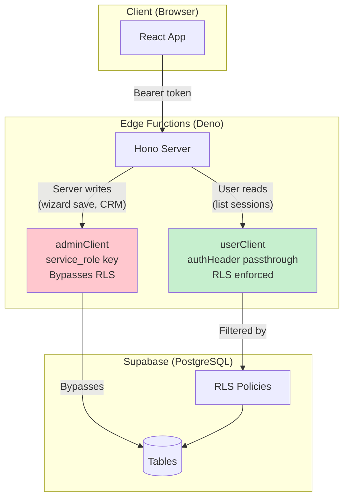

# P2: RLS & Security

> **Priority:** HIGH -- Required before public launch; data leaks without proper RLS
> **Depends on:** P0 (auth wiring) -- RLS policies reference `auth.uid()` which requires working auth
> **Est:** ~2 hours

---

## Status

| Table | RLS Enabled | SELECT | INSERT | UPDATE | DELETE | Status |
|-------|------------|--------|--------|--------|--------|--------|
| `profiles` | 🟢 Yes | 🟢 Own row | 🟢 Own row | 🟢 Own row | -- | 🟡 9 policies (redundant, consolidate in P6) |
| `wizard_sessions` | 🟢 Yes | 🟢 Anon+auth | 🟢 Anon+auth | 🟢 Auth | -- | 🟢 Good (anon by design) |
| `wizard_answers` | 🟢 Yes | 🟢 Anon+auth | 🟢 Anon+auth | -- | -- | 🟢 Good (anon by design) |
| `ai_cache` | 🟢 Yes | 🟢 Auth SELECT | -- | -- | -- | 🟢 Good (server-write) |
| `ai_run_logs` | 🟢 Yes | 🟢 Auth SELECT | -- | -- | -- | 🟢 Good (server-write) |
| `projects` | 🟢 Yes | 🟢 CRUD | 🟢 CRUD | 🟢 CRUD | 🟢 CRUD | 🟢 Good |
| `clients` | 🟢 Yes | 🟢 CRUD | 🟢 CRUD | 🟢 CRUD | 🟢 CRUD | 🟢 Good |
| `crm_*` (5 tables) | 🟢 Yes | 🟢 CRUD | 🟢 CRUD | 🟢 CRUD | 🟢 CRUD | 🟢 Good |
| `roadmaps` | 🟢 Yes | 🟢 SELECT | 🔴 Missing | 🔴 Missing | 🔴 Missing | 🟡 Fix in P6 |
| `roadmap_phases` | 🟢 Yes | 🟢 SELECT | 🔴 Missing | 🔴 Missing | 🔴 Missing | 🟡 Fix in P6 |
| `temp_anon` policies | -- | -- | -- | -- | -- | 🟢 None found (resolved) |

---

## Architecture: Auth & RLS Layers



### Two Client Patterns (from `server/db.tsx`)

```
adminClient()           -- service_role key, bypasses RLS
                          Used for: wizard upserts, CRM writes, user creation
                          SAFE: only called from trusted edge functions

userClient(authHeader)  -- passes user's JWT, RLS enforced
                          Used for: list user's own sessions, read own data
                          SAFE: scoped to auth.uid()
```

---

## RLS Policy Patterns

### Pattern A: User owns the row

```sql
-- SELECT: users see only their own rows
CREATE POLICY "Users read own" ON table_name
  FOR SELECT USING (auth.uid() = user_id);

-- INSERT: users can only insert for themselves
CREATE POLICY "Users insert own" ON table_name
  FOR INSERT WITH CHECK (auth.uid() = user_id);

-- UPDATE: users can only update their own rows
CREATE POLICY "Users update own" ON table_name
  FOR UPDATE USING (auth.uid() = user_id)
  WITH CHECK (auth.uid() = user_id);
```

### Pattern B: Server-only (no direct client access)

```sql
-- No policies = no access via userClient
-- adminClient (service_role) always bypasses RLS
-- Used for: ai_cache, ai_run_logs
```

### Pattern C: Anon-allowed (wizard before signup)

```sql
-- SELECT: anyone can read by session_id (no auth required)
CREATE POLICY "Anon read by session" ON wizard_sessions
  FOR SELECT USING (true);  -- edge function validates session ownership

-- The edge function itself validates session_id ownership
-- RLS allows read, but data is scoped by session_id in the query
```

---

## Implementation Steps

### Step 1: Audit current policies

```sql
-- Run in Supabase SQL Editor to see all existing policies
SELECT schemaname, tablename, policyname, permissive, roles, cmd, qual, with_check
FROM pg_policies
WHERE schemaname = 'public'
ORDER BY tablename, cmd;
```

### Step 2: Fix `ai_cache` and `ai_run_logs`

These tables are server-only -- `adminClient()` writes, nothing reads via `userClient()`.

```sql
-- ai_cache: server-only, no client access needed
-- RLS is enabled but has no policies = blocks all client access (correct!)
-- Verify: SELECT * FROM ai_cache; -- should return 0 rows via anon key

-- ai_run_logs: same pattern
-- If a dashboard page needs to read logs, add a scoped read policy:
CREATE POLICY "Users read own agent logs" ON ai_run_logs
  FOR SELECT USING (auth.uid() = user_id);
```

### Step 3: Remove `temp_anon` policies

Find and remove any policies named `temp_anon_*` or with overly permissive `USING (true)` on sensitive tables:

```sql
-- Find temp policies
SELECT tablename, policyname FROM pg_policies
WHERE policyname LIKE '%temp%' OR policyname LIKE '%anon%';

-- Drop each one
DROP POLICY IF EXISTS "temp_anon_select" ON clients;
DROP POLICY IF EXISTS "temp_anon_insert" ON clients;
-- ... repeat for each found
```

### Step 4: Ensure wizard tables allow anonymous access

Wizard needs to work before signup. The edge function uses `adminClient()` for writes, so RLS doesn't gate writes. But reads via `userClient()` need:

```sql
-- wizard_sessions: allow read by anyone (session_id scoping is in the query)
CREATE POLICY "Read wizard sessions" ON wizard_sessions
  FOR SELECT USING (true);

-- wizard_answers: same pattern
CREATE POLICY "Read wizard answers" ON wizard_answers
  FOR SELECT USING (true);
```

### Step 5: Ensure CRM tables require auth

```sql
-- clients: only authenticated users
CREATE POLICY "Auth users manage clients" ON clients
  FOR ALL USING (auth.uid() IS NOT NULL)
  WITH CHECK (auth.uid() IS NOT NULL);

-- contacts: only authenticated users
CREATE POLICY "Auth users manage contacts" ON contacts
  FOR ALL USING (auth.uid() IS NOT NULL)
  WITH CHECK (auth.uid() IS NOT NULL);
```

### Step 6: CORS audit

**File:** `supabase/functions/server/index.tsx`

Current CORS: `origin: "*"` -- acceptable for development, should be restricted for production:

```tsx
// Production:
origin: ['https://sunai.agency', 'https://www.sunai.agency', 'http://localhost:3000']
```

---

## Verification

```sql
-- Test 1: Anon key should NOT read clients
-- (Run with anon key in Supabase API explorer)
SELECT * FROM clients; -- Expected: 0 rows

-- Test 2: Anon key CAN read wizard_sessions
SELECT * FROM wizard_sessions LIMIT 1; -- Expected: rows if any exist

-- Test 3: Auth user CAN read their own clients
-- (Run with auth token)
SELECT * FROM clients; -- Expected: only their rows

-- Test 4: ai_cache is server-only
SELECT * FROM ai_cache; -- Expected: 0 rows via anon/auth key
```

---

## Security Checklist

| Check | Status |
|-------|--------|
| No hardcoded credentials in codebase | 🟢 Fixed (settings.local.json cleaned) |
| .env files in .gitignore | 🟢 Done |
| RLS enabled on all tables | 🟢 Yes (31/31) |
| RLS policies cover all referenced tables | 🟢 Audited 2026-03-07 (see P6 for minor gaps) |
| `temp_anon` policies removed | 🟢 None found (resolved) |
| CORS restricted to known origins | 🔴 Do for production |
| Edge function auth: sensitive routes check JWT | 🟢 CRM + dashboard-insights require auth |
| Gemini API key in env, not in code | 🟢 Uses `Deno.env.get()` |
| Service role key only in edge functions | 🟢 Only in `db.tsx` |
| `roadmaps`/`roadmap_phases` CRUD policies | 🟡 Fix in P6 |
| `profiles` redundant policies consolidated | 🟡 Fix in P6 |
