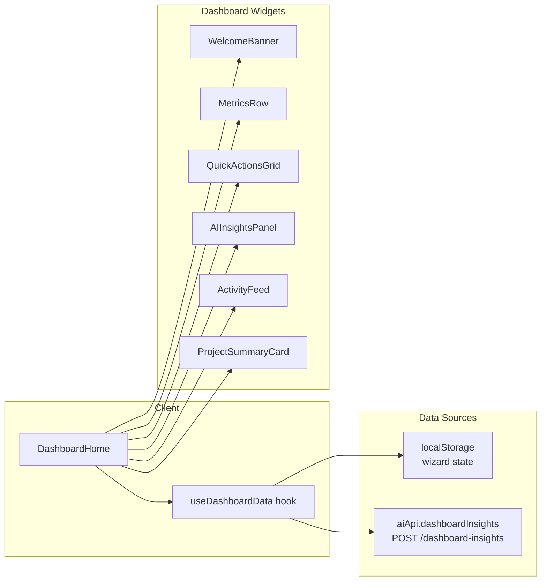

# P3: Dashboard Completion

> **Priority:** MEDIUM -- Build remaining stub pages and ensure all sidebar links resolve
> **Depends on:** P0 (auth wiring) -- dashboard unreachable until routes exist
> **Est:** ~1 week

---

## Status

| Dashboard Page | Path | Component | Status |
|----------------|------|-----------|--------|
| Dashboard Home | `/app/dashboard` | `DashboardHome.tsx` | 🟢 Complete |
| Projects List | `/app/projects` | `ProjectsList.tsx` | 🟢 Complete |
| Project Detail | `/app/projects/:id` | `ProjectDetail.tsx` | 🟢 Complete |
| Roadmap | `/app/roadmap` | `RoadmapPage.tsx` | 🟢 Complete |
| Roadmap Timeline | (embedded) | `RoadmapTimeline.tsx` | 🟢 Complete |
| Clients List | `/app/clients` | `ClientsListPage.tsx` | 🟢 Complete |
| Client Detail | `/app/clients/:id` | `ClientDetailPage.tsx` | 🟢 Complete |
| Client Form | (modal) | `ClientForm.tsx` | 🟢 Complete |
| AI Insights | `/app/insights` | `InsightsPage.tsx` | 🟢 Complete |
| Readiness Radar | (embedded) | `ReadinessRadar.tsx` | 🟢 Complete |
| Readiness Breakdown | (embedded) | `ReadinessBreakdown.tsx` | 🟢 Complete |
| Snapshot History | (embedded) | `SnapshotHistory.tsx` | 🟢 Complete |
| AI Agents | `/app/agents` | `AgentsPage.tsx` | 🟢 Complete |
| Run History | (embedded) | `RunHistoryTable.tsx` | 🟢 Complete |
| Token Usage | (embedded) | `TokenUsagePanel.tsx` | 🟢 Complete |
| Cache Stats | (embedded) | `CacheStatsPanel.tsx` | 🟢 Complete |
| Settings | `/app/settings` | `SettingsPage.tsx` | 🟢 Complete |
| **CRM Pipeline** | `/app/crm/pipelines` | `PlaceholderPage.tsx` | 🔴 Stub |
| **Documents** | `/app/documents` | `PlaceholderPage.tsx` | 🔴 Stub |
| **Financial** | `/app/financial` | `PlaceholderPage.tsx` | 🔴 Stub |
| **Workflows** | `/app/workflows` | `PlaceholderPage.tsx` | 🔴 Stub |
| **Activity Analytics** | `/app/analytics` | (none) | 🔴 Missing |
| **Services Catalog** | `/app/services` | (none) | 🔴 Missing |

**Built: 17/23 (74%) | Stubs: 4 | Missing: 2**

---

## Dashboard Architecture

```mermaid
flowchart TD
    subgraph "ProtectedRoute (auth guard)"
        subgraph "DashboardLayout (sidebar + header)"
            DH[DashboardHome\n/app/dashboard]
            PL[ProjectsList\n/app/projects]
            PD[ProjectDetail\n/app/projects/:id]
            RM[RoadmapPage\n/app/roadmap]
            CL[ClientsListPage\n/app/clients]
            CD[ClientDetailPage\n/app/clients/:id]
            IN[InsightsPage\n/app/insights]
            AG[AgentsPage\n/app/agents]
            ST[SettingsPage\n/app/settings]
            PP[CRM Pipeline\n/app/crm/pipelines]
            DC[Documents\n/app/documents]
            FN[Financial\n/app/financial]
            WF[Workflows\n/app/workflows]
        end
    end

    style DH fill:#c6efce
    style PL fill:#c6efce
    style PD fill:#c6efce
    style RM fill:#c6efce
    style CL fill:#c6efce
    style CD fill:#c6efce
    style IN fill:#c6efce
    style AG fill:#c6efce
    style ST fill:#c6efce
    style PP fill:#ffc7ce
    style DC fill:#ffc7ce
    style FN fill:#ffc7ce
    style WF fill:#ffc7ce
```



## Data Flow: Dashboard Home



---

## Implementation Steps

### Task 1: CRM Pipeline Page (`/app/crm/pipelines`)

**Create:** `src/components/dashboard/PipelinePage.tsx`

A Kanban-style pipeline view showing client progression through stages:
- Lead -> Qualified -> Proposal -> Negotiation -> Won/Lost
- Each card shows: client name, value, days in stage
- Drag-and-drop optional (can be v2)
- Data source: `GET /crm/clients` (already available, filter by `status` field)

**Sidebar entry already exists:** `DashboardSidebar.tsx:17` -- `{ to: '/app/crm/pipelines', label: 'CRM Pipeline', icon: GitBranch }`

### Task 2: Documents Page (`/app/documents`)

**Create:** `src/components/dashboard/DocumentsPage.tsx`

Document management view:
- List of briefs, proposals, reports
- Data source: `briefs` table (exists in schema)
- Filter by project, type, date
- PDF export link (if brief has content)

### Task 3: Financial Page (`/app/financial`)

**Create:** `src/components/dashboard/FinancialPage.tsx`

Financial overview:
- Revenue by month (Recharts bar chart)
- Project costs vs estimates
- Data source: mock data initially (no financial tables yet)
- Can reuse Recharts (already installed)

### Task 4: Workflows Page (`/app/workflows`)

**Create:** `src/components/dashboard/WorkflowsPage.tsx`

Automation dashboard:
- List of active/inactive workflows
- Status indicators
- Data source: mock data initially (no workflow tables)
- Placeholder for Phase 9 integration

### Task 5: Activity Analytics Page (`/app/analytics`)

**Create:** `src/components/dashboard/AnalyticsPage.tsx`

Activity and usage analytics:
- Wizard completions over time
- AI agent usage stats (from `ai_run_logs`)
- Data source: `ai_run_logs` table
- Recharts line/area charts

### Task 6: Services Catalog Page (`/app/services`)

**Create:** `src/components/dashboard/ServicesCatalogPage.tsx`

Available AI services and systems:
- Grid of service cards
- Status: active/available/coming soon
- Data source: static (from `src/lib/constants.ts` services)

### Task 7: Update routes for new pages

**File:** `src/routes.tsx`

Replace `PlaceholderPage` imports with real components:

```tsx
import PipelinePage from './components/dashboard/PipelinePage';
import DocumentsPage from './components/dashboard/DocumentsPage';
import FinancialPage from './components/dashboard/FinancialPage';
import WorkflowsPage from './components/dashboard/WorkflowsPage';
import AnalyticsPage from './components/dashboard/AnalyticsPage';
import ServicesCatalogPage from './components/dashboard/ServicesCatalogPage';

// In /app routes:
{ path: 'crm/pipelines', Component: PipelinePage },
{ path: 'documents', Component: DocumentsPage },
{ path: 'financial', Component: FinancialPage },
{ path: 'workflows', Component: WorkflowsPage },
{ path: 'analytics', Component: AnalyticsPage },
{ path: 'services', Component: ServicesCatalogPage },
```

### Task 8: Add sidebar entries for new pages

**File:** `src/components/dashboard/DashboardSidebar.tsx`

Add missing sidebar items:
```tsx
{ to: '/app/analytics', label: 'Analytics', icon: BarChart3 },
{ to: '/app/services', label: 'Services', icon: Package },
```

---

## Component Template

Each new page should follow the existing dashboard pattern:

```tsx
// Component pattern from existing dashboard pages
import { useAuth } from '../AuthContext';

export default function NewPage() {
  const { user } = useAuth();

  return (
    <div className="space-y-6">
      {/* Page header */}
      <div>
        <h1 className="text-2xl font-semibold text-[#1A1A1A]"
            style={{ fontFamily: 'Playfair Display, serif' }}>
          Page Title
        </h1>
        <p className="text-sm text-[#6B6B63] mt-1">Description</p>
      </div>

      {/* Content */}
      <div className="bg-white rounded-lg border border-[#E8E8E4] p-6">
        {/* ... */}
      </div>
    </div>
  );
}
```

**Design tokens:**
- Background: `#F5F5F0` (page), `#FFFFFF` (cards)
- Text: `#1A1A1A` (headings), `#6B6B63` (secondary)
- Border: `#E8E8E4`
- Accent: `#00875A` (green), `#84CC16` (lime)
- Font: `Playfair Display` (headings), `Lora` (body)

---

## Verification

1. `npm run build` -- zero errors
2. Log in and visit each sidebar link
3. All 11 sidebar items should render (no PlaceholderPage)
4. Responsive check: mobile hamburger menu, tablet icon sidebar, desktop full sidebar
