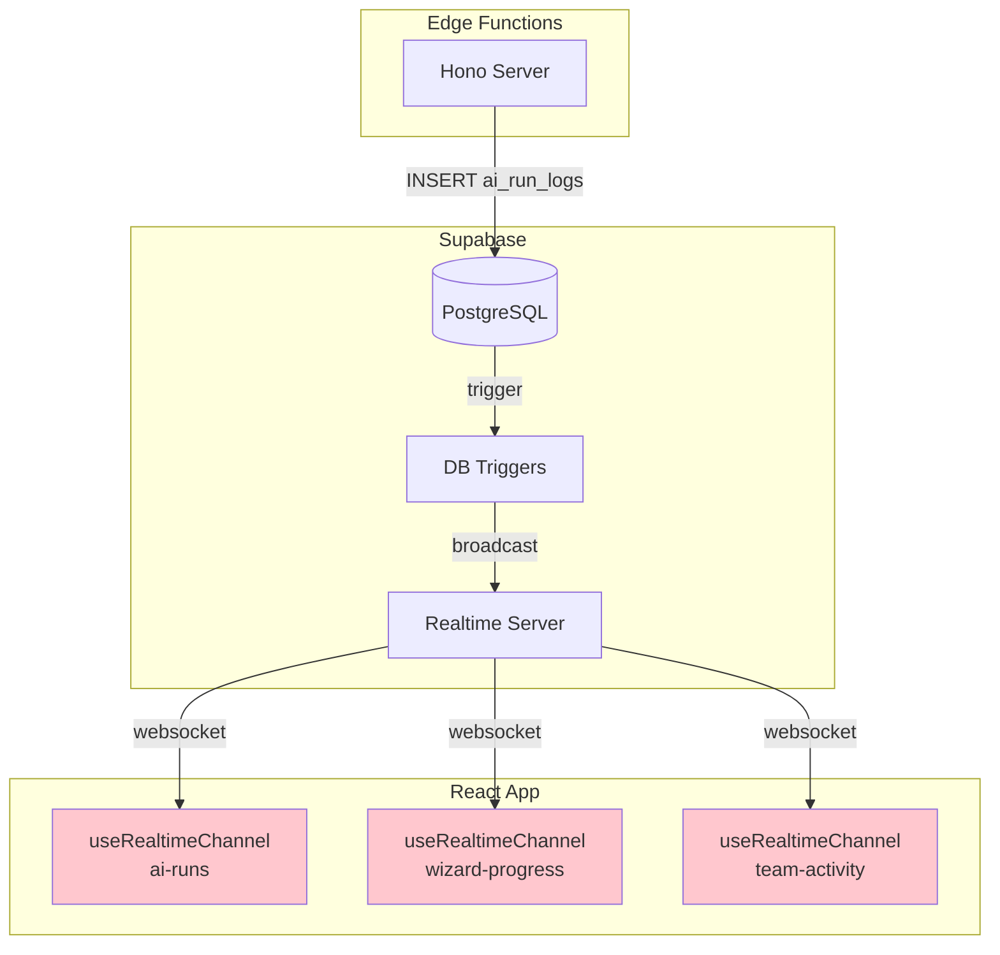

# P5: Supabase Realtime Implementation

> **Priority:** MEDIUM -- Enhances UX with live updates; not a blocker for launch
> **Depends on:** P0 (auth), P3 (dashboard pages), P4 (edge functions)
> **Est:** ~6 hours

---

## Status

| Channel | Table | Implementation | Status |
|---------|-------|----------------|--------|
| `ai-runs` | `ai_run_logs` | None (planned in visualization only) | Missing |
| `wizard-progress` | `wizard_sessions` | None | Missing |
| `team-activity` | `team_members` | None | Missing |
| `project-tasks` | `tasks` | None | Missing |
| `milestones` | `milestones` | None | Missing |

**Built: 0/5 (0%)**

> **Source:** 5 channels defined in `src/components/supabase-arch/RealtimeSystem.tsx` (visualization component only, not functional). Patterns documented in `.cursor/rules/supabase/ai-Realtime-assistant-.mdc`.

---

## Architecture



## Recommended Approach: Broadcast over postgres_changes

Per `.cursor/rules/supabase/ai-Realtime-assistant-.mdc`:

- **Use `broadcast`** instead of `postgres_changes` for better performance and RLS bypass
- **Database triggers** call `realtime.broadcast_changes()` to push events
- **Private channels** with RLS on `realtime.messages` for security
- **Topic naming**: `scope:entity:id` (e.g., `org:ai_runs:123`)

---

## Implementation Steps

### Step 1: Create reusable Realtime hook

**Create:** `src/lib/hooks/useRealtimeChannel.ts`

```tsx
import { useEffect, useRef } from 'react';
import { supabaseClient } from '../supabase';
import type { RealtimeChannel } from '@supabase/supabase-js';

interface UseRealtimeOptions {
  channelName: string;
  event: string;
  onMessage: (payload: any) => void;
  enabled?: boolean;
}

export function useRealtimeChannel({ channelName, event, onMessage, enabled = true }: UseRealtimeOptions) {
  const channelRef = useRef<RealtimeChannel | null>(null);

  useEffect(() => {
    if (!enabled) return;

    const channel = supabaseClient
      .channel(channelName)
      .on('broadcast', { event }, (payload) => {
        onMessage(payload.payload);
      })
      .subscribe((status) => {
        if (status === 'CHANNEL_ERROR') {
          // Auto-reconnect after 3s
          setTimeout(() => {
            channel.subscribe();
          }, 3000);
        }
      });

    channelRef.current = channel;

    return () => {
      channel.unsubscribe();
      channelRef.current = null;
    };
  }, [channelName, event, enabled]);

  return channelRef;
}
```

### Step 2: Database trigger for ai_run_logs (highest value)

**Create:** `supabase/migrations/YYYYMMDD_realtime_ai_runs.sql`

```sql
-- Trigger: broadcast new AI run log entries
CREATE OR REPLACE FUNCTION broadcast_ai_run_insert()
RETURNS trigger AS $$
BEGIN
  PERFORM realtime.broadcast_changes(
    'ai-runs',           -- topic
    TG_OP,               -- operation (INSERT)
    TG_OP,               -- operation
    TG_TABLE_NAME,       -- table
    TG_TABLE_SCHEMA,     -- schema
    NEW,                 -- new record
    OLD                  -- old record (null for INSERT)
  );
  RETURN NEW;
END;
$$ LANGUAGE plpgsql;

CREATE TRIGGER on_ai_run_log_insert
  AFTER INSERT ON ai_run_logs
  FOR EACH ROW
  EXECUTE FUNCTION broadcast_ai_run_insert();
```

### Step 3: Wire AI Agents page to Realtime

**File:** `src/components/dashboard/agents/AgentsPage.tsx`

Add live AI run feed:

```tsx
import { useRealtimeChannel } from '../../../lib/hooks/useRealtimeChannel';

// Inside AgentsPage component:
const [liveRuns, setLiveRuns] = useState<any[]>([]);

useRealtimeChannel({
  channelName: 'ai-runs',
  event: 'INSERT',
  onMessage: (newRun) => {
    setLiveRuns(prev => [newRun, ...prev].slice(0, 50));
  },
});
```

### Step 4: Database trigger for wizard_sessions

**Create:** `supabase/migrations/YYYYMMDD_realtime_wizard.sql`

```sql
CREATE OR REPLACE FUNCTION broadcast_wizard_update()
RETURNS trigger AS $$
BEGIN
  PERFORM realtime.broadcast_changes(
    'wizard-progress',
    TG_OP,
    TG_OP,
    TG_TABLE_NAME,
    TG_TABLE_SCHEMA,
    NEW,
    OLD
  );
  RETURN NEW;
END;
$$ LANGUAGE plpgsql;

CREATE TRIGGER on_wizard_session_update
  AFTER UPDATE ON wizard_sessions
  FOR EACH ROW
  EXECUTE FUNCTION broadcast_wizard_update();
```

### Step 5: Wire wizard processing page (optional for v1)

If a processing/loading screen exists during wizard AI calls, subscribe to `wizard-progress` to show live step completion indicators.

---

## Priority Order

| # | Channel | Value | Complexity | Recommended |
|---|---------|-------|------------|-------------|
| 1 | `ai-runs` | High -- live agent activity feed | Low | Phase 1 |
| 2 | `wizard-progress` | Medium -- processing page updates | Low | Phase 1 |
| 3 | `team-activity` | Low -- team roster changes | Low | Phase 2 |
| 4 | `project-tasks` | Medium -- task board auto-refresh | Medium | Phase 2 |
| 5 | `milestones` | Low -- infrequent updates | Low | Phase 2 |

---

## Security Considerations

- Use **private channels** for org-scoped data
- Enable **RLS on `realtime.messages`** for channel-level access control
- Never broadcast sensitive fields (passwords, tokens) via Realtime
- Validate payload shape client-side before updating state

---

## Verification

1. Insert a row into `ai_run_logs` via SQL or edge function
2. AgentsPage should show the new entry in the live feed within 1s
3. No console errors related to Realtime subscription
4. Channel disconnects cleanly on page unmount
