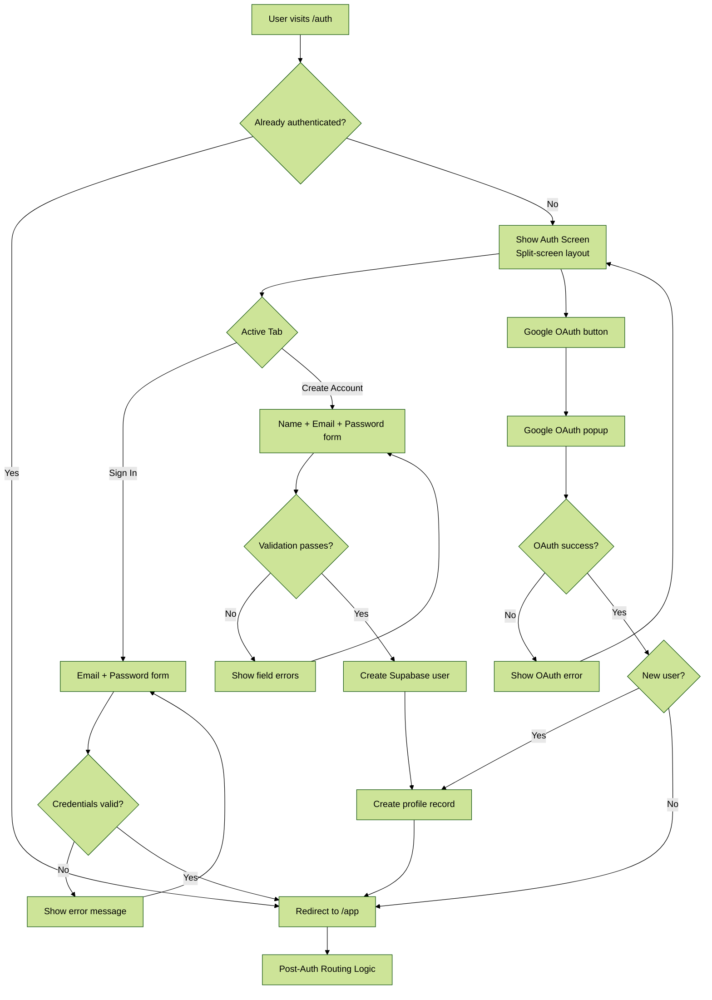
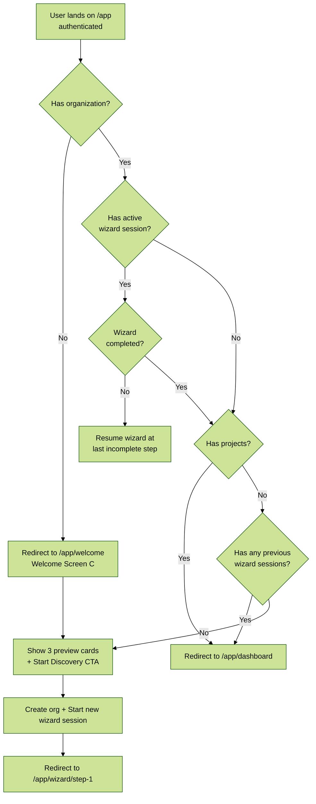
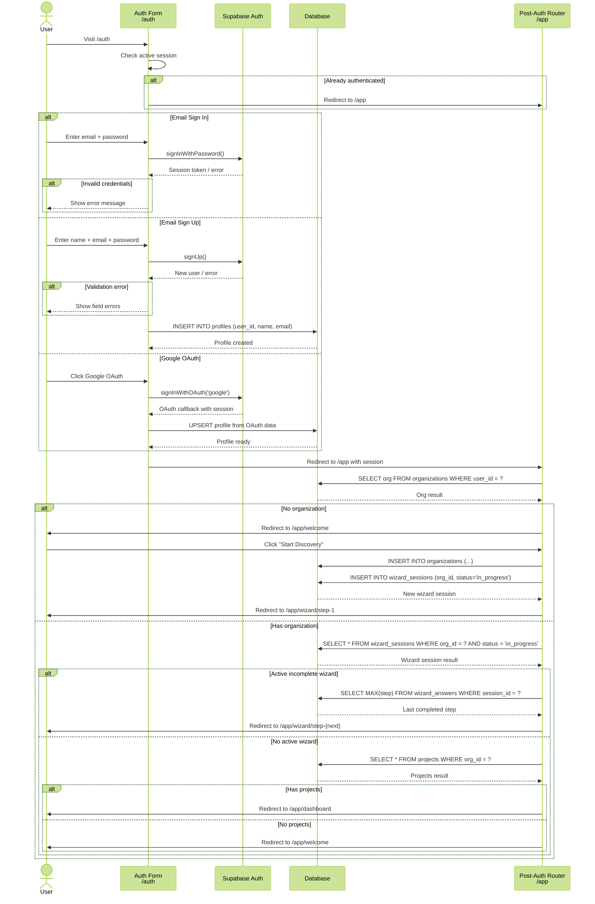

# Screen 0 / Entry: Auth & Routing

## Overview

The auth entry point consists of three sub-screens:

- **Screen A** -- Login/Signup at `/auth` (split-screen: left branding, right form with Sign In / Create Account tabs, Google OAuth)
- **Screen B** -- Post-Auth Routing at `/app` (checks org, wizard sessions, projects, then routes to appropriate destination)
- **Screen C** -- Welcome at `/app/welcome` (for new users, 3 preview cards, "Start Discovery" CTA)

---

## 1. Auth Flow

---

## 2. Post-Auth Routing Logic

---

## 3. Auth Sequence

