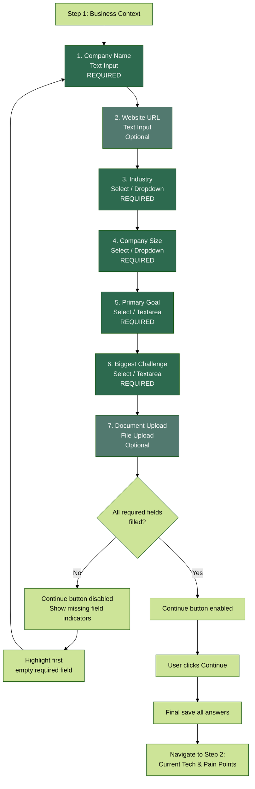
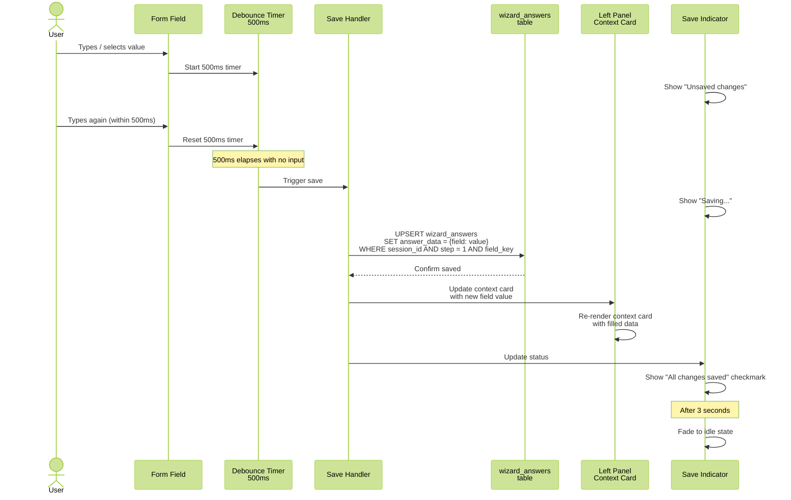
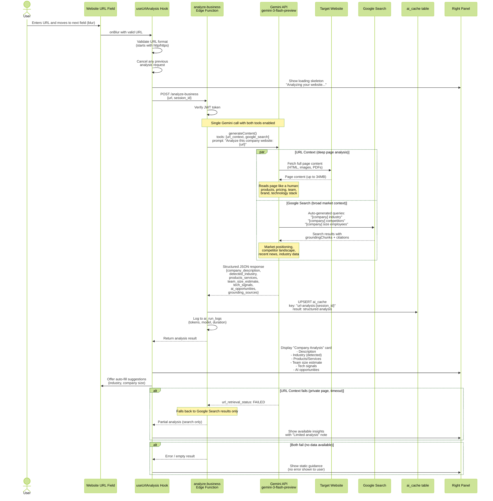
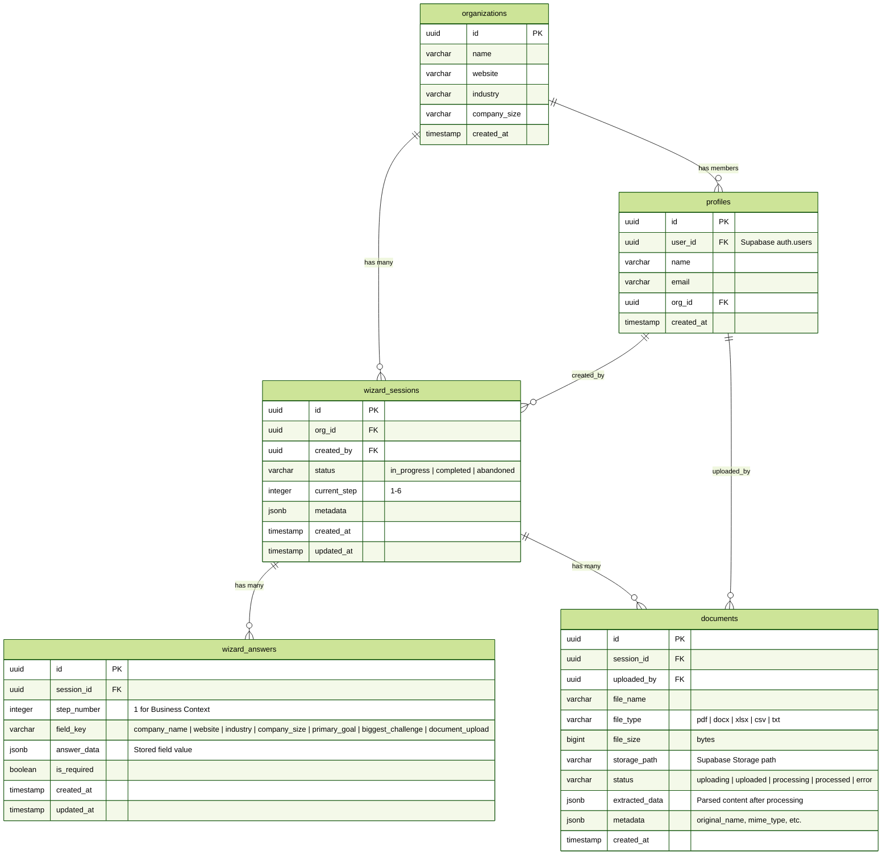

# Step 1: Business Context

## Overview

A form with 7 fields collecting foundational business information. Features auto-save with 500ms debounce, a left panel with progress and a real-time context card, and a right panel with field-specific guidance that changes on focus.

### Fields

| # | Field | Type | Required |
|---|-------|------|----------|
| 1 | Company Name | Text input | Yes |
| 2 | Website URL | Text input | No |
| 3 | Industry | Select / Dropdown | Yes |
| 4 | Company Size | Select / Dropdown | Yes |
| 5 | Primary Goal | Select / Textarea | Yes |
| 6 | Biggest Challenge | Select / Textarea | Yes |
| 7 | Document Upload | File upload | No |

**Continue requires:** company_name, industry, company_size, primary_goal, biggest_challenge

**AI features on this step:**
- URL Context: When user enters website URL, Gemini reads the full page content (HTML, PDFs, images up to 34MB, max 20 URLs)
- Google Search: Gemini searches for company context, competitors, industry data, and market positioning
- Both tools fire together in a single analyze-business Edge Function call (gemini-3-flash-preview)
- Results cached in ai_cache, displayed in right panel, and can auto-fill industry + company size fields

---

## 1. Form Field Flow



---

## 2. Auto-Save Sequence



---

## 3. URL Analysis Flow (URL Context + Google Search)



---

## 4. Right Panel State

```mermaid
%%{init: {'theme': 'forest'}}%%
stateDiagram-v2
    [*] --> Default

    Default: Default State
    Default: "Tell us about your business"
    Default: General overview of Step 1 purpose

    CompanyName: Company Name Focused
    CompanyName: "What's your company called?"
    CompanyName: Tips for brand consistency

    Website: Website URL Focused
    Website: "Share your online presence"
    Website: We'll analyze your site for AI opportunities

    Industry: Industry Focused
    Industry: "What industry are you in?"
    Industry: Industry-specific AI use cases + examples

    Size: Company Size Focused
    Size: "How large is your team?"
    Size: Scale-appropriate recommendations

    Goal: Primary Goal Focused
    Goal: "What do you want to achieve?"
    Goal: Goal-aligned AI solution previews

    Challenge: Biggest Challenge Focused
    Challenge: "What's holding you back?"
    Challenge: How AI addresses common challenges

    Upload: Document Upload Focused
    Upload: "Share relevant documents"
    Upload: Accepted formats, size limits, examples

    Default --> CompanyName: Focus company_name
    Default --> Website: Focus website
    Default --> Industry: Focus industry
    Default --> Size: Focus company_size
    Default --> Goal: Focus primary_goal
    Default --> Challenge: Focus biggest_challenge
    Default --> Upload: Focus document_upload

    CompanyName --> Default: Blur (no other focus)
    Website --> Default: Blur (no other focus)
    Industry --> Default: Blur (no other focus)
    Size --> Default: Blur (no other focus)
    Goal --> Default: Blur (no other focus)
    Challenge --> Default: Blur (no other focus)
    Upload --> Default: Blur (no other focus)

    CompanyName --> Website: Focus website
    CompanyName --> Industry: Focus industry
    Website --> Industry: Focus industry
    Industry --> Size: Focus company_size
    Size --> Goal: Focus primary_goal
    Goal --> Challenge: Focus biggest_challenge
    Challenge --> Upload: Focus document_upload
    Upload --> CompanyName: Focus company_name
```

---

## 5. Step 1 Data Model


