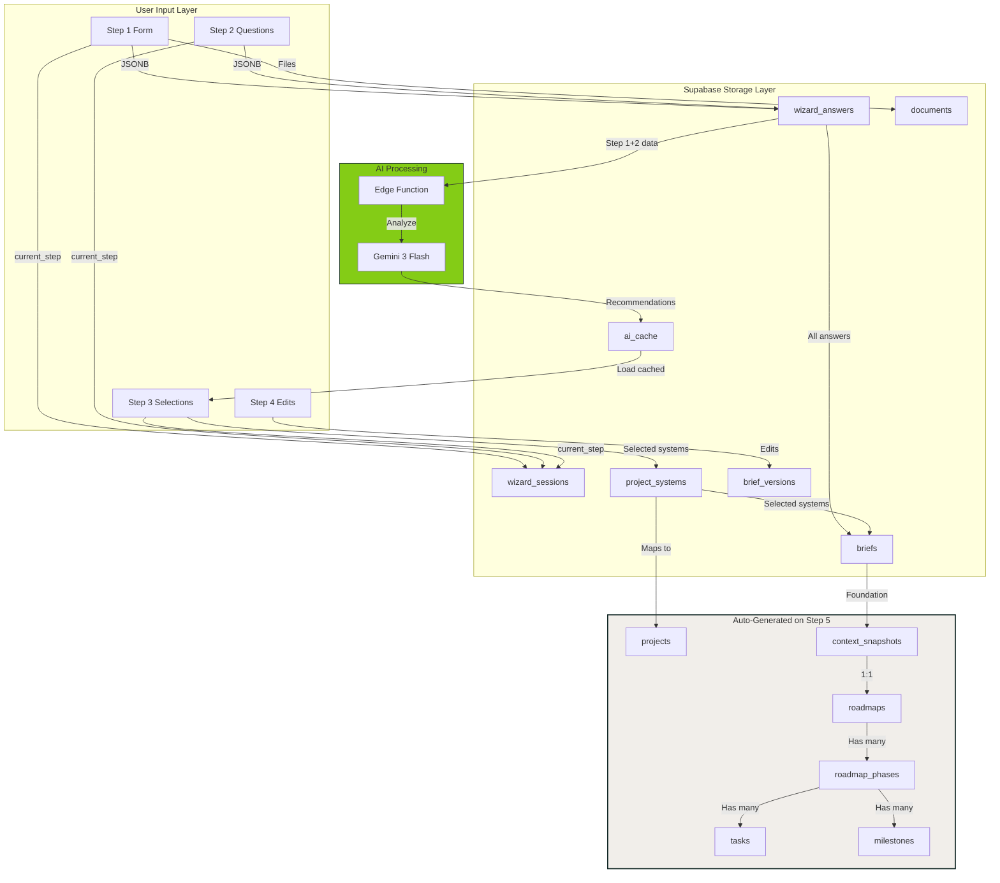
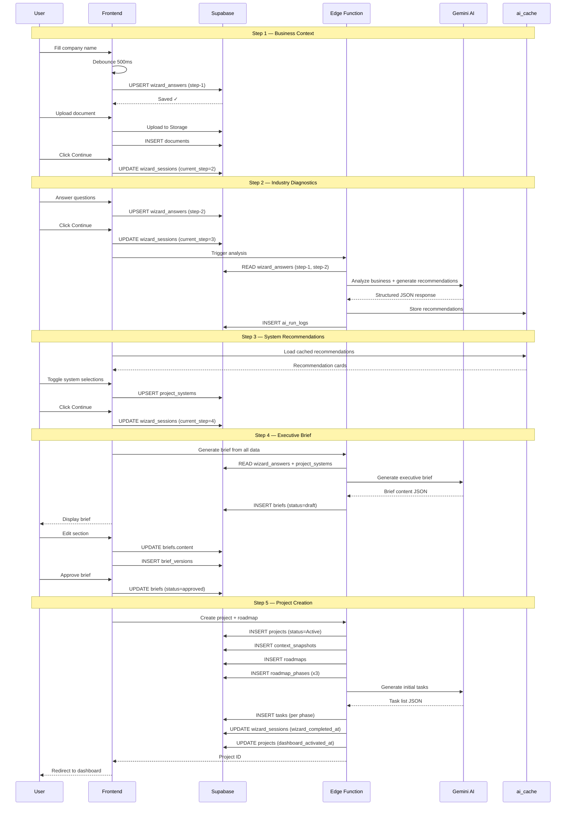
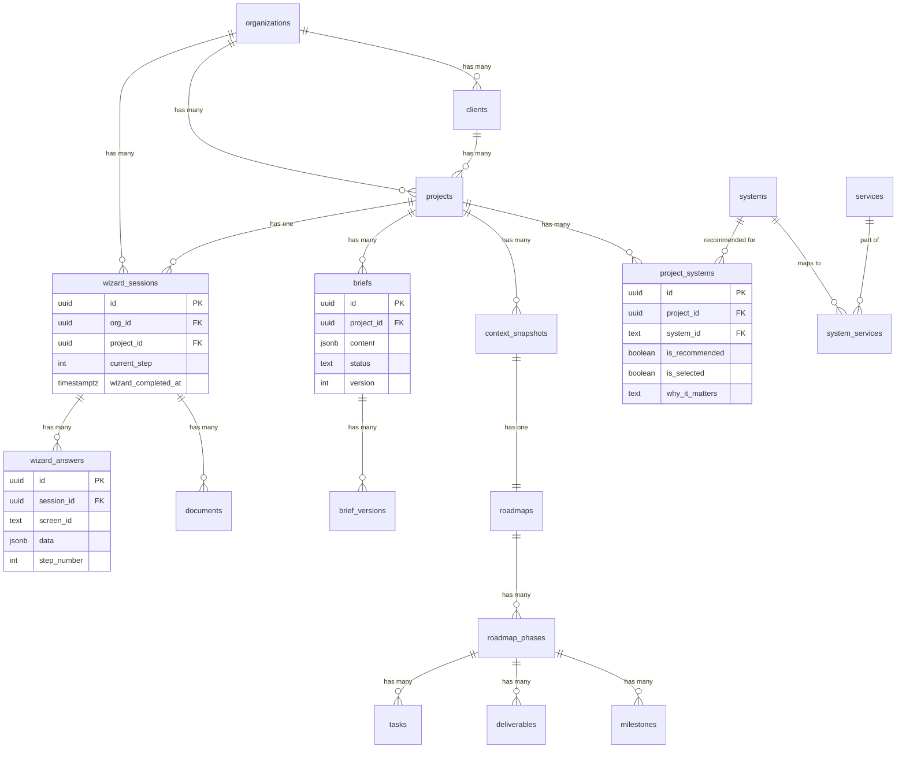

# Wizard Data Flow Diagrams

## Data Architecture

```mermaid
flowchart TD
    subgraph UserInput["User Input Layer"]
        S1_Form[Step 1 Form]
        S2_Form[Step 2 Questions]
        S3_Select[Step 3 Selections]
        S4_Edit[Step 4 Edits]
    end

    subgraph Storage["Supabase Storage Layer"]
        WA[wizard_answers]
        WS[wizard_sessions]
        PS[project_systems]
        BR[briefs]
        BV[brief_versions]
        DOC[documents]
        AC[ai_cache]
    end

    subgraph Generated["Auto-Generated on Step 5"]
        PR[projects]
        CS[context_snapshots]
        RM[roadmaps]
        RP[roadmap_phases]
        TK[tasks]
        ML[milestones]
    end

    subgraph AI["AI Processing"]
        EF[Edge Function]
        GM[Gemini 3 Flash]
    end

    S1_Form -->|JSONB| WA
    S1_Form -->|Files| DOC
    S1_Form -->|current_step| WS

    S2_Form -->|JSONB| WA
    S2_Form -->|current_step| WS
    WA -->|Step 1+2 data| EF
    EF -->|Analyze| GM
    GM -->|Recommendations| AC

    AC -->|Load cached| S3_Select
    S3_Select -->|Selected systems| PS
    S3_Select -->|current_step| WS

    WA -->|All answers| BR
    PS -->|Selected systems| BR
    S4_Edit -->|Edits| BV

    BR -->|Foundation| CS
    CS -->|1:1| RM
    RM -->|Has many| RP
    RP -->|Has many| TK
    RP -->|Has many| ML
    PS -->|Maps to| PR

    style AI fill:#84CC16,stroke:#0A211F,stroke-width:1px
    style Generated fill:#F1EEEA,stroke:#0A211F,stroke-width:2px
```

## Per-Step Data Save Sequence

```mermaid
sequenceDiagram
    participant U as User
    participant FE as Frontend
    participant SB as Supabase
    participant EF as Edge Function
    participant GM as Gemini AI
    participant Cache as ai_cache

    Note over U,Cache: Step 1 — Business Context
    U->>FE: Fill company name
    FE->>FE: Debounce 500ms
    FE->>SB: UPSERT wizard_answers (step-1)
    SB-->>FE: Saved ✓
    U->>FE: Upload document
    FE->>SB: Upload to Storage
    FE->>SB: INSERT documents
    U->>FE: Click Continue
    FE->>SB: UPDATE wizard_sessions (current_step=2)

    Note over U,Cache: Step 2 — Industry Diagnostics
    U->>FE: Answer questions
    FE->>SB: UPSERT wizard_answers (step-2)
    U->>FE: Click Continue
    FE->>SB: UPDATE wizard_sessions (current_step=3)
    FE->>EF: Trigger analysis
    EF->>SB: READ wizard_answers (step-1, step-2)
    EF->>GM: Analyze business + generate recommendations
    GM-->>EF: Structured JSON response
    EF->>Cache: Store recommendations
    EF->>SB: INSERT ai_run_logs

    Note over U,Cache: Step 3 — System Recommendations
    FE->>Cache: Load cached recommendations
    Cache-->>FE: Recommendation cards
    U->>FE: Toggle system selections
    FE->>SB: UPSERT project_systems
    U->>FE: Click Continue
    FE->>SB: UPDATE wizard_sessions (current_step=4)

    Note over U,Cache: Step 4 — Executive Brief
    FE->>EF: Generate brief from all data
    EF->>SB: READ wizard_answers + project_systems
    EF->>GM: Generate executive brief
    GM-->>EF: Brief content JSON
    EF->>SB: INSERT briefs (status=draft)
    FE-->>U: Display brief
    U->>FE: Edit section
    FE->>SB: UPDATE briefs.content
    FE->>SB: INSERT brief_versions
    U->>FE: Approve brief
    FE->>SB: UPDATE briefs (status=approved)

    Note over U,Cache: Step 5 — Project Creation
    FE->>EF: Create project + roadmap
    EF->>SB: INSERT projects (status=Active)
    EF->>SB: INSERT context_snapshots
    EF->>SB: INSERT roadmaps
    EF->>SB: INSERT roadmap_phases (x3)
    EF->>GM: Generate initial tasks
    GM-->>EF: Task list JSON
    EF->>SB: INSERT tasks (per phase)
    EF->>SB: UPDATE wizard_sessions (wizard_completed_at)
    EF->>SB: UPDATE projects (dashboard_activated_at)
    EF-->>FE: Project ID
    FE-->>U: Redirect to dashboard
```

## Database Entity Relationships (Wizard-Related)

```mermaid
erDiagram
    organizations ||--o{ wizard_sessions : "has many"
    organizations ||--o{ clients : "has many"
    organizations ||--o{ projects : "has many"

    clients ||--o{ projects : "has many"

    projects ||--o{ wizard_sessions : "has one"
    projects ||--o{ briefs : "has many"
    projects ||--o{ context_snapshots : "has many"
    projects ||--o{ project_systems : "has many"

    wizard_sessions ||--o{ wizard_answers : "has many"
    wizard_sessions ||--o{ documents : "has many"

    briefs ||--o{ brief_versions : "has many"

    context_snapshots ||--|| roadmaps : "has one"
    roadmaps ||--o{ roadmap_phases : "has many"
    roadmap_phases ||--o{ tasks : "has many"
    roadmap_phases ||--o{ deliverables : "has many"
    roadmap_phases ||--o{ milestones : "has many"

    systems ||--o{ project_systems : "recommended for"
    systems ||--o{ system_services : "maps to"
    services ||--o{ system_services : "part of"

    wizard_sessions {
        uuid id PK
        uuid org_id FK
        uuid project_id FK
        int current_step
        timestamptz wizard_completed_at
    }

    wizard_answers {
        uuid id PK
        uuid session_id FK
        text screen_id
        jsonb data
        int step_number
    }

    briefs {
        uuid id PK
        uuid project_id FK
        jsonb content
        text status
        int version
    }

    project_systems {
        uuid id PK
        uuid project_id FK
        text system_id FK
        boolean is_recommended
        boolean is_selected
        text why_it_matters
    }
```
