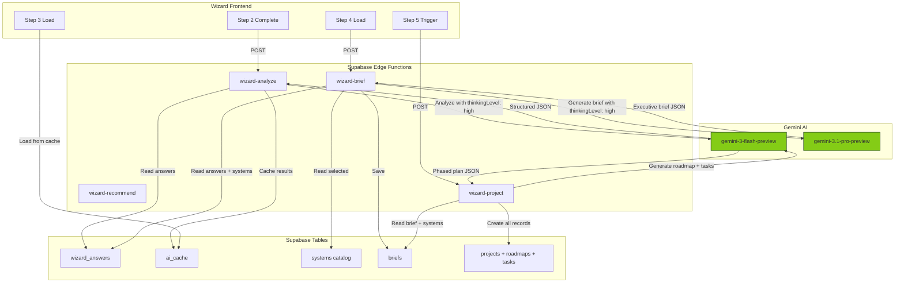
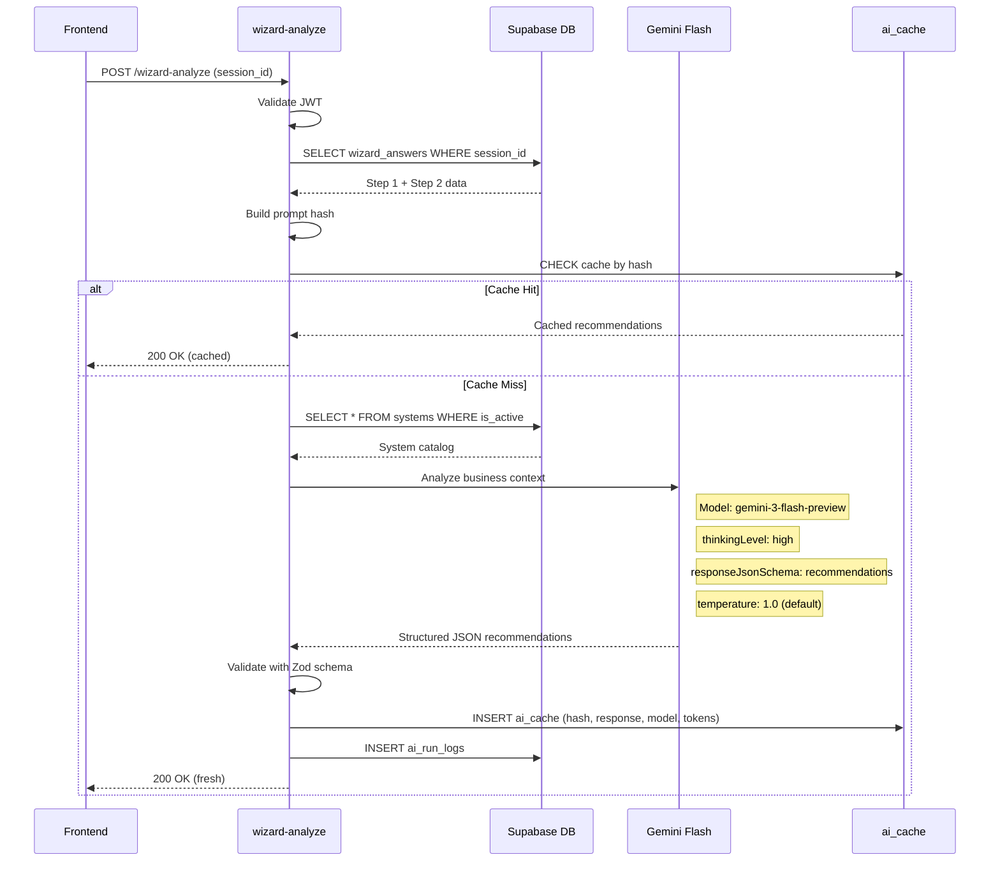
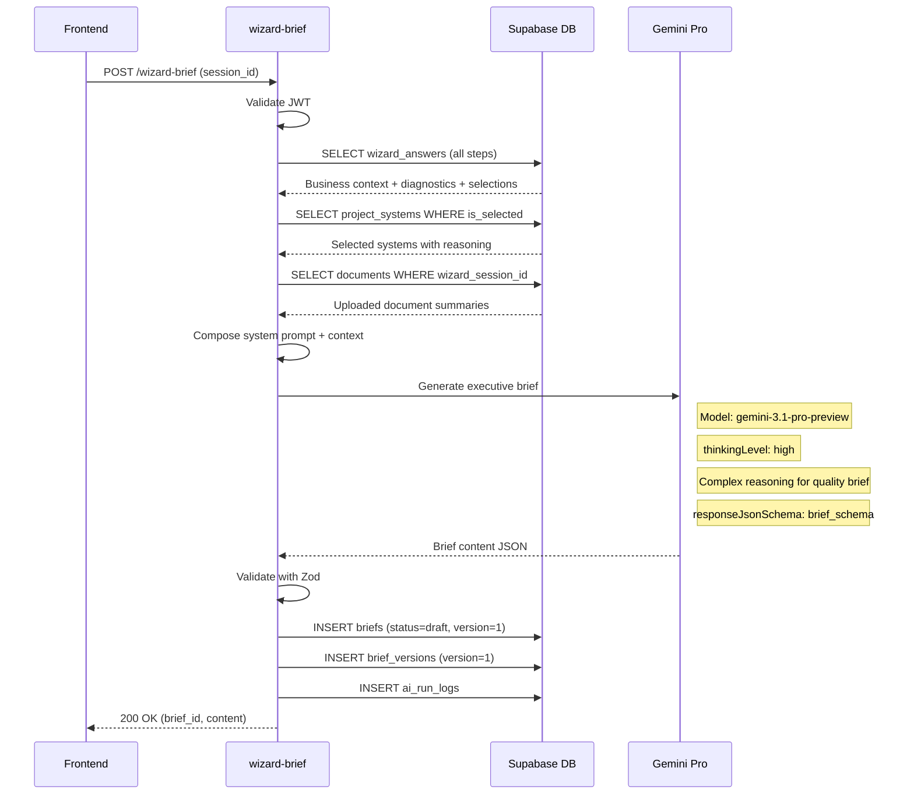
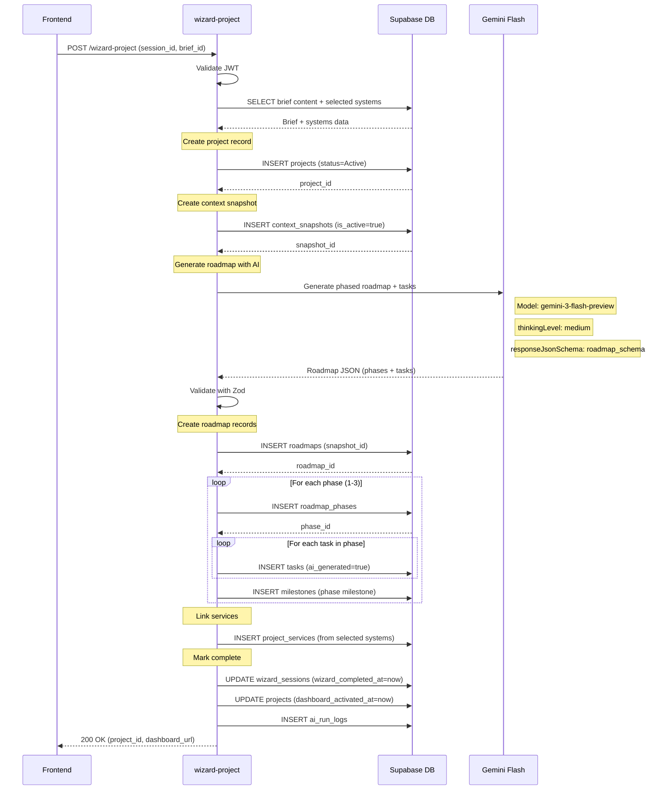
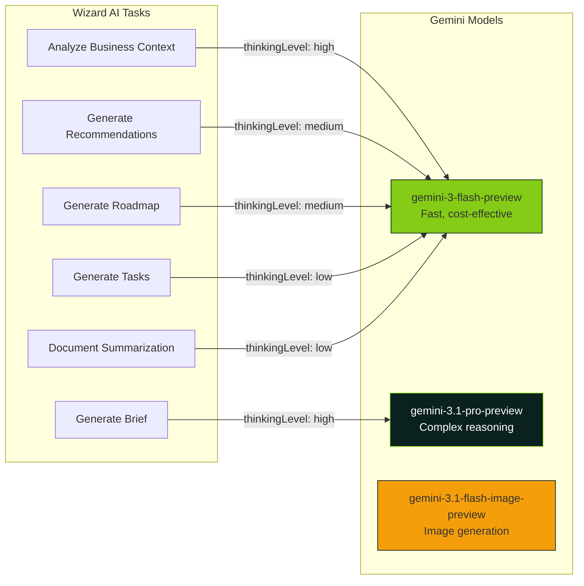

# AI Agent & Edge Function Flow Diagrams

## Wizard AI Agent Architecture

## AI Analysis Edge Function (Step 2 → Step 3)

## Brief Generation Edge Function (Step 4)

## Project Creation Edge Function (Step 5)

## AI Model Selection Strategy

