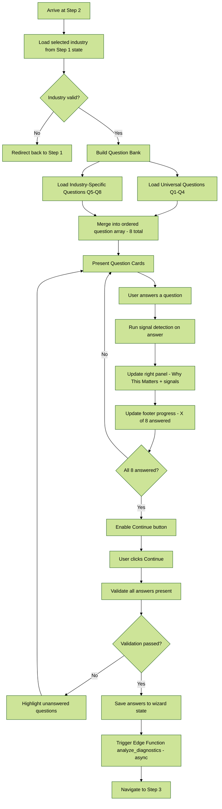
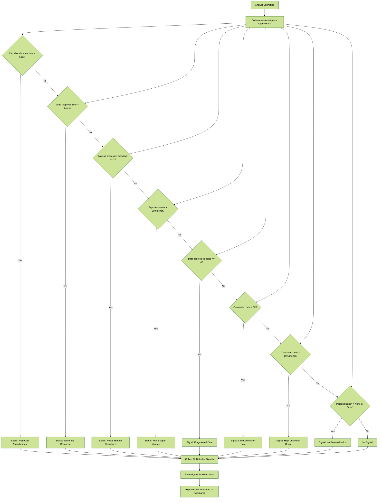
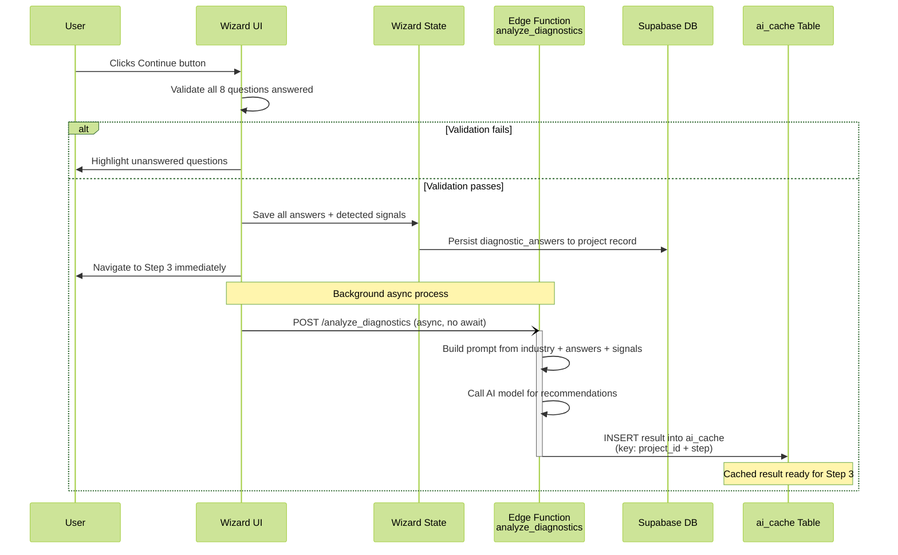
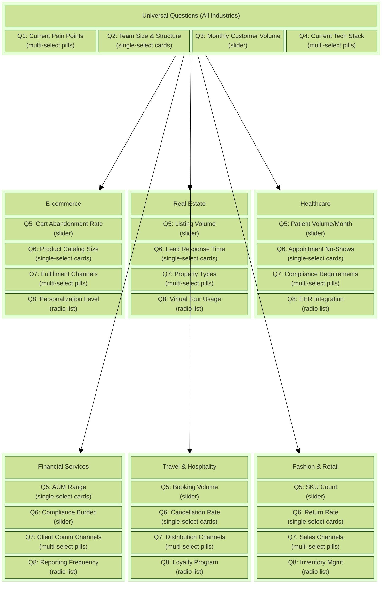

# Step 2 - Industry Diagnostics

## 1. Question Flow

```mermaid
%%{init: {'theme': 'forest'}}%%
flowchart TD
    A[Arrive at Step 2] --> B[Load selected industry from Step 1 state]
    B --> C{Industry valid?}
    C -- No --> D[Redirect back to Step 1]
    C -- Yes --> E[Build Question Bank]

    E --> F[Load Universal Questions Q1-Q4]
    E --> G[Load Industry-Specific Questions Q5-Q8]
    F --> H[Merge into ordered question array - 8 total]
    G --> H

    H --> I[Present Question Cards]
    I --> J[User answers a question]
    J --> K[Run signal detection on answer]
    K --> L[Update right panel - Why This Matters + signals]
    L --> M[Update footer progress - X of 8 answered]

    M --> N{All 8 answered?}
    N -- No --> I
    N -- Yes --> O[Enable Continue button]

    O --> P[User clicks Continue]
    P --> Q[Validate all answers present]
    Q --> R{Validation passed?}
    R -- No --> S[Highlight unanswered questions]
    S --> I
    R -- Yes --> T[Save answers to wizard state]
    T --> U[Trigger Edge Function analyze_diagnostics - async]
    U --> V[Navigate to Step 3]
```

## 2. Signal Detection Logic

```mermaid
%%{init: {'theme': 'forest'}}%%
flowchart TD
    START[Answer Submitted] --> EVAL[Evaluate Answer Against Signal Rules]

    EVAL --> CHK_CART{Cart abandonment rate > 50%?}
    CHK_CART -- Yes --> SIG_CART["Signal: High Cart Abandonment"]
    CHK_CART -- No --> CHK_LEAD

    EVAL --> CHK_LEAD{Lead response time > 24hrs?}
    CHK_LEAD -- Yes --> SIG_LEAD["Signal: Slow Lead Response"]
    CHK_LEAD -- No --> CHK_MANUAL

    EVAL --> CHK_MANUAL{Manual processes selected >= 3?}
    CHK_MANUAL -- Yes --> SIG_MANUAL["Signal: Heavy Manual Operations"]
    CHK_MANUAL -- No --> CHK_SUPPORT

    EVAL --> CHK_SUPPORT{Support volume > 500/month?}
    CHK_SUPPORT -- Yes --> SIG_SUPPORT["Signal: High Support Volume"]
    CHK_SUPPORT -- No --> CHK_DATA

    EVAL --> CHK_DATA{Data sources selected >= 4?}
    CHK_DATA -- Yes --> SIG_DATA["Signal: Fragmented Data"]
    CHK_DATA -- No --> CHK_CONV

    EVAL --> CHK_CONV{Conversion rate < 2%?}
    CHK_CONV -- Yes --> SIG_CONV["Signal: Low Conversion Rate"]
    CHK_CONV -- No --> CHK_CHURN

    EVAL --> CHK_CHURN{Customer churn > 10%/month?}
    CHK_CHURN -- Yes --> SIG_CHURN["Signal: High Customer Churn"]
    CHK_CHURN -- No --> CHK_PERSONAL

    EVAL --> CHK_PERSONAL{Personalization = None or Basic?}
    CHK_PERSONAL -- Yes --> SIG_PERSONAL["Signal: No Personalization"]
    CHK_PERSONAL -- No --> DONE

    SIG_CART --> COLLECT[Collect All Detected Signals]
    SIG_LEAD --> COLLECT
    SIG_MANUAL --> COLLECT
    SIG_SUPPORT --> COLLECT
    SIG_DATA --> COLLECT
    SIG_CONV --> COLLECT
    SIG_CHURN --> COLLECT
    SIG_PERSONAL --> COLLECT
    DONE[No Signal] --> COLLECT

    COLLECT --> STORE[Store signals in wizard state]
    STORE --> DISPLAY[Display signal indicators on right panel]
```

## 3. AI Trigger Sequence

```mermaid
%%{init: {'theme': 'forest'}}%%
sequenceDiagram
    participant U as User
    participant UI as Wizard UI
    participant S as Wizard State
    participant EF as Edge Function<br/>analyze_diagnostics
    participant DB as Supabase DB
    participant AC as ai_cache Table

    U->>UI: Clicks Continue button
    UI->>UI: Validate all 8 questions answered
    alt Validation fails
        UI->>U: Highlight unanswered questions
    else Validation passes
        UI->>S: Save all answers + detected signals
        S->>DB: Persist diagnostic_answers to project record
        UI->>U: Navigate to Step 3 immediately

        Note over UI,EF: Background async process
        UI-)EF: POST /analyze_diagnostics (async, no await)
        activate EF
        EF->>EF: Build prompt from industry + answers + signals
        EF->>EF: Call AI model for recommendations
        EF->>AC: INSERT result into ai_cache<br/>(key: project_id + step)
        deactivate EF
        Note over AC: Cached result ready for Step 3
    end
```

## 4. Industry Question Bank

```mermaid
%%{init: {'theme': 'forest'}}%%
block-beta
    columns 3

    block:UNIVERSAL:3
        columns 4
        UH["Universal Questions (All Industries)"]:4
        Q1["Q1: Current Pain Points<br/>(multi-select pills)"]
        Q2["Q2: Team Size & Structure<br/>(single-select cards)"]
        Q3["Q3: Monthly Customer Volume<br/>(slider)"]
        Q4["Q4: Current Tech Stack<br/>(multi-select pills)"]
    end

    space:3

    block:ECOM
        columns 1
        IH1["E-commerce"]
        Q5A["Q5: Cart Abandonment Rate<br/>(slider)"]
        Q6A["Q6: Product Catalog Size<br/>(single-select cards)"]
        Q7A["Q7: Fulfillment Channels<br/>(multi-select pills)"]
        Q8A["Q8: Personalization Level<br/>(radio list)"]
    end

    block:REALESTATE
        columns 1
        IH2["Real Estate"]
        Q5B["Q5: Listing Volume<br/>(slider)"]
        Q6B["Q6: Lead Response Time<br/>(single-select cards)"]
        Q7B["Q7: Property Types<br/>(multi-select pills)"]
        Q8B["Q8: Virtual Tour Usage<br/>(radio list)"]
    end

    block:HEALTH
        columns 1
        IH3["Healthcare"]
        Q5C["Q5: Patient Volume/Month<br/>(slider)"]
        Q6C["Q6: Appointment No-Shows<br/>(single-select cards)"]
        Q7C["Q7: Compliance Requirements<br/>(multi-select pills)"]
        Q8C["Q8: EHR Integration<br/>(radio list)"]
    end

    space:3

    block:FINANCE
        columns 1
        IH4["Financial Services"]
        Q5D["Q5: AUM Range<br/>(single-select cards)"]
        Q6D["Q6: Compliance Burden<br/>(slider)"]
        Q7D["Q7: Client Comm Channels<br/>(multi-select pills)"]
        Q8D["Q8: Reporting Frequency<br/>(radio list)"]
    end

    block:TRAVEL
        columns 1
        IH5["Travel & Hospitality"]
        Q5E["Q5: Booking Volume<br/>(slider)"]
        Q6E["Q6: Cancellation Rate<br/>(single-select cards)"]
        Q7E["Q7: Distribution Channels<br/>(multi-select pills)"]
        Q8E["Q8: Loyalty Program<br/>(radio list)"]
    end

    block:FASHION
        columns 1
        IH6["Fashion & Retail"]
        Q5F["Q5: SKU Count<br/>(slider)"]
        Q6F["Q6: Return Rate<br/>(single-select cards)"]
        Q7F["Q7: Sales Channels<br/>(multi-select pills)"]
        Q8F["Q8: Inventory Mgmt<br/>(radio list)"]
    end

    UNIVERSAL --> ECOM
    UNIVERSAL --> REALESTATE
    UNIVERSAL --> HEALTH
    UNIVERSAL --> FINANCE
    UNIVERSAL --> TRAVEL
    UNIVERSAL --> FASHION
```
