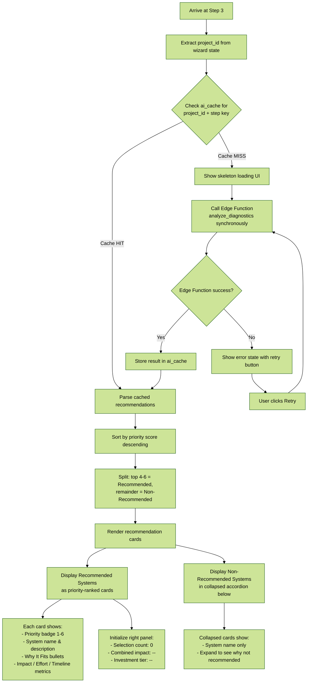
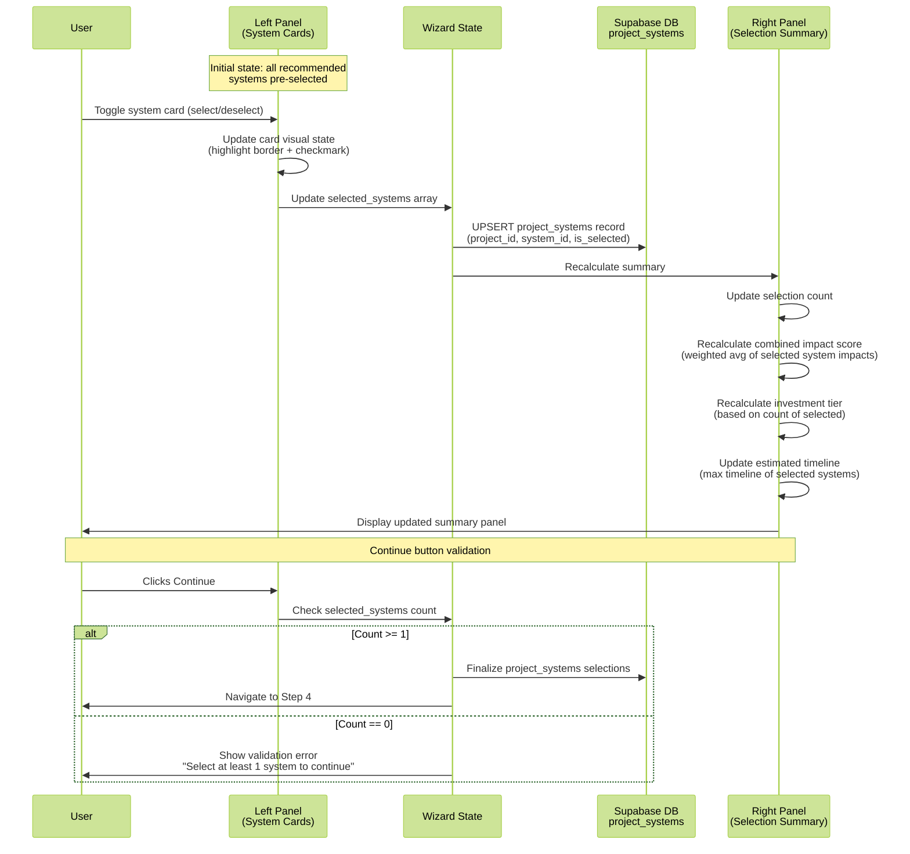
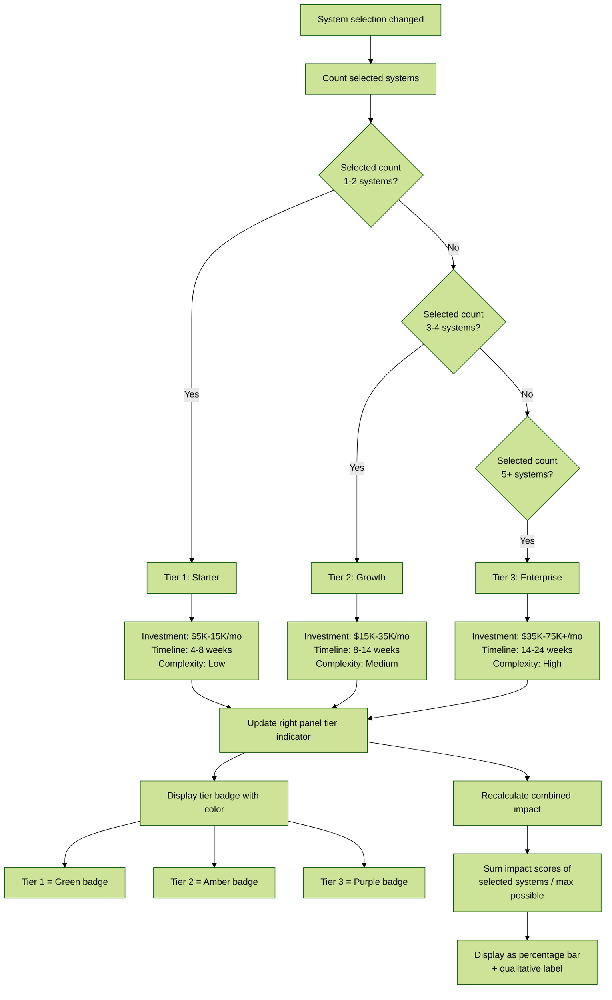
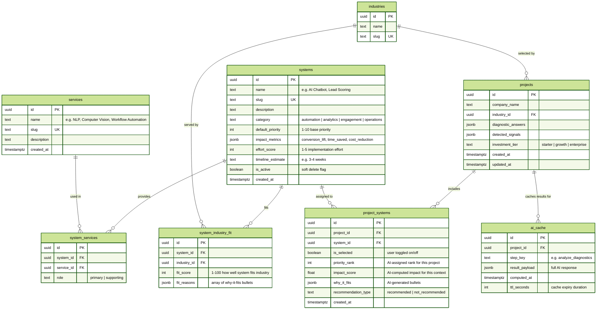

# Step 3 - System Recommendations

## 1. Recommendation Load Flow

```mermaid
%%{init: {'theme': 'forest'}}%%
flowchart TD
    A[Arrive at Step 3] --> B[Extract project_id from wizard state]
    B --> C{Check ai_cache for<br/>project_id + step key}

    C -- Cache HIT --> D[Parse cached recommendations]
    D --> E[Sort by priority score descending]
    E --> F[Split: top 4-6 = Recommended,<br/>remainder = Non-Recommended]
    F --> G[Render recommendation cards]

    C -- Cache MISS --> H[Show skeleton loading UI]
    H --> I[Call Edge Function<br/>analyze_diagnostics synchronously]
    I --> J{Edge Function success?}
    J -- Yes --> K[Store result in ai_cache]
    K --> D
    J -- No --> L[Show error state with retry button]
    L --> M[User clicks Retry]
    M --> I

    G --> N[Display Recommended Systems<br/>as priority-ranked cards]
    G --> O[Display Non-Recommended Systems<br/>in collapsed accordion below]

    N --> P[Each card shows:<br/>- Priority badge 1-6<br/>- System name & description<br/>- Why It Fits bullets<br/>- Impact / Effort / Timeline metrics]

    O --> Q[Collapsed cards show:<br/>- System name only<br/>- Expand to see why not recommended]

    N --> R[Initialize right panel:<br/>- Selection count: 0<br/>- Combined impact: --<br/>- Investment tier: --]
```

## 2. System Selection Sequence

```mermaid
%%{init: {'theme': 'forest'}}%%
sequenceDiagram
    participant U as User
    participant LC as Left Panel<br/>(System Cards)
    participant S as Wizard State
    participant DB as Supabase DB<br/>project_systems
    participant RP as Right Panel<br/>(Selection Summary)

    Note over LC: Initial state: all recommended<br/>systems pre-selected

    U->>LC: Toggle system card (select/deselect)
    LC->>LC: Update card visual state<br/>(highlight border + checkmark)
    LC->>S: Update selected_systems array

    S->>DB: UPSERT project_systems record<br/>(project_id, system_id, is_selected)

    S->>RP: Recalculate summary
    RP->>RP: Update selection count
    RP->>RP: Recalculate combined impact score<br/>(weighted avg of selected system impacts)
    RP->>RP: Recalculate investment tier<br/>(based on count of selected)
    RP->>RP: Update estimated timeline<br/>(max timeline of selected systems)

    RP->>U: Display updated summary panel

    Note over U,RP: Continue button validation

    U->>LC: Clicks Continue
    LC->>S: Check selected_systems count

    alt Count >= 1
        S->>DB: Finalize project_systems selections
        S->>U: Navigate to Step 4
    else Count == 0
        S->>U: Show validation error<br/>"Select at least 1 system to continue"
    end
```

## 3. Investment Tier Logic

```mermaid
%%{init: {'theme': 'forest'}}%%
flowchart TD
    START[System selection changed] --> COUNT[Count selected systems]

    COUNT --> CHECK1{Selected count<br/>1-2 systems?}
    CHECK1 -- Yes --> TIER1["Tier 1: Starter"]
    CHECK1 -- No --> CHECK2{Selected count<br/>3-4 systems?}
    CHECK2 -- Yes --> TIER2["Tier 2: Growth"]
    CHECK2 -- No --> CHECK3{Selected count<br/>5+ systems?}
    CHECK3 -- Yes --> TIER3["Tier 3: Enterprise"]

    TIER1 --> DESC1["Investment: $5K-15K/mo<br/>Timeline: 4-8 weeks<br/>Complexity: Low"]
    TIER2 --> DESC2["Investment: $15K-35K/mo<br/>Timeline: 8-14 weeks<br/>Complexity: Medium"]
    TIER3 --> DESC3["Investment: $35K-75K+/mo<br/>Timeline: 14-24 weeks<br/>Complexity: High"]

    DESC1 --> UPDATE[Update right panel tier indicator]
    DESC2 --> UPDATE
    DESC3 --> UPDATE

    UPDATE --> BADGE[Display tier badge with color]
    BADGE --> COLOR1["Tier 1 = Green badge"]
    BADGE --> COLOR2["Tier 2 = Amber badge"]
    BADGE --> COLOR3["Tier 3 = Purple badge"]

    UPDATE --> IMPACT[Recalculate combined impact]
    IMPACT --> IMP_CALC["Sum impact scores of<br/>selected systems / max possible"]
    IMP_CALC --> IMP_DISPLAY["Display as percentage bar<br/>+ qualitative label"]
```

## 4. System Catalog ERD

```mermaid
%%{init: {'theme': 'forest'}}%%
erDiagram
    systems {
        uuid id PK
        text name "e.g. AI Chatbot, Lead Scoring"
        text slug UK
        text description
        text category "automation | analytics | engagement | operations"
        int default_priority "1-10 base priority"
        jsonb impact_metrics "conversion_lift, time_saved, cost_reduction"
        int effort_score "1-5 implementation effort"
        text timeline_estimate "e.g. 3-4 weeks"
        boolean is_active "soft delete flag"
        timestamptz created_at
    }

    services {
        uuid id PK
        text name "e.g. NLP, Computer Vision, Workflow Automation"
        text slug UK
        text description
        timestamptz created_at
    }

    system_services {
        uuid id PK
        uuid system_id FK
        uuid service_id FK
        text role "primary | supporting"
    }

    industries {
        uuid id PK
        text name
        text slug UK
    }

    system_industry_fit {
        uuid id PK
        uuid system_id FK
        uuid industry_id FK
        int fit_score "1-100 how well system fits industry"
        jsonb fit_reasons "array of why-it-fits bullets"
    }

    projects {
        uuid id PK
        text company_name
        uuid industry_id FK
        jsonb diagnostic_answers
        jsonb detected_signals
        text investment_tier "starter | growth | enterprise"
        timestamptz created_at
        timestamptz updated_at
    }

    project_systems {
        uuid id PK
        uuid project_id FK
        uuid system_id FK
        boolean is_selected "user toggled on/off"
        int priority_rank "AI-assigned rank for this project"
        float impact_score "AI-computed impact for this context"
        jsonb why_it_fits "AI-generated bullets"
        text recommendation_type "recommended | not_recommended"
        timestamptz created_at
    }

    ai_cache {
        uuid id PK
        uuid project_id FK
        text step_key "e.g. analyze_diagnostics"
        jsonb result_payload "full AI response"
        timestamptz computed_at
        int ttl_seconds "cache expiry duration"
    }

    systems ||--o{ system_services : "provides"
    services ||--o{ system_services : "used in"
    systems ||--o{ system_industry_fit : "fits"
    industries ||--o{ system_industry_fit : "served by"
    industries ||--o{ projects : "selected by"
    projects ||--o{ project_systems : "includes"
    systems ||--o{ project_systems : "assigned to"
    projects ||--o{ ai_cache : "caches results for"
```
