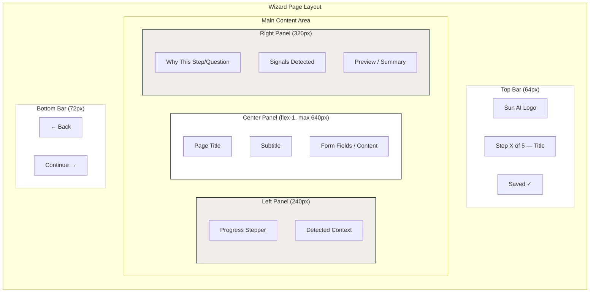
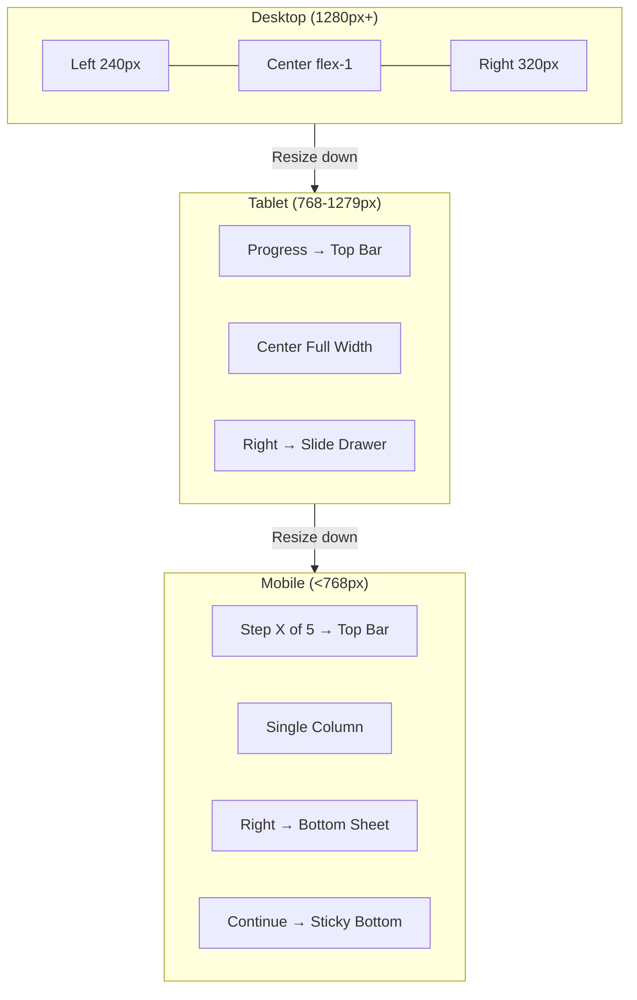
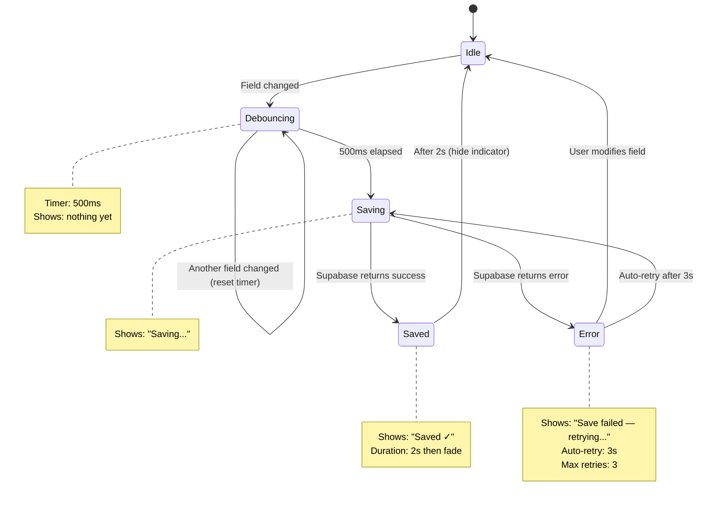

# UI Layout & Component Diagrams

## Three-Panel Layout Architecture



## Responsive Layout Breakpoints



## Component Hierarchy

```mermaid
flowchart TD
    WizardLayout[WizardLayout]
    WizardLayout --> TopBar[TopBar]
    WizardLayout --> ThreePanel[ThreePanelLayout]
    WizardLayout --> BottomBar[BottomBar]

    TopBar --> Logo[Logo]
    TopBar --> StepIndicator[StepIndicator]
    TopBar --> SaveStatus[SaveStatus]

    ThreePanel --> LeftPanel[LeftPanel]
    ThreePanel --> CenterPanel[CenterPanel]
    ThreePanel --> RightPanel[RightPanel]

    LeftPanel --> ProgressStepper[ProgressStepper]
    LeftPanel --> ContextSummary[ContextSummary]

    CenterPanel --> Step1[Step1BusinessContext]
    CenterPanel --> Step2[Step2IndustryDiagnostics]
    CenterPanel --> Step3[Step3SystemRecommendations]
    CenterPanel --> Step4[Step4ExecutiveBrief]
    CenterPanel --> Step5[Step5DashboardEntry]

    Step1 --> TextInput[TextInput]
    Step1 --> SelectInput[SelectInput]
    Step1 --> CardSelect[CardSelect]
    Step1 --> TextareaInput[TextareaInput]
    Step1 --> FileUpload[FileUpload]

    Step2 --> MultiSelectCards[MultiSelectCards]
    Step2 --> SelectInput2[SelectInput]
    Step2 --> TriStateCards[TriStateCards: Yes/No/Partial]

    Step3 --> RecommendationCard[RecommendationCard]
    Step3 --> SystemToggle[SystemToggle]
    Step3 --> EffortBadge[EffortBadge]

    Step4 --> BriefSection[BriefSection]
    Step4 --> InlineEditor[InlineEditor]
    Step4 --> ApprovalControls[ApprovalControls]

    Step5 --> ConfirmationCard[ConfirmationCard]
    Step5 --> PreviewCards[PreviewCards]
    Step5 --> DashboardCTA[DashboardCTA]

    RightPanel --> ContextCard[ContextCard]
    RightPanel --> InsightPill[InsightPill]
    RightPanel --> SignalsList[SignalsList]
    RightPanel --> SelectionSummary[SelectionSummary]

    BottomBar --> BackButton[BackButton]
    BottomBar --> ContinueButton[ContinueButton]

    style WizardLayout fill:#0A211F,color:#fff
    style Step1 fill:#84CC16,stroke:#0A211F
    style Step2 fill:#84CC16,stroke:#0A211F
    style Step3 fill:#84CC16,stroke:#0A211F
    style Step4 fill:#84CC16,stroke:#0A211F
    style Step5 fill:#84CC16,stroke:#0A211F
```



## User Journey Through Wizard

```mermaid
journey
    title Sun AI Agency — Wizard User Journey
    section Step 1: Business Context
        Enter company name: 5: User
        Select industry: 4: User
        Choose company size: 5: User
        Describe main goal: 4: User
        Write biggest challenge: 3: User
        Upload documents: 3: User
        Click Continue: 5: User
    section Step 2: Industry Diagnostics
        Answer channel question: 4: User
        Answer sales process: 4: User
        Answer support method: 4: User
        Answer tools used: 4: User
        Answer industry questions: 3: User
        Review signals detected: 5: User
        Click Continue: 5: User
    section Step 3: System Recommendations
        Review recommendations: 5: User, AI
        Read why it fits: 5: User
        Select systems: 4: User
        Review selection summary: 5: User
        Click Continue: 5: User
    section Step 4: Executive Brief
        Read executive summary: 5: User
        Review company profile: 4: User
        Check industry analysis: 5: User
        Review recommended systems: 4: User
        Edit sections if needed: 3: User
        Approve brief: 5: User
    section Step 5: Dashboard Entry
        See project confirmation: 5: User
        Review what was created: 5: User
        Enter dashboard: 5: User
```

## Auto-Save State Machine


