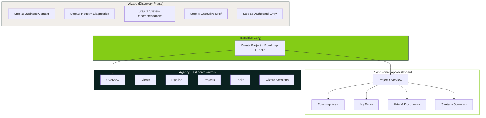
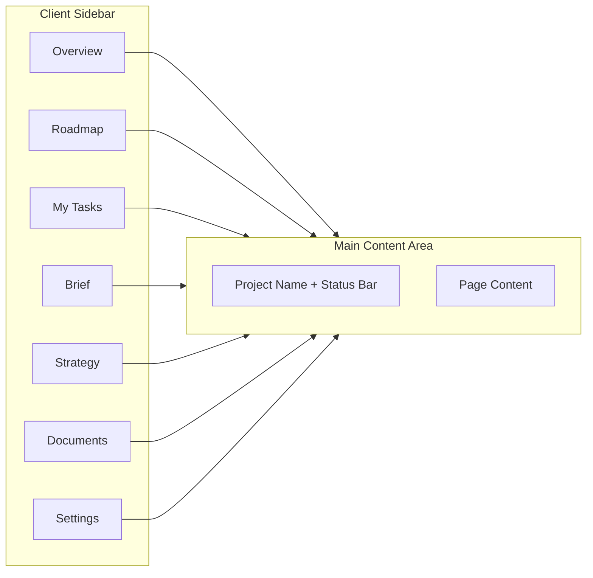
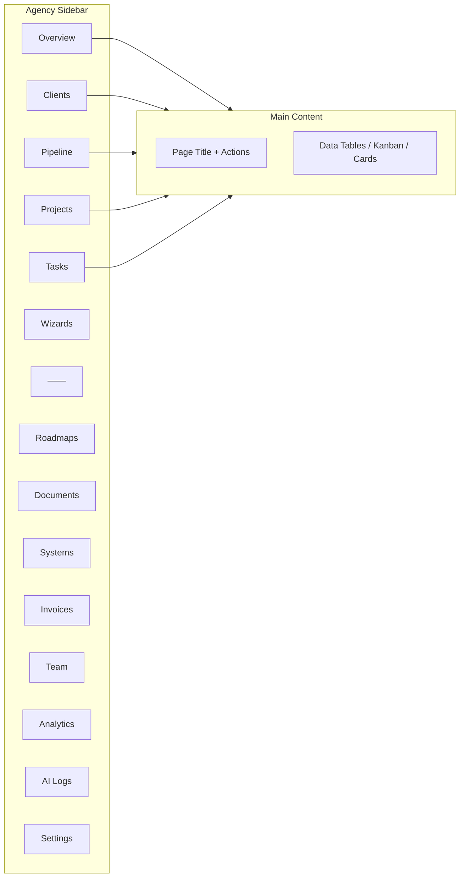
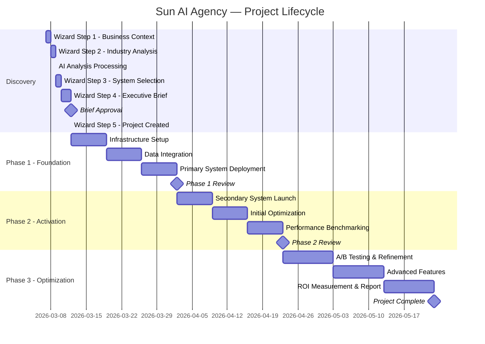
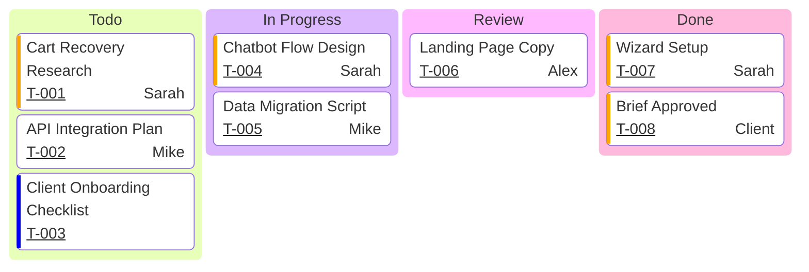

# Dashboard Transition & Post-Wizard Diagrams

## Wizard to Dashboard Transition



## Role-Based Access Flow

```mermaid
flowchart TD
    Login([User Logs In]) --> CheckRole{team_members.role?}

    CheckRole -->|Client| ClientCheck{Has wizard_session?}
    ClientCheck -->|No session| StartWizard[/app/wizard/step-1]
    ClientCheck -->|Incomplete| ResumeWizard[/app/wizard/step-N]
    ClientCheck -->|Complete| ClientDash[/app/dashboard/project_id]

    CheckRole -->|Owner / Consultant| AdminDash[/admin]

    AdminDash --> ViewClients[All Clients]
    AdminDash --> ViewPipeline[Pipeline]
    AdminDash --> ViewProjects[All Projects]
    AdminDash --> ViewWizards[Wizard Sessions]

    ViewWizards --> ReviewSession[Review Client Wizard]
    ViewWizards --> ResumeForClient[Resume on Behalf of Client]

    style AdminDash fill:#0A211F,color:#fff
    style ClientDash fill:#84CC16,stroke:#0A211F
```

## Client Dashboard Layout



## Agency Dashboard Layout



## Project Lifecycle (End to End)



## Kanban — Task Board (Agency View)


